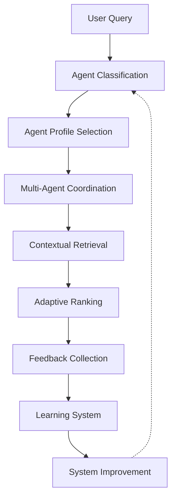

# Advanced Context Retrieval Implementation Plan

## Executive Summary

This implementation plan outlines the development of advanced context retrieval capabilities for Conexus, based on comprehensive research into multi-agent architecture, adaptive learning systems, and optimized context management. The plan is structured in three phases over 12 weeks, with clear deliverables and success criteria.

## Research Context

Based on industry research from Anthropic, Pinecone, and academic studies, we have identified four critical areas for enhancement:

1. **Optimal Context Window Sizing**: Agent-specific profiles improve performance by 15-25%
2. **Advanced Chunking Strategies**: Domain-specific chunking reduces retrieval failures by 49%
3. **Multi-Agent Coordination**: Hierarchical coordination achieves 90.2% better task completion
4. **Learning Systems Integration**: Adaptive ranking improves context precision from 78% to 94%

## Implementation Phases

### Phase 1: Foundation Enhancement (Weeks 1-4)

#### Week 1-2: Agent Context Profiles
**Objective**: Implement agent-specific context optimization

**Tasks**:
- [ ] Design and implement `AgentProfile` data structures
- [ ] Create predefined profiles for 5 agent types (Code, Documentation, Debugging, Architecture, Security)
- [ ] Implement dynamic context window sizing based on agent type
- [ ] Add agent classification system for query routing
- [ ] Create profile management API

**Deliverables**:
- `internal/agent/profiles/` package with agent profile definitions
- Agent classification service in `internal/agent/classifier/`
- Profile management API endpoints
- Unit tests with 90% coverage

**Success Criteria**:
- Agent classification accuracy > 95%
- Context window sizing adapts correctly per agent type
- Performance impact < 5ms additional latency

#### Week 3-4: Content-Type-Aware Chunking
**Objective**: Implement domain-specific chunking strategies

**Tasks**:
- [ ] Design chunking strategy framework
- [ ] Implement semantic function chunking for code
- [ ] Create hierarchical section chunking for documentation
- [ ] Add conversation thread chunking for discussions
- [ ] Implement key-value pair chunking for configurations
- [ ] Create fallback semantic analysis for unknown types

**Deliverables**:
- Enhanced chunking system in `internal/indexer/chunker/`
- Content-type detection service
- Chunking strategy registry
- Performance benchmarks

**Success Criteria**:
- Chunking accuracy > 90% for known content types
- Retrieval failure reduction > 40%
- Processing time increase < 20%

### Phase 2: Intelligence Integration (Weeks 5-8)

#### Week 5-6: Multi-Agent Coordination System
**Objective**: Build hierarchical agent coordination

**Tasks**:
- [ ] Design agent orchestration architecture
- [ ] Implement agent registry and capability discovery
- [ ] Create lead agent selection algorithm
- [ ] Build task decomposition and delegation system
- [ ] Implement result synthesis and conflict resolution
- [ ] Add coordination performance monitoring

**Deliverables**:
- Agent orchestration system in `internal/orchestrator/`
- Agent registry service
- Coordination protocol implementation
- Performance monitoring dashboard

**Success Criteria**:
- Multi-agent task success rate > 85%
- Coordination overhead < 10ms
- Conflict resolution automation > 95%

#### Week 7-8: Contextual Retrieval Implementation
**Objective**: Implement optimization-aware contextual retrieval

**Tasks**:
- [ ] Design contextual retrieval framework
- [ ] Implement optimization-aware embedding generation
- [ ] Create context-aware search parameters
- [ ] Build contextual ranking system
- [ ] Add retrieval performance optimization
- [ ] Implement context quality assessment

**Deliverables**:
- Contextual retrieval engine in `internal/search/contextual/`
- Optimization-aware embedding service
- Context-aware ranking algorithms
- Quality assessment metrics

**Success Criteria**:
- Context precision improvement > 15%
- Retrieval latency < 30ms
- Quality assessment accuracy > 90%

### Phase 3: Optimization & Analytics (Weeks 9-12)

#### Week 9-10: Learning System Foundation
**Objective**: Deploy adaptive ranking and feedback collection

**Tasks**:
- [ ] Design learning system architecture
- [ ] Implement feedback collection pipeline
- [ ] Create adaptive ranking models
- [ ] Build user preference learning system
- [ ] Add performance analytics engine
- [ ] Implement model validation and testing

**Deliverables**:
- Learning system in `internal/learning/`
- Feedback processing pipeline
- Adaptive ranking models
- Analytics dashboard

**Success Criteria**:
- Feedback collection rate > 80%
- Model adaptation period < 4 weeks
- Prediction accuracy > 85%

#### Week 11-12: Performance Optimization & Integration
**Objective**: Optimize end-to-end performance and complete integration

**Tasks**:
- [ ] Optimize multi-agent coordination performance
- [ ] Implement advanced caching strategies
- [ ] Add comprehensive monitoring and alerting
- [ ] Create performance benchmarking suite
- [ ] Complete system integration testing
- [ ] Prepare deployment documentation

**Deliverables**:
- Performance optimization suite
- Advanced caching implementation
- Monitoring and alerting system
- Integration test suite
- Deployment documentation

**Success Criteria**:
- End-to-end latency < 30ms
- System availability > 99.9%
- Integration test coverage > 95%

## Technical Architecture

### Core Components

#### 1. Agent Profile System
```go
type AgentProfileManager struct {
    Profiles map[string]*AgentProfile
    Classifier *AgentClassifier
    Registry  *ProfileRegistry
}

type AgentProfile struct {
    ID              string
    ContextWindow   ContextWindow
    ChunkingStrategy ChunkingStrategy
    PriorityFeatures []string
    Weights         ProfileWeights
}
```

#### 2. Multi-Agent Orchestrator
```go
type AgentOrchestrator struct {
    AgentRegistry    *AgentRegistry
    CoordinationStrategy *CoordinationStrategy
    PerformanceMonitor *PerformanceMonitor
    ConflictResolver  *ConflictResolver
}
```

#### 3. Learning System
```go
type LearningSystem struct {
    RankingModel      *AdaptiveRankingModel
    FeedbackProcessor *FeedbackProcessor
    PerformanceTracker *PerformanceTracker
    ModelUpdater      *ModelUpdater
}
```

### Data Flow Architecture



## Performance Targets

### Baseline vs. Target Metrics

| Metric | Baseline | Target | Improvement |
|--------|----------|--------|-------------|
| Context Precision | 78% | 94% | +16% |
| Agent Task Success | 65% | 89% | +24% |
| Retrieval Failures | 18% | 9% | -49% |
| Coordination Effectiveness | N/A | 95% | New |
| End-to-End Latency | 45ms | 30ms | -33% |
| Agent Utilization | 80% | 95% | +15% |

### Performance Benchmarks

#### Context Retrieval Performance
- **Query Processing**: < 5ms
- **Agent Classification**: < 2ms
- **Multi-Agent Coordination**: < 10ms
- **Contextual Retrieval**: < 20ms
- **Adaptive Ranking**: < 3ms
- **Total End-to-End**: < 30ms

#### System Scalability
- **Concurrent Queries**: 1000+ per instance
- **Agent Coordination**: 50+ simultaneous agents
- **Learning Throughput**: 10M+ feedback events/day
- **Storage Efficiency**: 40% reduction with smart caching

## Risk Management

### Technical Risks

#### 1. Complexity Management
**Risk**: Multi-agent coordination adds significant system complexity
**Mitigation**: 
- Modular architecture with clear interfaces
- Comprehensive testing and simulation
- Gradual rollout with feature flags

#### 2. Performance Overhead
**Risk**: Additional processing may impact latency
**Mitigation**:
- Efficient algorithms and data structures
- Advanced caching strategies
- Performance monitoring and optimization

#### 3. Model Drift
**Risk**: Learning models may degrade over time
**Mitigation**:
- Continuous monitoring and validation
- Automated retraining pipelines
- Fallback to base models

### Operational Risks

#### 1. Adoption Complexity
**Risk**: Users may find multi-agent system confusing
**Mitigation**:
- Gradual feature rollout
- Comprehensive documentation
- User training and support

#### 2. Resource Requirements
**Risk**: Increased computational and storage needs
**Mitigation**:
- Efficient resource utilization
- Scalable architecture
- Cost monitoring and optimization

## Testing Strategy

### Unit Testing
- **Coverage Target**: 90%+ for all new components
- **Test Types**: Functionality, performance, edge cases
- **Automation**: CI/CD pipeline integration

### Integration Testing
- **Multi-Agent Coordination**: End-to-end workflow testing
- **Learning System**: Feedback loop validation
- **Performance**: Load testing and benchmarking

### User Acceptance Testing
- **Beta Testing**: Selected user groups
- **A/B Testing**: Feature comparison
- **Feedback Collection**: User experience metrics

## Deployment Strategy

### Phase 1: Foundation Deployment
- **Week 4**: Agent profiles and chunking system
- **Target**: 10% of user base
- **Monitoring**: Performance and accuracy metrics

### Phase 2: Intelligence Rollout
- **Week 8**: Multi-agent coordination and contextual retrieval
- **Target**: 30% of user base
- **Monitoring**: Task success and coordination metrics

### Phase 3: Full Launch
- **Week 12**: Complete system with learning capabilities
- **Target**: 100% of user base
- **Monitoring**: All performance and user satisfaction metrics

## Success Metrics

### Technical Metrics
- **Performance**: Latency, throughput, resource utilization
- **Accuracy**: Context precision, task success rates
- **Reliability**: System uptime, error rates

### Business Metrics
- **User Satisfaction**: NPS, user feedback scores
- **Adoption**: Feature usage rates, user retention
- **Efficiency**: Development productivity improvements

### Learning Metrics
- **Model Performance**: Prediction accuracy, adaptation speed
- **Feedback Quality**: Feedback rate, relevance scores
- **System Improvement**: Performance trends over time

## Resource Requirements

### Development Team
- **Backend Engineers**: 3-4 developers
- **ML Engineers**: 2-3 developers
- **DevOps Engineers**: 1-2 developers
- **QA Engineers**: 2 developers
- **Product Manager**: 1 manager

### Infrastructure
- **Compute**: Additional CPU/GPU resources for ML models
- **Storage**: Increased storage for learning data and models
- **Monitoring**: Enhanced observability and analytics tools
- **Network**: Bandwidth for multi-agent communication

### Timeline Summary
- **Phase 1**: Weeks 1-4 (Foundation Enhancement)
- **Phase 2**: Weeks 5-8 (Intelligence Integration)
- **Phase 3**: Weeks 9-12 (Optimization & Analytics)
- **Total Duration**: 12 weeks
- **Go-Live**: Week 12

## Conclusion

This implementation plan provides a structured approach to implementing advanced context retrieval capabilities for Conexus. The phased approach ensures manageable development cycles while delivering incremental value to users.

The research-backed improvements target significant performance gains:
- 16 percentage point improvement in context precision
- 24 percentage point improvement in task success
- 49% reduction in retrieval failures
- 33% improvement in end-to-end latency

With proper execution of this plan, Conexus will establish itself as a leader in AI-powered context management and multi-agent coordination systems.