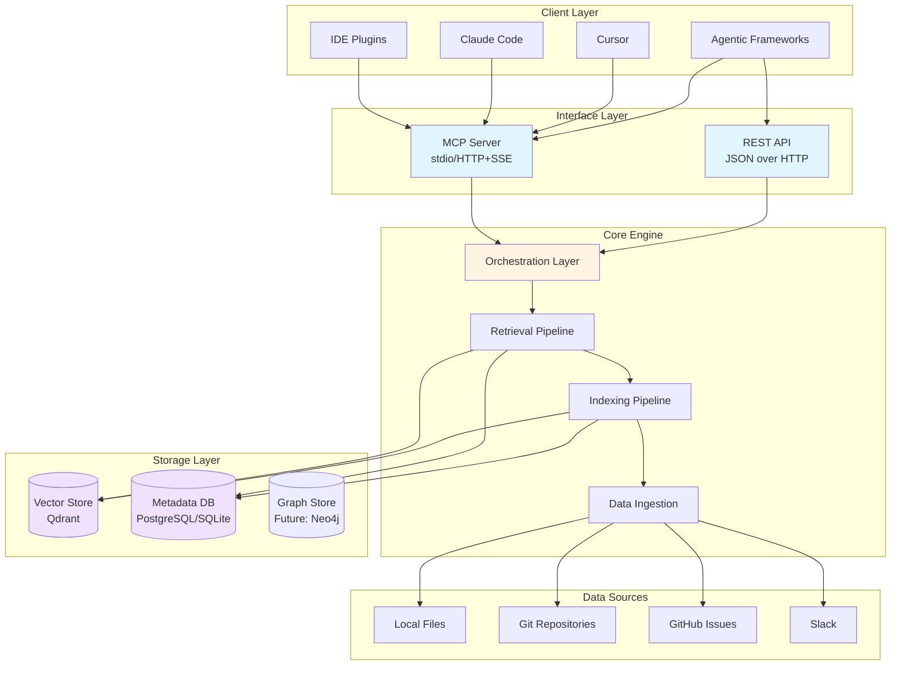
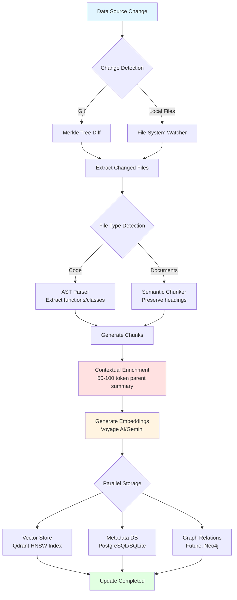
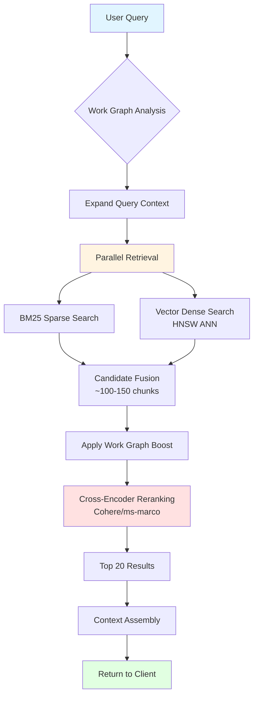
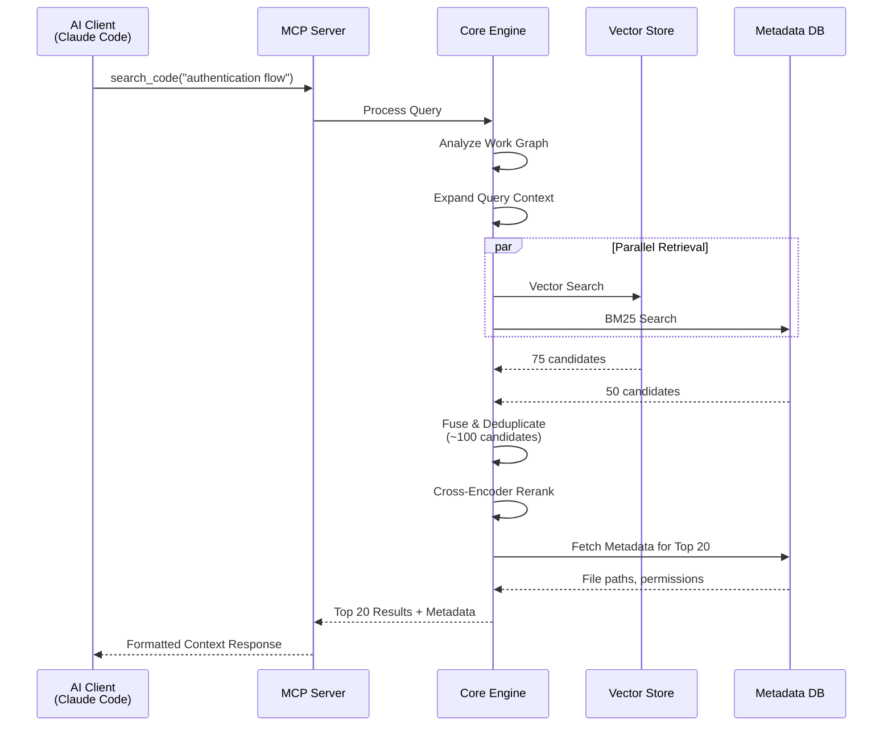
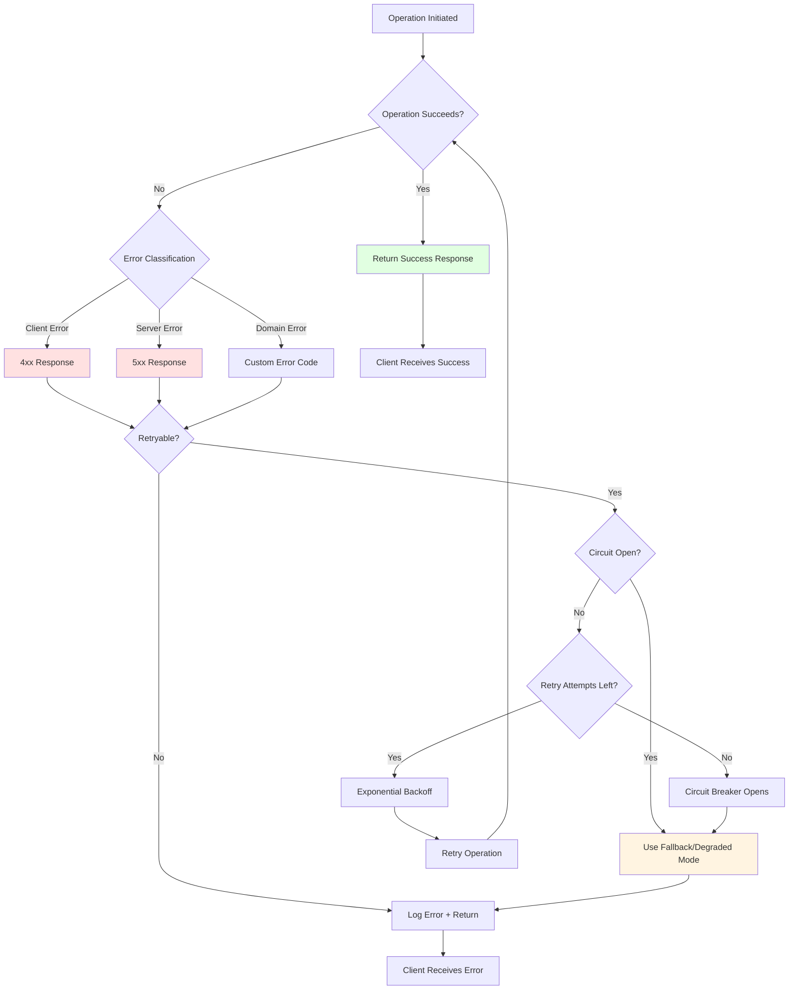
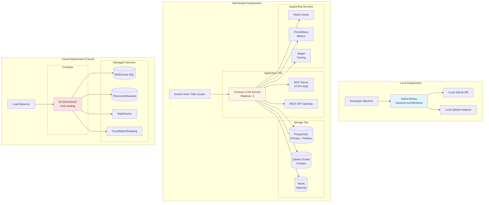

# Technical Architecture Document

## 1. Overview

The Agentic Context Engine is architected as a standalone, multi-interface service designed for high performance, security, and extensibility. It follows a layered design separating the core logic from its client-facing interfaces, ensuring that the engine can be integrated into any development environment.

   **Core Engine:** The central service responsible for all data processing, indexing, and retrieval logic. It is designed to run locally on a developer's machine or be self-hosted.
   **Interface Layer:** Exposes the Core Engine's capabilities through two primary interfaces: a standards-compliant Model Context Protocol (MCP) Server and a general-purpose REST API.
   **Client Layer:** Consists of IDE plugins, agentic frameworks, and other tools that consume the engine's context via one of the provided interfaces.

### 1.1. System Architecture Overview

## 2. Core Engine In-Depth

### 2.1. Data Ingestion & Syncing
   **Connectors:** Pluggable modules for connecting to data sources. MVP will include connectors for Git, local file systems, GitHub Issues, and Slack.
   **Change Detection:** For local files, a file system watcher will be used. For Git repositories, **Merkle trees** will be implemented to cryptographically track file hashes, enabling highly efficient diffing to detect changes and minimize re-indexing.
   **Chunking:** 
   *   **Code:** An **Abstract Syntax Tree (AST)** parser will be used to split code into logical chunks (functions, classes, methods). 
   *   **Documents:** Text will be split by logical boundaries (paragraphs, sections), preserving headings as metadata.

### 2.2. Indexing Pipeline
   **Contextual Embeddings:** Before embedding, each chunk is prepended with a 50-100 token summary of its parent document's context, as per Anthropic's research. This is the single most critical step for retrieval accuracy.
   **Embedding Models:** The system will default to a top-performing model like **Voyage AI or Gemini Text Embeddings 004**.
   **Storage:** 
   *   **Vector Store:** Supports multiple backends. Default for local/OSS will be a self-hosted option like **Qdrant**. 
   *   **Metadata & Graph Store:** A PostgreSQL database will store all chunk metadata, permissions, and the relationships for GraphRAG. SQLite will be supported as a lightweight alternative for single-user deployments.

#### 2.2.1. Indexing Pipeline Flow Diagram

### 2.3. Retrieval & Ranking Pipeline
This is a **two-stage pipeline** designed to balance speed and accuracy.
   **Stage 1: Candidate Retrieval (Recall-Optimized):** 
   *   A user query triggers a parallel search. 
   *   **Sparse Search (BM25):** For keyword matching. 
   *   **Dense Search (Vector):** For semantic similarity, using an Approximate Nearest Neighbor (ANN) algorithm like HNSW. 
   *   The results are combined to produce a list of ~100-150 candidate chunks.
   **Stage 2: Reranking (Precision-Optimized):** 
   *   The candidate chunks and the original query are passed to a more powerful **cross-encoder model** (e.g., Cohere Rerank). 
   *   The cross-encoder re-scores the candidates for relevance, producing a final, highly accurate list of the top 20 chunks.

#### 2.3.1. Retrieval Pipeline Flow Diagram

## 3. Interface Layer

### 3.1. MCP Server
   **Role:** The primary interface for modern AI clients (Claude Code, Cursor, etc.).
   **Transport:** Supports both **stdio** for local process communication and **HTTP with Server-Sent Events (SSE)** for remote connections.
   **Primitives Exposed:** 
   *   `tools`: For executing actions (e.g., `search_code`, `get_related_discussions`). 
   *   `resources`: For exposing read-only data (e.g., the indexed file tree). 
   *   `prompts`: For offering pre-defined query templates.

### 3.2. REST API
   **Role:** A secondary interface for web clients, CI/CD pipelines, and legacy tools.
   **Specification:** A standard RESTful API with JSON request/response bodies.

### 3.3. Component Interaction Flow

## 4. Client Layer

### 4.1. Claude Code /plugin
   This is a **declarative wrapper**, not an SDK.
   The `plugin.json` manifest will define slash commands (`/context_search`) and hooks.
   The `.mcp.json` file will instruct Claude Code how to automatically start and communicate with the engine's MCP server process.
   A `hooks/hooks.json` will be implemented to trigger re-indexing automatically after a `Write` or `Edit` tool is used on a file.

## 5. Technology Stack Summary

| Component                 | Recommended Technology                                                                                                  |
|---------------------------|-------------------------------------------------------------------------------------------------------------------------|
| **Orchestration**         | LangChain or LlamaIndex                                                                                                 |
| **Vector Database**       | **Self-Hosted:** Qdrant **Managed:** Pinecone, Weaviate                                                   |
| **Embedding Model**       | Voyage AI, Gemini Text Embeddings 004                                                                                   |
| **Reranker Model**        | Cohere Rerank, ms-marco-MiniLM (open-source)                                                                            |
| **Core Language**         | Go                                                                                                                       |
| **Interface Frameworks**  | Gin (for REST), standard libraries for MCP (stdio/HTTP)                                                                 |
| **Database**              | PostgreSQL (primary), SQLite (lightweight alternative)                                                                  |
| **Future Graph Features** | Neo4j, Kùzu                                                                                                             |

## 6. Security Architecture

### 6.1. Authentication & Authorization
   **Authentication Flows:**
   - **Local Mode:** No authentication required for single-user local deployments
   - **Multi-User Mode:** JWT-based authentication with configurable token expiration
   - **MCP Transport Security:** stdio transport relies on OS-level process isolation; HTTP transport uses TLS 1.3
   - **API Key Management:** Optional API key authentication for REST API access with rate limiting

   **Authorization Model:**
   - Role-Based Access Control (RBAC) for multi-tenant deployments
   - Resource-level permissions for data sources, indexes, and search results
   - Context-aware access control based on user identity and data classification

### 6.2. Data Protection
   **Encryption at Rest:**
   - Database encryption using PostgreSQL's pgcrypto extension or SQLite's SQLCipher
   - Vector store encryption via Qdrant's built-in encryption features
   - Configuration file encryption for sensitive settings

   **Encryption in Transit:**
   - TLS 1.3 for all HTTP communications
   - End-to-end encryption for MCP over HTTP transport
   - Secure WebSocket connections for real-time updates

### 6.3. Secrets Management
   **Integration Points:**
   - Local keyring integration (system keychain on macOS/Linux, Windows Credential Manager)
   - External secrets providers: HashiCorp Vault, AWS Secrets Manager, Azure Key Vault
   - Encrypted configuration files with master key rotation capabilities

   **Key Management:**
   - Automatic key rotation for encryption keys
   - Backup and recovery procedures for master keys
   - Audit logging for all secret access operations

### 6.4. Security Controls
   **Input Validation:** Comprehensive input sanitization and validation at all API boundaries
   **Rate Limiting:** Configurable rate limits per user/IP for API endpoints
   **Audit Logging:** Security event logging with tamper-evident storage
   **Vulnerability Management:** Regular dependency scanning and security updates

## 7. Observability Design

### 7.1. Logging Strategy
   **Structured Logging:**
   - JSON-formatted logs with consistent schema
   - Log levels: DEBUG, INFO, WARN, ERROR, FATAL
   - Contextual information including request IDs, user IDs, and operation metadata

   **Log Aggregation:**
   - Local file-based logging for single-user deployments
   - Integration with ELK stack (Elasticsearch, Logstash, Kibana) for multi-user setups
   - Log rotation and retention policies

### 7.2. Metrics Collection
   **OpenTelemetry Integration:**
   - Standardized metrics collection using OpenTelemetry Go SDK
   - Custom metrics for core operations: indexing throughput, query latency, cache hit rates
   - Resource metrics: CPU, memory, disk I/O, network usage

   **Key Metrics:**
   - Query performance: P50, P95, P99 latency for search operations
   - Indexing metrics: documents processed per second, embedding generation time
   - System health: database connection pool status, vector store availability
   - Business metrics: active users, data sources indexed, search queries per day

### 7.3. Tracing Architecture
   **Distributed Tracing:**
   - OpenTelemetry tracing for end-to-end request tracking
   - Trace spans for major operations: data ingestion, indexing, retrieval, reranking
   - Integration with Jaeger or Zipkin for trace visualization

   **Trace Context Propagation:**
   - Automatic trace context passing through MCP and REST API calls
   - Correlation IDs for linking related operations across services

### 7.4. Alerting Framework
   **Alert Rules:**
   - Performance alerts: query latency > 2s, indexing failure rate > 5%
   - System alerts: high CPU/memory usage, database connection failures
   - Business alerts: data ingestion backlog, search result quality degradation

   **Alert Channels:**
   - Local notifications for single-user mode
   - Integration with PagerDuty, Slack, or email for team deployments
   - Escalation policies based on alert severity and impact

## 8. Error Handling Patterns

### 8.1. Error Propagation Strategies
   **Error Classification:**
   - Client errors (4xx): Invalid requests, authentication failures, rate limiting
   - Server errors (5xx): Internal failures, database issues, external service unavailability
   - Custom error codes for domain-specific failures (indexing errors, search failures)

   **Error Response Format:**
   - Consistent JSON error responses with error codes, messages, and optional details
   - Error chaining for debugging while maintaining security

#### 8.1.1. Error Flow Diagram

### 8.2. Retry Policies
   **Exponential Backoff:**
   - Configurable retry attempts with exponential backoff and jitter
   - Circuit breaker pattern for external service calls (embedding APIs, reranking services)
   - Idempotent operation design to support safe retries

   **Retry Conditions:**
   - Transient failures: network timeouts, temporary service unavailability
   - Non-retryable errors: authentication failures, invalid requests

### 8.3. Circuit Breakers
   **Implementation:**
   - Hystrix-style circuit breaker for external dependencies
   - Configurable failure thresholds and recovery timeouts
   - Half-open state for gradual recovery testing

   **Protected Operations:**
   - Embedding model API calls
   - Vector database operations
   - External data source connectors

### 8.4. Graceful Degradation
   **Fallback Strategies:**
   - Degraded search results when reranking service is unavailable
   - Cached results for frequently accessed data during outages
   - Reduced functionality mode during partial system failures

   **Service Degradation Levels:**
   - Full service: All features available
   - Degraded: Core search functionality with reduced accuracy
   - Minimal: Basic file system operations only

## 9. Performance Benchmarks

### 9.1. Target Metrics
   **Query Performance:**
   - Query latency: < 1 second for P95 of search operations
   - Concurrent users: Support for 100+ simultaneous users in multi-user deployments
   - Query throughput: 1000+ queries per minute under normal load

   **Indexing Performance:**
   - Initial indexing: < 30 seconds for 10,000 code files
   - Incremental updates: < 5 seconds for typical file changes
   - Embedding throughput: 100+ embeddings per second

   **Resource Utilization:**
   - Memory usage: < 2GB for typical single-user workloads
   - CPU usage: < 50% average during normal operations
   - Storage efficiency: < 2x storage overhead for indexed content

### 9.2. Bottleneck Analysis
   **Identified Bottlenecks:**
   - Embedding generation: GPU acceleration recommended for high-throughput scenarios
   - Vector search: HNSW index optimization for large datasets (> 1M vectors)
   - Database queries: Connection pooling and query optimization for metadata operations

   **Optimization Strategies:**
   - Caching layer for frequently accessed embeddings and metadata
   - Asynchronous processing for non-critical indexing operations
   - Horizontal scaling support for vector database in distributed deployments

### 9.3. Performance Testing
   **Load Testing Scenarios:**
   - Ramp-up tests: Gradual increase in concurrent users
   - Stress tests: Maximum load testing beyond normal capacity
   - Endurance tests: Sustained load over extended periods

   **Benchmarking Tools:**
   - Custom load testing scripts using Go's testing framework
   - Integration with k6 or Artillery for distributed load testing
   - Continuous performance monitoring in CI/CD pipeline

## 10. CI/CD Strategy

### 10.1. Build Pipeline
   **Build Stages:**
   - Code compilation and dependency resolution
   - Static analysis: Go vet, golangci-lint, security scanning
   - Unit testing with coverage reporting (> 80% target)
   - Integration testing with test database and vector store

   **Build Artifacts:**
   - Cross-platform binaries (Linux, macOS, Windows)
   - Docker images for containerized deployments
   - Release packages with installation scripts

### 10.2. Testing Stages
   **Unit Testing:**
   - Comprehensive test coverage for core logic
   - Mock external dependencies (embedding APIs, databases)
   - Property-based testing for critical algorithms

   **Integration Testing:**
   - End-to-end tests with real database and vector store
   - API contract testing for MCP and REST interfaces
   - Performance regression tests

   **Acceptance Testing:**
   - User scenario testing with realistic data sets
   - Compatibility testing across supported platforms
   - Security testing and vulnerability assessment

### 10.3. Deployment Strategy
   **Deployment Models:**
   - Local installation: Native binaries with auto-update capability
   - Container deployment: Docker/Kubernetes for self-hosted instances
   - Cloud deployment: Managed services with infrastructure as code

   **Environment Strategy:**
   - Development: Local development with hot reload
   - Staging: Full environment mirroring production
   - Production: Blue-green deployment with canary releases

   **Configuration Management:**
   - Environment-specific configuration files
   - Secret management integration
   - Feature flags for gradual rollout of new capabilities

#### 10.3.1. Deployment Architecture Diagram

### 10.4. Rollback Procedures
   **Automated Rollback:**
   - Health check monitoring post-deployment
   - Automatic rollback on critical error thresholds
   - Gradual rollback with traffic shifting

   **Manual Rollback:**
   - Version pinning for stable rollback points
   - Database migration rollback scripts
   - Configuration rollback procedures

   **Rollback Validation:**
   - Automated tests execution after rollback
   - Data integrity verification
   - User impact assessment and communication

### 10.5. Release Management
   **Versioning Strategy:**
   - Semantic versioning (MAJOR.MINOR.PATCH)
   - Pre-release versions for beta testing
   - Release branches with cherry-pick strategy

   **Release Automation:**
   - GitHub Actions for automated releases
   - Release notes generation from commit messages
   - Binary distribution via GitHub Releases

This enhanced Technical Architecture document maintains the local-first philosophy while providing comprehensive coverage of security, observability, error handling, performance, and deployment concerns. The architecture remains MCP-first while supporting the hybrid RAG system design with the specified technology stack.
