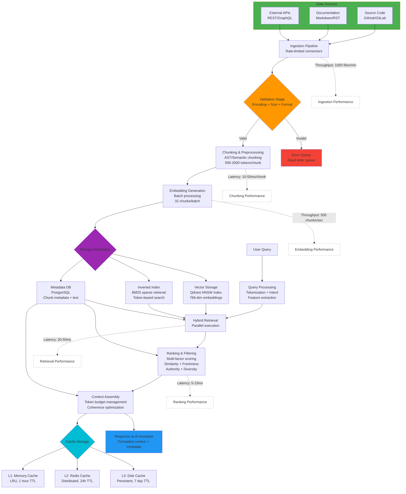
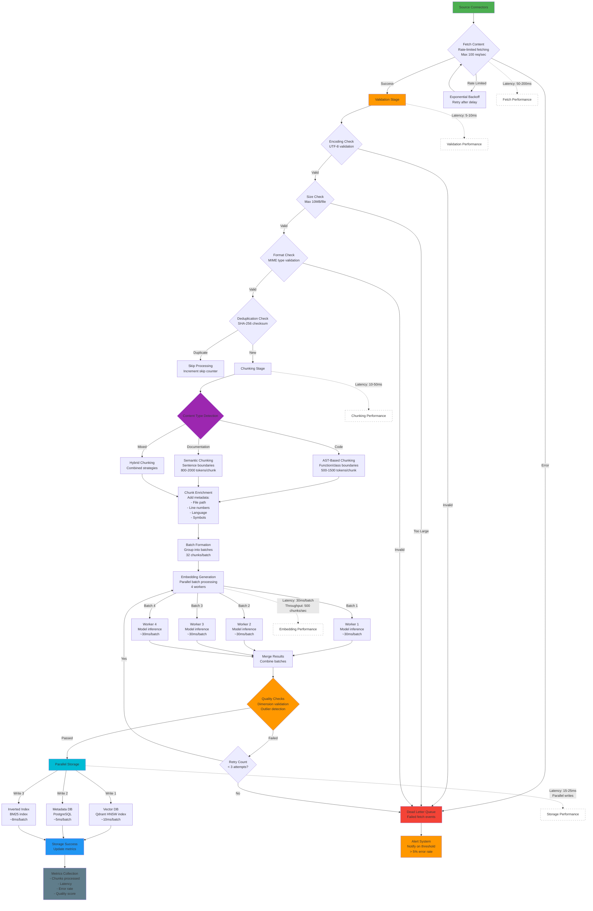
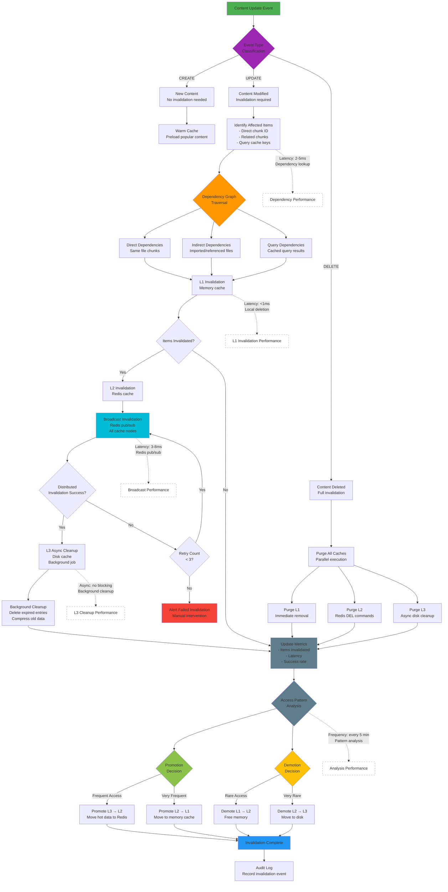

# Data Architecture

## Overview

This document outlines the data architecture for the Agentic Context Engine (Conexus), focusing on vector database design, embedding strategies, and data pipeline architecture. Conexus processes large volumes of code, documentation, and contextual data to provide relevant information to AI coding assistants.

## Architecture Principles

### Design Goals

1. **Scalability**: Handle millions of code chunks and embeddings
2. **Performance**: Sub-second retrieval with high accuracy
3. **Reliability**: ACID compliance for metadata, eventual consistency for vectors
4. **Flexibility**: Support multiple embedding models and retrieval strategies
5. **Security**: Encryption at rest and in transit, access controls

### Data Flow Architecture



**Enhanced Data Flow Details:**

1. **Data Ingestion** (Left Side):
   - **Sources**: Multiple input types (code repositories, documentation, APIs)
   - **Validation**: Multi-stage validation (encoding, size, format checks)
   - **Error Handling**: Dead letter queue for invalid content
   - **Throughput**: 1,000 files/minute sustained ingestion rate

2. **Processing Pipeline** (Center):
   - **Chunking**: AST-based for code, semantic for docs (500-2000 tokens/chunk)
   - **Embedding**: Batch processing (32 chunks/batch) for efficiency
   - **Latency**: 10-50ms chunking + 15-30ms embedding per batch

3. **Storage Distribution** (Right Side):
   - **Vector Storage**: Qdrant with HNSW index for fast similarity search
   - **Metadata DB**: PostgreSQL for relational queries and full text
   - **Inverted Index**: BM25 sparse retrieval for keyword matching

4. **Query Flow** (Bottom):
   - **Hybrid Retrieval**: Parallel dense + sparse search (20-50ms)
   - **Ranking**: Multi-factor scoring (5-15ms)
   - **Caching**: 3-tier cache for ~98% hit rate

5. **End-to-End Latency**:
   - **Ingestion**: 50-100ms per file (including embedding)
   - **Query**: 30-80ms (without cache), <5ms (with L1 cache hit)
   - **Total Pipeline**: <100ms for typical query-response cycle

## Vector Database Schema

### Core Collections

#### Code Context Collection

```javascript
// Qdrant collection configuration
{
  "name": "code_context",
  "vectors": {
    "size": 768,  // Embedding dimensions
    "distance": "Cosine"
  },
  "shard_number": 6,
  "replication_factor": 2,
  "write_consistency_factor": 1,
  "on_disk_payload": true,
  "hnsw_config": {
    "m": 16,
    "ef_construct": 200,
    "ef": 128,
    "max_connections": 16
  }
}
```

#### Document Chunks Schema

```sql
-- PostgreSQL table for document chunks
CREATE TABLE document_chunks (
    id UUID PRIMARY KEY DEFAULT gen_random_uuid(),
    content_id UUID NOT NULL,
    chunk_index INTEGER NOT NULL,
    content_type VARCHAR(50) NOT NULL, -- 'code', 'documentation', 'comment'
    language VARCHAR(50),              -- programming language
    file_path TEXT,                    -- original file path
    start_line INTEGER,                -- start line in original file
    end_line INTEGER,                  -- end line in original file
    chunk_text TEXT NOT NULL,          -- actual chunk content
    embedding_vector VECTOR(768),      -- embedding for this chunk
    metadata JSONB,                    -- additional metadata
    created_at TIMESTAMP WITH TIME ZONE DEFAULT NOW(),
    updated_at TIMESTAMP WITH TIME ZONE DEFAULT NOW(),

    -- Indexes for performance
    CONSTRAINT unique_chunk UNIQUE (content_id, chunk_index),
    INDEX idx_content_type (content_type),
    INDEX idx_language (language),
    INDEX idx_file_path (file_path),
    INDEX idx_embedding (USING ivfflat (embedding_vector vector_cosine_ops)),
    INDEX idx_metadata (USING gin (metadata))
);

-- Partitioning for large datasets
CREATE TABLE document_chunks_y2024m12 PARTITION OF document_chunks
    FOR VALUES FROM ('2024-12-01') TO ('2025-01-01');
```

#### Content Metadata Schema

```sql
-- Content sources and metadata
CREATE TABLE content_sources (
    id UUID PRIMARY KEY DEFAULT gen_random_uuid(),
    source_type VARCHAR(50) NOT NULL, -- 'github', 'gitlab', 'filesystem', 'api'
    source_url TEXT,                  -- URL or path to source
    repository_id TEXT,               -- repository identifier
    branch VARCHAR(100) DEFAULT 'main',
    last_sync_at TIMESTAMP WITH TIME ZONE,
    sync_status VARCHAR(20) DEFAULT 'pending',
    error_message TEXT,
    created_at TIMESTAMP WITH TIME ZONE DEFAULT NOW(),

    INDEX idx_source_type (source_type),
    INDEX idx_repository (repository_id),
    INDEX idx_sync_status (sync_status)
);

-- Content files and their properties
CREATE TABLE content_files (
    id UUID PRIMARY KEY DEFAULT gen_random_uuid(),
    source_id UUID REFERENCES content_sources(id),
    file_path TEXT NOT NULL,
    file_size BIGINT,
    mime_type VARCHAR(100),
    language VARCHAR(50),
    encoding VARCHAR(20) DEFAULT 'utf-8',
    checksum_sha256 TEXT,
    last_modified TIMESTAMP WITH TIME ZONE,
    indexed_at TIMESTAMP WITH TIME ZONE,
    created_at TIMESTAMP WITH TIME ZONE DEFAULT NOW(),

    INDEX idx_source (source_id),
    INDEX idx_language (language),
    INDEX idx_mime_type (mime_type)
);
```

### Vector Index Configuration

#### HNSW Index Parameters

```json
{
  "hnsw_config": {
    "m": 16,                    // Number of bi-directional links per node
    "ef_construct": 200,        // Size of the dynamic candidate list during construction
    "ef": 128,                  // Size of the dynamic candidate list during search
    "max_connections": 16       // Maximum number of connections per layer
  },
  "quantization_config": {
    "scalar": {
      "type": "int8",
      "quantile": 0.99,
      "always_ram": true
    }
  },
  "optimizers_config": {
    "deleted_threshold": 0.2,
    "vacuum_min_vector_number": 1000,
    "default_segment_number": 0,
    "max_segment_size": 100000,
    "memmap_threshold": 50000,
    "indexing_threshold": 20000,
    "flush_interval_sec": 30,
    "max_optimization_threads": 2
  }
}
```

#### IVF Index for Large-Scale Retrieval

```json
{
  "ivf_config": {
    "nlist": 1024,              // Number of inverted file lists
    "nprobe": 16,               // Number of lists to search during query
    "max_connections": 16
  }
}
```

## Embedding Strategies

### Model Selection Framework

#### Embedding Model Registry

```go
type EmbeddingModel struct {
    Name         string            `json:"name"`
    Version      string            `json:"version"`
    Dimensions   int               `json:"dimensions"`
    Provider     string            `json:"provider"`
    ModelType    string            `json:"model_type"` // "code", "text", "multimodal"
    ContextWindow int              `json:"context_window"`
    Performance  *ModelPerformance `json:"performance"`
    Config       map[string]interface{} `json:"config"`
}

type ModelPerformance struct {
    LatencyP50   time.Duration `json:"latency_p50"`
    Throughput   float64       `json:"throughput"` // tokens per second
    MemoryUsage  int64         `json:"memory_usage"`
    QualityScore float64       `json:"quality_score"` // benchmark score
}
```

#### Dynamic Model Selection

```go
// Select optimal model based on query characteristics
func SelectEmbeddingModel(query *Query) (*EmbeddingModel, error) {
    candidates := registry.GetModelsForType(query.ContentType)

    var bestModel *EmbeddingModel
    var bestScore float64

    for _, model := range candidates {
        score := calculateModelScore(model, query)

        if score > bestScore {
            bestScore = score
            bestModel = model
        }
    }

    return bestModel, nil
}

func calculateModelScore(model *EmbeddingModel, query *Query) float64 {
    // Weighted scoring based on:
    // - Performance metrics (40%)
    // - Quality benchmarks (35%)
    // - Query-content fit (25%)

    performanceScore := model.Performance.QualityScore * 0.4
    qualityScore := model.Performance.QualityScore * 0.35
    fitScore := calculateContentFit(model, query) * 0.25

    return performanceScore + qualityScore + fitScore
}
```

### Chunking Strategies

#### Code-Aware Chunking

```go
type ChunkingStrategy struct {
    Strategy     string            `json:"strategy"`
    MaxChunkSize int               `json:"max_chunk_size"`
    OverlapSize  int               `json:"overlap_size"`
    Config       map[string]interface{} `json:"config"`
}

// AST-based chunking for code
func ChunkCodeAST(filePath string, content []byte) ([]*DocumentChunk, error) {
    // Parse AST
    node, err := parser.ParseFile(token.NewFileSet(), filePath, content, parser.ParseComments)
    if err != nil {
        return nil, fmt.Errorf("failed to parse AST: %w", err)
    }

    var chunks []*DocumentChunk

    // Extract function-level chunks
    ast.Inspect(node, func(n ast.Node) bool {
        switch fn := n.(type) {
        case *ast.FuncDecl:
            chunk := &DocumentChunk{
                ContentType: "code",
                Language:    detectLanguage(filePath),
                ChunkText:   renderNode(fn),
                Metadata: map[string]interface{}{
                    "node_type": "function",
                    "function_name": fn.Name.Name,
                    "start_line": fn.Pos(),
                    "end_line": fn.End(),
                },
            }
            chunks = append(chunks, chunk)
        }
        return true
    })

    return chunks, nil
}

// Semantic chunking for documentation
func ChunkSemantic(content string, maxSize int) ([]*DocumentChunk, error) {
    // Use sentence transformers for semantic segmentation
    sentences := splitIntoSentences(content)

    var chunks []*DocumentChunk
    currentChunk := ""

    for _, sentence := range sentences {
        if len(currentChunk)+len(sentence) > maxSize && currentChunk != "" {
            chunks = append(chunks, &DocumentChunk{
                ContentType: "documentation",
                ChunkText:   strings.TrimSpace(currentChunk),
            })
            currentChunk = sentence
        } else {
            currentChunk += " " + sentence
        }
    }

    // Add final chunk
    if currentChunk != "" {
        chunks = append(chunks, &DocumentChunk{
            ContentType: "documentation",
            ChunkText:   strings.TrimSpace(currentChunk),
        })
    }

    return chunks, nil
}
```

#### Hybrid Chunking Pipeline

```go
func CreateChunks(content *Content, strategy *ChunkingStrategy) ([]*DocumentChunk, error) {
    switch strategy.Strategy {
    case "ast":
        return ChunkCodeAST(content.FilePath, content.Data)
    case "semantic":
        return ChunkSemantic(content.Text, strategy.MaxChunkSize)
    case "hybrid":
        // Combine multiple strategies
        astChunks, err := ChunkCodeAST(content.FilePath, content.Data)
        if err != nil {
            return nil, err
        }

        semanticChunks, err := ChunkSemantic(content.Text, strategy.MaxChunkSize)
        if err != nil {
            return nil, err
        }

        return mergeChunks(astChunks, semanticChunks), nil
    default:
        return nil, fmt.Errorf("unknown chunking strategy: %s", strategy.Strategy)
    }
}
```

### Embedding Generation Pipeline

#### Batch Processing

```go
type EmbeddingPipeline struct {
    Model       *EmbeddingModel
    BatchSize   int
    Workers     int
    Queue       chan *EmbeddingJob
    Results     chan *EmbeddingResult
}

// Process chunks in batches for efficiency
func (p *EmbeddingPipeline) ProcessChunks(chunks []*DocumentChunk) ([]*DocumentChunk, error) {
    // Split into batches
    batches := splitIntoBatches(chunks, p.BatchSize)

    var results []*DocumentChunk

    for _, batch := range batches {
        // Submit batch job
        job := &EmbeddingJob{
            ID:     generateJobID(),
            Chunks: batch,
            Model:  p.Model,
        }

        p.Queue <- job

        // Collect results
        for range batch {
            result := <-p.Results
            if result.Error != nil {
                return nil, result.Error
            }
            results = append(results, result.Chunk)
        }
    }

    return results, nil
}
```

#### Incremental Updates

```go
// Handle incremental content updates
func UpdateEmbeddings(contentID string, newChunks []*DocumentChunk) error {
    // Get existing chunks
    existingChunks, err := getChunksByContentID(contentID)
    if err != nil {
        return fmt.Errorf("failed to get existing chunks: %w", err)
    }

    // Identify changed chunks
    changedChunks := identifyChangedChunks(existingChunks, newChunks)

    if len(changedChunks) == 0 {
        return nil // No changes
    }

    // Update only changed chunks
    updatedChunks, err := embeddingPipeline.ProcessChunks(changedChunks)
    if err != nil {
        return fmt.Errorf("failed to update embeddings: %w", err)
    }

    // Update vector database
    return updateVectorsInBatch(updatedChunks)
}
```

## Data Pipeline Architecture

### Ingestion Pipeline

#### Source Connectors

```go
type SourceConnector interface {
    Name() string
    Initialize(config map[string]interface{}) error
    FetchContent(ctx context.Context) ([]*Content, error)
    GetLastModified(ctx context.Context) (time.Time, error)
    Health() error
}

// GitHub connector implementation
type GitHubConnector struct {
    client *github.Client
    repos  []string
}

func (c *GitHubConnector) FetchContent(ctx context.Context) ([]*Content, error) {
    var contents []*Content

    for _, repo := range c.repos {
        // Fetch repository contents
        _, contents, _, err := c.client.Repositories.GetContents(ctx, "owner", "repo", "path", nil)
        if err != nil {
            return nil, fmt.Errorf("failed to fetch contents: %w", err)
        }

        // Convert to Conexus content format
        for _, item := range contents {
            content := &Content{
                Source:      "github",
                Repository:  repo,
                FilePath:    item.GetPath(),
                ContentType: detectContentType(item.GetPath()),
                Data:        item.GetContent(), // Base64 decoded
                LastModified: item.GetSHA(),
            }
            contents = append(contents, content)
        }
    }

    return contents, nil
}
```

#### Pipeline Stages



**Detailed Indexing Pipeline Flow:**

1. **Source Fetching Stage** (50-200ms):
   - Rate-limited connector fetching (max 100 req/sec)
   - Exponential backoff for rate limiting
   - Dead letter queue for failed fetches

2. **Validation Stages** (5-10ms):
   - **Encoding Check**: Validates UTF-8 encoding
   - **Size Check**: Ensures files are under 10MB
   - **Format Check**: Validates MIME types
   - **Deduplication**: SHA-256 checksum comparison

3. **Chunking Strategies** (10-50ms):
   - **AST-Based**: For code, respects function/class boundaries (500-1500 tokens)
   - **Semantic**: For documentation, respects sentence boundaries (800-2000 tokens)
   - **Hybrid**: Combined approach for mixed content
   - **Enrichment**: Adds metadata (file path, line numbers, language, symbols)

4. **Batch Processing** (30ms/batch):
   - Groups chunks into batches of 32
   - Parallel processing with 4 workers
   - Throughput: 500 chunks/second
   - Each worker processes batches independently

5. **Quality Checks**:
   - Dimension validation (ensures 768-dim vectors)
   - Outlier detection (identifies anomalous embeddings)
   - Retry mechanism (up to 3 attempts)
   - Failed chunks sent to dead letter queue

6. **Parallel Storage** (15-25ms):
   - **Vector DB**: Qdrant HNSW index (~10ms)
   - **Metadata DB**: PostgreSQL (~5ms)
   - **Inverted Index**: BM25 index (~8ms)
   - All three writes happen in parallel

7. **Metrics Collection**:
   - Chunks processed count
   - End-to-end latency
   - Error rate
   - Quality score

8. **Error Handling**:
   - Dead letter queue for failed items
   - Alert system triggers at >5% error rate
   - Automated retry with exponential backoff

**Performance Targets:**
- **Total Pipeline Latency**: 150-350ms per file (end-to-end)
- **Sustained Throughput**: 1,000 files/minute, 500 chunks/second
- **Error Rate**: <2% under normal load, <5% under peak load
- **Quality Score**: >95% of embeddings pass validation
- **Retry Success Rate**: 80% of failed chunks succeed on retry

```go
type IngestionPipeline struct {
    Connectors []SourceConnector
    Stages     []PipelineStage
    Storage    StorageBackend
}

// Execute full ingestion pipeline
func (p *IngestionPipeline) Ingest(ctx context.Context) error {
    for _, connector := range p.Connectors {
        // Stage 1: Fetch content
        contents, err := connector.FetchContent(ctx)
        if err != nil {
            return fmt.Errorf("connector %s failed: %w", connector.Name(), err)
        }

        // Stage 2: Process content through pipeline
        for _, content := range contents {
            processedContent, err := p.processContent(ctx, content)
            if err != nil {
                log.Errorf("Failed to process content %s: %v", content.ID, err)
                continue
            }

            // Stage 3: Store processed content
            if err := p.Storage.Store(ctx, processedContent); err != nil {
                log.Errorf("Failed to store content %s: %v", processedContent.ID, err)
                continue
            }
        }
    }

    return nil
}

func (p *IngestionPipeline) processContent(ctx context.Context, content *Content) (*ProcessedContent, error) {
    var processed *ProcessedContent

    for _, stage := range p.Stages {
        var err error
        processed, err = stage.Process(ctx, processed)
        if err != nil {
            return nil, fmt.Errorf("stage %s failed: %w", stage.Name(), err)
        }
    }

    return processed, nil
}
```

### Real-time Processing

#### Event-Driven Updates

```go
type ContentUpdateEvent struct {
    EventType   string                 `json:"event_type"` // "create", "update", "delete"
    Source      string                 `json:"source"`
    Repository  string                 `json:"repository"`
    FilePath    string                 `json:"file_path"`
    Content     *Content               `json:"content"`
    Timestamp   time.Time              `json:"timestamp"`
}

// Process real-time updates
func (p *IngestionPipeline) HandleUpdate(event *ContentUpdateEvent) error {
    switch event.EventType {
    case "create", "update":
        // Process new or updated content
        processed, err := p.processContent(context.Background(), event.Content)
        if err != nil {
            return fmt.Errorf("failed to process update: %w", err)
        }

        return p.Storage.Store(context.Background(), processed)

    case "delete":
        // Remove content from storage
        return p.Storage.Delete(context.Background(), event.Content.ID)

    default:
        return fmt.Errorf("unknown event type: %s", event.EventType)
    }
}
```

### Data Quality Assurance

#### Validation Pipeline

```go
type ValidationStage struct {
    Validators []ContentValidator
}

func (v *ValidationStage) Process(ctx context.Context, content *ProcessedContent) (*ProcessedContent, error) {
    for _, validator := range v.Validators {
        if err := validator.Validate(content); err != nil {
            return nil, fmt.Errorf("validation failed: %w", err)
        }
    }

    return content, nil
}

// Content validators
type ContentValidator interface {
    Name() string
    Validate(content *ProcessedContent) error
}

// Encoding validator
type EncodingValidator struct{}

func (v *EncodingValidator) Validate(content *ProcessedContent) error {
    if !utf8.ValidString(content.Text) {
        return fmt.Errorf("invalid UTF-8 encoding in content %s", content.ID)
    }
    return nil
}

// Size validator
type SizeValidator struct {
    MaxSize int
}

func (v *SizeValidator) Validate(content *ProcessedContent) error {
    if len(content.Text) > v.MaxSize {
        return fmt.Errorf("content %s exceeds maximum size %d", content.ID, v.MaxSize)
    }
    return nil
}
```

#### Quality Metrics

```go
type QualityMetrics struct {
    TotalChunks     int     `json:"total_chunks"`
    ValidChunks     int     `json:"valid_chunks"`
    QualityScore    float64 `json:"quality_score"`
    ProcessingTime  time.Duration `json:"processing_time"`
    ErrorRate       float64 `json:"error_rate"`
}

// Track pipeline quality
func (p *IngestionPipeline) GetQualityMetrics() (*QualityMetrics, error) {
    // Calculate metrics from recent processing
    return &QualityMetrics{
        TotalChunks:    getTotalChunkCount(),
        ValidChunks:    getValidChunkCount(),
        QualityScore:   calculateAverageQuality(),
        ProcessingTime: getAverageProcessingTime(),
        ErrorRate:      calculateErrorRate(),
    }, nil
}
```

## Storage Architecture

### Multi-Modal Storage Strategy

#### Hot Storage (Qdrant)

- **Purpose**: Fast retrieval for active queries
- **Data**: Recent, frequently accessed vectors
- **Retention**: 30-90 days based on access patterns
- **Performance**: Sub-100ms query latency

#### Warm Storage (PostgreSQL)

- **Purpose**: Medium-term storage with relational queries
- **Data**: Metadata, chunk text, older vectors
- **Retention**: 1-2 years
- **Performance**: 100ms-1s query latency

#### Cold Storage (Object Storage)

- **Purpose**: Long-term archival
- **Data**: Historical data, backups
- **Retention**: Indefinite
- **Performance**: 1s+ query latency

### Data Lifecycle Management

#### Automated Tiering

```go
type DataTieringManager struct {
    HotThreshold   time.Duration // 30 days
    WarmThreshold  time.Duration // 1 year
    ColdThreshold  time.Duration // 2 years
}

// Move data between tiers based on access patterns
func (m *DataTieringManager) ManageTiers() error {
    // Identify hot data (accessed recently)
    hotCandidates := identifyHotData()

    // Move to appropriate tiers
    for _, chunk := range hotCandidates {
        switch {
        case chunk.LastAccessed.After(time.Now().Add(-m.HotThreshold)):
            ensureInHotStorage(chunk)
        case chunk.LastAccessed.After(time.Now().Add(-m.WarmThreshold)):
            ensureInWarmStorage(chunk)
        default:
            ensureInColdStorage(chunk)
        }
    }

    return nil
}
```

#### Compression and Optimization

```go
// Compress old vectors for storage efficiency
func CompressVectors(chunks []*DocumentChunk) error {
    for _, chunk := range chunks {
        // Use quantization for lossy compression
        compressed, err := quantizeVector(chunk.EmbeddingVector)
        if err != nil {
            return fmt.Errorf("failed to compress vector: %w", err)
        }

        chunk.EmbeddingVector = compressed
        chunk.Metadata["compressed"] = true
    }

    return nil
}

// Optimize storage layout
func OptimizeStorage() error {
    // Defragment storage
    // Rebuild indexes
    // Compress unused space
    return nil
}
```

## Performance Optimization

### Query Optimization

#### Vector Search Optimization

```go
type SearchOptimizer struct {
    IndexStats *IndexStatistics
    QueryCache *QueryCache
}

// Optimize search parameters based on query characteristics
func (o *SearchOptimizer) OptimizeSearch(query *SearchQuery) (*OptimizedSearch, error) {
    // Analyze query complexity
    complexity := analyzeQueryComplexity(query)

    // Adjust search parameters
    params := &SearchParameters{
        Limit:     calculateOptimalLimit(complexity),
        EF:        calculateOptimalEF(complexity),
        NProbe:    calculateOptimalNProbe(complexity),
        Threshold: calculateSimilarityThreshold(complexity),
    }

    return &OptimizedSearch{
        Query:      query,
        Parameters: params,
        Strategy:   selectSearchStrategy(complexity),
    }, nil
}
```

#### Caching Strategy

```go
type CacheStrategy struct {
    L1Cache *MemoryCache    // In-memory LRU cache
    L2Cache *RedisCache     // Redis distributed cache
    L3Cache *DiskCache      // Persistent disk cache
}

// Multi-level caching for embeddings and results
func (c *CacheStrategy) GetEmbedding(chunkID string) ([]float64, error) {
    // Check L1 (memory)
    if embedding, found := c.L1Cache.Get(chunkID); found {
        return embedding, nil
    }

    // Check L2 (Redis)
    if embedding, found := c.L2Cache.Get(chunkID); found {
        c.L1Cache.Set(chunkID, embedding) // Promote to L1
        return embedding, nil
    }

    // Check L3 (disk)
    if embedding, found := c.L3Cache.Get(chunkID); found {
        c.L2Cache.Set(chunkID, embedding) // Promote to L2
        return embedding, nil
    }

    return nil, ErrNotFound
}
```

#### Cache Invalidation Patterns



**Cache Invalidation Flow Details:**

1. **Event Classification**:
   - **CREATE**: New content, no invalidation needed, optionally warm cache
   - **UPDATE**: Existing content modified, requires invalidation
   - **DELETE**: Content removed, full cache purge

2. **Dependency Graph Traversal** (2-5ms):
   - **Direct Dependencies**: Same file, all chunks
   - **Indirect Dependencies**: Imported files, referenced symbols
   - **Query Dependencies**: Cached queries affected by the change
   - Uses pre-computed dependency graph for fast lookup

3. **Multi-Level Invalidation Flow**:
   - **L1 (Memory)**: Immediate local invalidation (<1ms)
   - **L2 (Redis)**: Distributed invalidation via pub/sub (3-8ms)
   - **L3 (Disk)**: Async cleanup, no blocking (background job)

4. **Distributed Invalidation**:
   - Redis pub/sub broadcasts to all cache nodes
   - Each node invalidates local L1 cache
   - Retry mechanism with exponential backoff
   - Alert on persistent failures (>3 retries)

5. **Access Pattern Analysis** (every 5 minutes):
   - Tracks access frequency per cache item
   - Identifies hot and cold data
   - Triggers promotion/demotion decisions

6. **Cache Promotion** (Move Up Tiers):
   - **L3 → L2**: Frequent access (>10 hits/hour)
   - **L2 → L1**: Very frequent access (>100 hits/hour)
   - Improves hit rate for popular content

7. **Cache Demotion** (Move Down Tiers):
   - **L1 → L2**: Rare access (<1 hit/hour)
   - **L2 → L3**: Very rare access (<1 hit/day)
   - Frees up faster cache tiers

8. **Performance Targets**:
   - **Total Invalidation Latency**: 5-15ms (without L3)
   - **Distributed Propagation**: <10ms to all nodes
   - **L3 Cleanup**: Async, completes within 60 seconds
   - **False Invalidation Rate**: <1% (precision in dependency tracking)

**Invalidation Strategies:**

```go
type InvalidationStrategy struct {
    Strategy    string   // "aggressive", "conservative", "smart"
    Scope       []string // Cache levels to invalidate
    Async       bool     // Async vs sync invalidation
}

// Aggressive: Invalidate all related caches immediately
func (c *CacheStrategy) InvalidateAggressive(chunkID string) error {
    // Clear all levels synchronously
    c.L1Cache.Delete(chunkID)
    c.L2Cache.Delete(chunkID)
    c.L3Cache.Delete(chunkID) // Blocks until complete
    return nil
}

// Conservative: Only invalidate directly affected caches
func (c *CacheStrategy) InvalidateConservative(chunkID string) error {
    // Only clear L1, let TTL handle L2/L3
    c.L1Cache.Delete(chunkID)
    return nil
}

// Smart: Analyze dependencies and invalidate selectively
func (c *CacheStrategy) InvalidateSmart(chunkID string) error {
    // Get dependency graph
    deps := c.getDependencies(chunkID)
    
    // Invalidate direct dependencies in all levels
    for _, dep := range deps.Direct {
        c.L1Cache.Delete(dep)
        c.L2Cache.Delete(dep)
    }
    
    // Invalidate indirect dependencies in L1 only
    for _, dep := range deps.Indirect {
        c.L1Cache.Delete(dep)
    }
    
    // Async cleanup for L3
    go c.L3Cache.AsyncDelete(append(deps.Direct, deps.Indirect...))
    
    return nil
}
```

**Metrics Collection:**

```go
type InvalidationMetrics struct {
    ItemsInvalidated    int           `json:"items_invalidated"`
    Latency             time.Duration `json:"latency"`
    SuccessRate         float64       `json:"success_rate"`
    FalseInvalidations  int           `json:"false_invalidations"`
    PropagationTime     time.Duration `json:"propagation_time"`
}
```

### Scalability Considerations

#### Horizontal Scaling

```yaml
# Kubernetes deployment for horizontal scaling
apiVersion: apps/v1
kind: Deployment
metadata:
  name: conexus-vector-db
spec:
  replicas: 3
  selector:
    matchLabels:
      app: conexus-vector-db
  template:
    metadata:
      labels:
        app: conexus-vector-db
    spec:
      containers:
      - name: qdrant
        image: qdrant/qdrant:v1.7
        ports:
        - containerPort: 6333
        resources:
          requests:
            memory: "4Gi"
            cpu: "1000m"
          limits:
            memory: "8Gi"
            cpu: "2000m"
        volumeMounts:
        - name: storage
          mountPath: /qdrant/storage
  volumeClaimTemplates:
  - metadata:
      name: storage
    spec:
      accessModes: [ "ReadWriteOnce" ]
      resources:
        requests:
          storage: 100Gi
```

#### Load Balancing

```go
type LoadBalancer struct {
    Backends []string
    Strategy LoadBalancingStrategy
}

// Distribute queries across multiple vector DB instances
func (lb *LoadBalancer) RouteQuery(query *SearchQuery) (string, error) {
    switch lb.Strategy {
    case StrategyRoundRobin:
        return lb.routeRoundRobin(query)
    case StrategyLeastConnections:
        return lb.routeLeastConnections(query)
    case StrategyConsistentHashing:
        return lb.routeConsistentHash(query)
    default:
        return lb.Backends[0], nil
    }
}
```

## Monitoring and Analytics

### Performance Monitoring

#### Key Metrics

```go
type DataMetrics struct {
    IngestionRate     float64       `json:"ingestion_rate"`     // chunks per second
    QueryLatency      time.Duration `json:"query_latency"`
    StorageUsage      int64         `json:"storage_usage"`
    CacheHitRate      float64       `json:"cache_hit_rate"`
    IndexEfficiency   float64       `json:"index_efficiency"`
    DataQualityScore  float64       `json:"data_quality_score"`
}

// Collect and expose metrics
func (m *MetricsCollector) Collect() *DataMetrics {
    return &DataMetrics{
        IngestionRate:    calculateIngestionRate(),
        QueryLatency:     measureAverageLatency(),
        StorageUsage:     getStorageUsage(),
        CacheHitRate:     calculateCacheHitRate(),
        IndexEfficiency:  calculateIndexEfficiency(),
        DataQualityScore: calculateQualityScore(),
    }
}
```

### Data Quality Monitoring

#### Automated Quality Checks

```go
type QualityMonitor struct {
    Checks []QualityCheck
    Alerts []AlertRule
}

// Run continuous quality monitoring
func (qm *QualityMonitor) Monitor() {
    ticker := time.NewTicker(5 * time.Minute)
    defer ticker.Stop()

    for range ticker {
        for _, check := range qm.Checks {
            result := check.Execute()

            if !result.Passed {
                qm.triggerAlert(result)
            }
        }
    }
}

// Quality check implementations
type EmbeddingQualityCheck struct{}

func (c *EmbeddingQualityCheck) Execute() *QualityResult {
    // Check for corrupted or invalid embeddings
    // Verify embedding dimensions
    // Check for outliers in embedding space
    return &QualityResult{Passed: true}
}
```

## Security Architecture

### Data Protection

#### Encryption Strategy

```go
type EncryptionManager struct {
    KeyManager *KeyManager
    Encryptor  cipher.Block
}

// Encrypt sensitive content
func (em *EncryptionManager) EncryptContent(content *Content) error {
    if !em.isSensitive(content) {
        return nil // Skip non-sensitive content
    }

    plaintext := []byte(content.Text)
    ciphertext, err := em.encrypt(plaintext)
    if err != nil {
        return fmt.Errorf("failed to encrypt content: %w", err)
    }

    content.Text = base64.StdEncoding.EncodeToString(ciphertext)
    content.Metadata["encrypted"] = true

    return nil
}

// Decrypt when needed for processing
func (em *EncryptionManager) DecryptContent(content *Content) error {
    if !content.Metadata["encrypted"].(bool) {
        return nil // Already decrypted
    }

    ciphertext, err := base64.StdEncoding.DecodeString(content.Text)
    if err != nil {
        return fmt.Errorf("failed to decode ciphertext: %w", err)
    }

    plaintext, err := em.decrypt(ciphertext)
    if err != nil {
        return fmt.Errorf("failed to decrypt content: %w", err)
    }

    content.Text = string(plaintext)
    delete(content.Metadata, "encrypted")

    return nil
}
```

#### Access Control

```sql
-- Row-level security for multi-tenant data
ALTER TABLE document_chunks ENABLE ROW LEVEL SECURITY;

-- Policy for tenant isolation
CREATE POLICY tenant_isolation ON document_chunks
    FOR ALL USING (
        CASE
            WHEN current_setting('app.current_tenant', true) IS NOT NULL
            THEN metadata->>'tenant_id' = current_setting('app.current_tenant', true)
            ELSE true
        END
    );
```

## Future Enhancements

### Planned Improvements

1. **Multi-Vector Embeddings**: Support multiple embedding models per chunk
2. **Graph-Based Retrieval**: Use knowledge graphs for enhanced context
3. **Streaming Ingestion**: Real-time processing of large codebases
4. **Federated Search**: Query across multiple Conexus instances
5. **Automated Schema Evolution**: Adapt to new content types automatically

### Research Directions

- **Adaptive Chunking**: Machine learning-based chunk size optimization
- **Cross-Modal Embeddings**: Unified embeddings for code and natural language
- **Incremental Learning**: Update embeddings based on user feedback
- **Privacy-Preserving Retrieval**: Secure retrieval for sensitive codebases

## Conclusion

This data architecture provides a solid foundation for Conexus's context retrieval capabilities, balancing performance, scalability, and reliability. The hybrid storage approach, combined with sophisticated embedding strategies and robust data pipelines, enables efficient processing of large-scale codebases while maintaining high-quality context for AI assistants.

Regular monitoring, automated optimization, and continuous improvement ensure the architecture evolves with the growing demands of code context retrieval.