# Evaluation Framework

## Overview

This document outlines the comprehensive evaluation framework for the Agentic Context Engine (Conexus). It covers context quality metrics, A/B testing methodologies, performance benchmarking, and continuous evaluation strategies to ensure Conexus delivers high-quality, relevant context to AI coding assistants.

## Evaluation Philosophy

### Core Principles

1. **Empirical Validation**: All improvements backed by statistical evidence
2. **User-Centric Metrics**: Focus on measurable impact on developer experience
3. **Continuous Monitoring**: Real-time evaluation of system performance
4. **Comparative Analysis**: Regular benchmarking against baselines and competitors
5. **Transparent Reporting**: Open methodology and reproducible results

### Evaluation Categories

- **Context Quality**: Relevance, completeness, and usefulness of retrieved context
- **Performance**: Speed, efficiency, and scalability metrics
- **User Experience**: Developer satisfaction and productivity impact
- **System Reliability**: Accuracy, consistency, and error rates

## Context Quality Metrics

### Relevance Metrics

#### Precision and Recall

```go
type RelevanceMetrics struct {
    PrecisionAtK float64 `json:"precision_at_k"`
    RecallAtK    float64 `json:"recall_at_k"`
    F1Score      float64 `json:"f1_score"`
    NDCGAtK      float64 `json:"ndcg_at_k"`
    MAP          float64 `json:"map"` // Mean Average Precision
}

// Calculate relevance metrics
func CalculateRelevanceMetrics(retrieved []string, relevant []string, k int) *RelevanceMetrics {
    precision := calculatePrecision(retrieved[:k], relevant)
    recall := calculateRecall(retrieved[:k], relevant)
    f1 := calculateF1Score(precision, recall)
    ndcg := calculateNDCG(retrieved[:k], relevant)
    mapScore := calculateMAP(retrieved, relevant)

    return &RelevanceMetrics{
        PrecisionAtK: precision,
        RecallAtK:    recall,
        F1Score:      f1,
        NDCGAtK:      ndcg,
        MAP:          mapScore,
    }
}
```

#### Context Relevance Score (CRS)

```go
type ContextRelevanceScorer struct {
    SemanticMatcher *SemanticMatcher
    CodeAnalyzer    *CodeAnalyzer
    IntentClassifier *IntentClassifier
}

// Calculate comprehensive relevance score
func (crs *ContextRelevanceScorer) ScoreContext(context *AssembledContext, query *ProcessedQuery) float64 {
    // Semantic relevance (40%)
    semanticScore := crs.SemanticMatcher.Match(context.Text, query.Text)

    // Code structure relevance (30%)
    codeScore := crs.CodeAnalyzer.AnalyzeStructure(context.Chunks, query.Intent)

    // Intent alignment (20%)
    intentScore := crs.IntentClassifier.AlignIntent(context.Chunks, query.Intent)

    // Freshness bonus (10%)
    freshnessScore := calculateFreshnessBonus(context.Chunks)

    // Weighted combination
    return (semanticScore * 0.4) + (codeScore * 0.3) + (intentScore * 0.2) + (freshnessScore * 0.1)
}
```

### Completeness Metrics

#### Information Completeness

```go
type CompletenessMetrics struct {
    APICompleteness    float64 `json:"api_completeness"`
    ExampleCoverage    float64 `json:"example_coverage"`
    DocumentationRatio float64 `json:"documentation_ratio"`
    ContextSufficiency float64 `json:"context_sufficiency"`
}

// Assess if context provides complete information
func (cm *CompletenessMetrics) Assess(context *AssembledContext, query *ProcessedQuery) *CompletenessMetrics {
    return &CompletenessMetrics{
        APICompleteness:    assessAPICompleteness(context.Chunks, query),
        ExampleCoverage:    assessExampleCoverage(context.Chunks, query),
        DocumentationRatio: assessDocumentationRatio(context.Chunks),
        ContextSufficiency: assessContextSufficiency(context, query),
    }
}
```

### Usefulness Metrics

#### Developer Experience Metrics

```go
type UsefulnessMetrics struct {
    TimeToSolution    time.Duration `json:"time_to_solution"`
    CodeQuality       float64       `json:"code_quality"`
    ConfidenceScore   float64       `json:"confidence_score"`
    AdoptionRate      float64       `json:"adoption_rate"`
}

// Measure actual usefulness to developers
func MeasureUsefulness(session *DeveloperSession) *UsefulnessMetrics {
    return &UsefulnessMetrics{
        TimeToSolution:  calculateTimeToSolution(session),
        CodeQuality:     assessCodeQuality(session.Output),
        ConfidenceScore: session.SelfReportedConfidence,
        AdoptionRate:    calculateAdoptionRate(session.Context, session.Output),
    }
}
```

### Quality Score Computation Pipeline

```mermaid
graph TB
    subgraph Input["Context & Query Input"]
        CTX[Assembled Context]
        QRY[Processed Query]
    end

    subgraph Relevance["Relevance Analysis (40% weight)<br/>───────────────"]
        SEM[Semantic Matching<br/>───────<br/>Embedding Similarity<br/>L2 Distance]
        CODE[Code Structure<br/>───────<br/>AST Alignment<br/>Symbol Coverage]
        INTENT[Intent Classification<br/>───────<br/>Task Type Matching<br/>Pattern Recognition]
        FRESH[Freshness Bonus<br/>───────<br/>Recency Score<br/>Update Timestamp]
        
        RELCALC[Weighted Combination<br/>───────<br/>Semantic: 40%<br/>Code: 30%<br/>Intent: 20%<br/>Fresh: 10%]
    end

    subgraph Completeness["Completeness Analysis (30% weight)<br/>───────────────"]
        API[API Coverage<br/>───────<br/>Function Signatures<br/>Parameter Info]
        EX[Example Coverage<br/>───────<br/>Code Samples<br/>Usage Patterns]
        DOC[Documentation Ratio<br/>───────<br/>Comments/Code<br/>README Presence]
        SUFF[Context Sufficiency<br/>───────<br/>Token Count<br/>Information Density]
        
        COMPCALC[Weighted Combination<br/>───────<br/>Equal 25% each]
    end

    subgraph Usefulness["Usefulness Analysis (30% weight)<br/>───────────────"]
        TIME[Time to Solution<br/>───────<br/>Task Completion<br/>Interaction Count]
        QUAL[Code Quality<br/>───────<br/>Linter Score<br/>Test Coverage]
        CONF[Confidence Score<br/>───────<br/>Self-reported<br/>1-5 Scale]
        ADOPT[Adoption Rate<br/>───────<br/>Acceptance Ratio<br/>Edit Distance]
        
        USECALC[Weighted Combination<br/>───────<br/>Equal 25% each]
    end

    subgraph Aggregation["Final Score Aggregation<br/>───────────────"]
        NORM[Normalize Scores<br/>───────<br/>0.0 - 1.0 Range]
        WEIGHT[Apply Category Weights<br/>───────<br/>R: 40%, C: 30%, U: 30%]
        FINAL[Final Quality Score<br/>───────<br/>Weighted Average<br/>0.0 - 1.0]
        THRESHOLD{Score >= 0.7<br/>Threshold?}
    end

    subgraph Output["Quality Classification"]
        HIGH[High Quality<br/>───────<br/>Score: 0.7 - 1.0<br/>Status: PASS]
        MED[Medium Quality<br/>───────<br/>Score: 0.4 - 0.69<br/>Status: REVIEW]
        LOW[Low Quality<br/>───────<br/>Score: 0.0 - 0.39<br/>Status: REJECT]
    end

    subgraph Cache["Performance Optimization"]
        CACHE[Cache Result<br/>───────<br/>TTL: 5 minutes<br/>Key: hash(CTX+QRY)]
    end

    CTX --> SEM
    QRY --> SEM
    CTX --> CODE
    QRY --> CODE
    CTX --> INTENT
    QRY --> INTENT
    CTX --> FRESH

    SEM --> RELCALC
    CODE --> RELCALC
    INTENT --> RELCALC
    FRESH --> RELCALC

    CTX --> API
    QRY --> API
    CTX --> EX
    QRY --> EX
    CTX --> DOC
    CTX --> SUFF
    QRY --> SUFF

    API --> COMPCALC
    EX --> COMPCALC
    DOC --> COMPCALC
    SUFF --> COMPCALC

    CTX --> TIME
    CTX --> QUAL
    CTX --> CONF
    CTX --> ADOPT

    TIME --> USECALC
    QUAL --> USECALC
    CONF --> USECALC
    ADOPT --> USECALC

    RELCALC --> NORM
    COMPCALC --> NORM
    USECALC --> NORM

    NORM --> WEIGHT
    WEIGHT --> FINAL
    FINAL --> THRESHOLD

    THRESHOLD -->|Yes| HIGH
    THRESHOLD -->|No| MED
    MED -.->|Score < 0.4| LOW

    FINAL --> CACHE

    style Relevance fill:#e3f2fd,stroke:#1976d2,stroke-width:2px
    style Completeness fill:#f3e5f5,stroke:#7b1fa2,stroke-width:2px
    style Usefulness fill:#fff3e0,stroke:#f57c00,stroke-width:2px
    style Aggregation fill:#e8f5e9,stroke:#388e3c,stroke-width:2px
    style HIGH fill:#c8e6c9,stroke:#4caf50,stroke-width:3px
    style MED fill:#fff9c4,stroke:#fbc02d,stroke-width:2px
    style LOW fill:#ffcdd2,stroke:#e53935,stroke-width:2px
    style Cache fill:#e0f2f1,stroke:#00796b,stroke-width:2px

    classDef perfBox fill:#fff,stroke:#999,stroke-width:1px,stroke-dasharray: 5 5
```

**Performance Characteristics:**
- **Relevance Analysis**: 8-15ms (embedding lookups + semantic matching)
- **Completeness Analysis**: 5-10ms (metadata queries + counting)
- **Usefulness Analysis**: 3-8ms (metric calculation from session data)
- **Aggregation**: 1-2ms (weighted combination + normalization)
- **Total Pipeline Latency**: 17-35ms end-to-end
- **Cache Hit Ratio**: 65-75% (5-minute TTL)
- **Cached Response Time**: <1ms

**Key Design Decisions:**
1. **Category Weighting** (40/30/30): Relevance prioritized as most critical for immediate context quality
2. **Multi-dimensional Scoring**: Captures different aspects (semantic, structural, practical)
3. **Threshold-based Classification**: Clear quality gates for automated decision-making
4. **Caching Strategy**: Aggressive caching for repeated queries with identical context
5. **Normalization**: All sub-scores normalized to 0.0-1.0 for consistent weighting

## A/B Testing Framework

### Experiment Design

#### A/B Test Structure

```go
type ABTest struct {
    ID              string                 `json:"id"`
    Name            string                 `json:"name"`
    Description     string                 `json:"description"`
    Hypothesis      string                 `json:"hypothesis"`
    Variants        []TestVariant          `json:"variants"`
    Metrics         []EvaluationMetric     `json:"metrics"`
    TargetAudience  *AudienceDefinition    `json:"target_audience"`
    Duration        time.Duration          `json:"duration"`
    SampleSize      int                    `json:"sample_size"`
    Status          TestStatus             `json:"status"`
    Results         *TestResults           `json:"results,omitempty"`
}

type TestVariant struct {
    ID           string                 `json:"id"`
    Name         string                 `json:"name"`
    Description  string                 `json:"description"`
    TrafficSplit float64                `json:"traffic_split"`
    Configuration map[string]interface{} `json:"configuration"`
}
```

#### Statistical Power Analysis

```go
type PowerAnalysis struct {
    EffectSize      float64 `json:"effect_size"`
    Alpha           float64 `json:"alpha"`           // Significance level
    Power           float64 `json:"power"`           // 1 - Beta
    RequiredSample  int     `json:"required_sample"`
    ActualSample    int     `json:"actual_sample"`
}

// Calculate required sample size for statistical significance
func (pa *PowerAnalysis) CalculateSampleSize() int {
    // Use power analysis formulas
    // For two-proportion test: n = (Z_{1-α/2} + Z_{1-β})^2 * (p1*(1-p1) + p2*(1-p2)) / (p1 - p2)^2
    // For continuous metrics: use t-test power analysis

    zAlpha := 1.96  // 95% confidence
    zBeta := 0.84   // 80% power

    variance := pa.EffectSize * (1 - pa.EffectSize)
    numerator := math.Pow(zAlpha + zBeta, 2)
    denominator := math.Pow(pa.EffectSize, 2)

    return int(math.Ceil((numerator * variance * 2) / denominator))
}
```

### Experiment Execution

#### Traffic Splitting

```go
type TrafficSplitter struct {
    HashFunction func(string) uint32
    Variants     []TestVariant
}

// Route users to appropriate variant
func (ts *TrafficSplitter) AssignVariant(userID string, test *ABTest) *TestVariant {
    // Consistent hashing for stable assignment
    hash := ts.HashFunction(userID)
    bucket := hash % 1000 // 1000 buckets for 0.1% precision

    cumulativeSplit := 0.0
    for _, variant := range ts.Variants {
        cumulativeSplit += variant.TrafficSplit
        if float64(bucket)/1000.0 <= cumulativeSplit {
            return &variant
        }
    }

    return &ts.Variants[0] // Fallback to first variant
}
```

#### Real-time Monitoring

```go
type ExperimentMonitor struct {
    MetricsCollector *MetricsCollector
    AlertThresholds  map[string]float64
    AlertChannel     chan *Alert
}

// Monitor experiment in real-time
func (em *ExperimentMonitor) Monitor(test *ABTest) {
    ticker := time.NewTicker(1 * time.Minute)
    defer ticker.Stop()

    for range ticker {
        // Collect current metrics
        currentMetrics := em.MetricsCollector.Collect(test)

        // Check for significant deviations
        for metric, threshold := range em.AlertThresholds {
            if value := currentMetrics[metric]; math.Abs(value) > threshold {
                em.AlertChannel <- &Alert{
                    TestID:      test.ID,
                    Metric:      metric,
                    Value:       value,
                    Threshold:   threshold,
                    Severity:    calculateSeverity(value, threshold),
                    Timestamp:   time.Now(),
                }
            }
        }
    }
}
```

### Statistical Analysis

#### Hypothesis Testing

```go
type StatisticalAnalyzer struct {
    TestType       string
    ConfidenceLevel float64
    CorrectionMethod string // "bonferroni", "fdr", etc.
}

// Perform statistical tests on experiment results
func (sa *StatisticalAnalyzer) Analyze(test *ABTest) (*StatisticalResults, error) {
    results := &StatisticalResults{
        TestID: test.ID,
        Metrics: make(map[string]*MetricResult),
    }

    for _, metric := range test.Metrics {
        // Get data for each variant
        variantData := sa.collectVariantData(test, metric)

        // Perform appropriate statistical test
        var testResult *TestResult
        var err error

        switch metric.Type {
        case "continuous":
            testResult, err = sa.performTTest(variantData)
        case "proportional":
            testResult, err = sa.performChiSquareTest(variantData)
        case "ranked":
            testResult, err = sa.performMannWhitneyTest(variantData)
        default:
            return nil, fmt.Errorf("unknown metric type: %s", metric.Type)
        }

        if err != nil {
            return nil, fmt.Errorf("statistical test failed for metric %s: %w", metric.Name, err)
        }

        results.Metrics[metric.Name] = &MetricResult{
            TestResult: testResult,
            EffectSize: calculateEffectSize(variantData),
            ConfidenceInterval: calculateConfidenceInterval(variantData, sa.ConfidenceLevel),
        }
    }

    return results, nil
}
```

### Complete A/B Testing Workflow

```mermaid
graph TB
    subgraph Design["Experiment Design Phase<br/>───────────────"]
        HYPO[Define Hypothesis<br/>───────<br/>Expected Improvement<br/>Success Criteria]
        METRICS[Select Metrics<br/>───────<br/>Primary: Relevance<br/>Secondary: Latency, QPS]
        POWER[Power Analysis<br/>───────<br/>Effect Size: 5%<br/>Required N: 10,000]
        VARIANTS[Configure Variants<br/>───────<br/>Control: Current<br/>Treatment: New Algorithm]
        AUDIENCE[Define Audience<br/>───────<br/>Target: All Users<br/>Exclusions: Beta Testers]
    end

    subgraph Setup["Test Setup & Validation<br/>───────────────"]
        VALIDATE{Configuration<br/>Valid?}
        CONFIG[Store Config<br/>───────<br/>DB + Redis<br/>Replicate to All Nodes]
        FEATURE[Enable Feature Flag<br/>───────<br/>Gradual Rollout<br/>Kill Switch Ready]
    end

    subgraph Execution["Traffic Splitting & Execution<br/>───────────────"]
        REQUEST[Incoming Request<br/>───────<br/>User ID: abc123<br/>Session: xyz789]
        HASH[Consistent Hashing<br/>───────<br/>hash = murmur3 userID<br/>bucket = hash % 1000]
        ASSIGN{Bucket<br/>Assignment}
        CONTROL[Control Group<br/>───────<br/>50% Traffic<br/>Buckets: 0-499]
        TREATMENT[Treatment Group<br/>───────<br/>50% Traffic<br/>Buckets: 500-999]
        EXEC_C[Execute Control<br/>───────<br/>Current Algorithm<br/>Standard Config]
        EXEC_T[Execute Treatment<br/>───────<br/>New Algorithm<br/>Test Config]
    end

    subgraph Monitoring["Real-time Monitoring<br/>───────────────"]
        COLLECT[Metrics Collection<br/>───────<br/>Every 1 minute<br/>Prometheus Scrape]
        AGGREGATE[Aggregate by Variant<br/>───────<br/>Group by: variant_id<br/>Compute: mean, p95, p99]
        CHECK{Health<br/>Check}
        ALERT[Trigger Alert<br/>───────<br/>PagerDuty<br/>Slack Notification]
        KILLSWITCH{Critical<br/>Failure?}
        EMERGENCY[Emergency Rollback<br/>───────<br/>Disable Feature Flag<br/>Route All to Control]
    end

    subgraph Analysis["Statistical Analysis<br/>───────────────"]
        WAIT{Minimum<br/>Sample Size?}
        STATS[Run Statistical Tests<br/>───────<br/>T-test for Latency<br/>Chi-square for Errors<br/>Mann-Whitney for Ranks]
        BONFERRONI[Multiple Test Correction<br/>───────<br/>Bonferroni Method<br/>Adjusted α = 0.05/k]
        SIGNIF{Statistically<br/>Significant?}
        EFFECT[Calculate Effect Size<br/>───────<br/>Cohen's d<br/>Confidence Interval]
        PRACTICAL{Practically<br/>Significant?}
    end

    subgraph Decision["Decision & Rollout<br/>───────────────"]
        WINNER[Declare Winner<br/>───────<br/>Treatment Wins<br/>Effect Size: +8.5%]
        GRADUAL[Gradual Rollout<br/>───────<br/>10% → 25% → 50%<br/>→ 75% → 100%]
        MONITOR_R[Monitor Rollout<br/>───────<br/>Watch for Regressions<br/>Compare to Test Results]
        COMPLETE[Rollout Complete<br/>───────<br/>Update Baseline<br/>Archive Test Data]
        
        NOWIN[No Winner<br/>───────<br/>No Significant Diff<br/>Or Negative Result]
        ROLLBACK[Rollback Treatment<br/>───────<br/>Keep Control<br/>Analyze Failure]
        ITERATE[Iterate Design<br/>───────<br/>New Hypothesis<br/>Revised Approach]
    end

    subgraph Documentation["Results Documentation<br/>───────────────"]
        REPORT[Generate Report<br/>───────<br/>Metrics Summary<br/>Statistical Results<br/>Recommendations]
        PUBLISH[Publish Results<br/>───────<br/>Internal Dashboard<br/>Research Blog Post]
    end

    HYPO --> METRICS
    METRICS --> POWER
    POWER --> VARIANTS
    VARIANTS --> AUDIENCE
    AUDIENCE --> VALIDATE

    VALIDATE -->|Yes| CONFIG
    VALIDATE -->|No| HYPO
    CONFIG --> FEATURE

    FEATURE --> REQUEST
    REQUEST --> HASH
    HASH --> ASSIGN

    ASSIGN -->|Bucket 0-499| CONTROL
    ASSIGN -->|Bucket 500-999| TREATMENT

    CONTROL --> EXEC_C
    TREATMENT --> EXEC_T

    EXEC_C --> COLLECT
    EXEC_T --> COLLECT

    COLLECT --> AGGREGATE
    AGGREGATE --> CHECK

    CHECK -->|Healthy| WAIT
    CHECK -->|Degraded| ALERT
    ALERT --> KILLSWITCH

    KILLSWITCH -->|Yes| EMERGENCY
    KILLSWITCH -->|No| WAIT

    WAIT -->|Not Yet| COLLECT
    WAIT -->|Yes| STATS

    STATS --> BONFERRONI
    BONFERRONI --> SIGNIF

    SIGNIF -->|Yes| EFFECT
    SIGNIF -->|No| NOWIN

    EFFECT --> PRACTICAL

    PRACTICAL -->|Yes| WINNER
    PRACTICAL -->|No| NOWIN

    WINNER --> GRADUAL
    GRADUAL --> MONITOR_R
    MONITOR_R --> COMPLETE

    NOWIN --> ROLLBACK
    ROLLBACK --> ITERATE
    ITERATE -.->|Redesign| HYPO

    COMPLETE --> REPORT
    ROLLBACK --> REPORT
    REPORT --> PUBLISH

    style Design fill:#e3f2fd,stroke:#1976d2,stroke-width:2px
    style Setup fill:#f3e5f5,stroke:#7b1fa2,stroke-width:2px
    style Execution fill:#fff3e0,stroke:#f57c00,stroke-width:2px
    style Monitoring fill:#ffebee,stroke:#c62828,stroke-width:2px
    style Analysis fill:#e8f5e9,stroke:#388e3c,stroke-width:2px
    style Decision fill:#fff9c4,stroke:#f57f17,stroke-width:2px
    style Documentation fill:#e0f2f1,stroke:#00796b,stroke-width:2px
    
    style EMERGENCY fill:#ffcdd2,stroke:#d32f2f,stroke-width:3px
    style WINNER fill:#c8e6c9,stroke:#4caf50,stroke-width:3px
    style COMPLETE fill:#c8e6c9,stroke:#4caf50,stroke-width:3px

    classDef perfBox fill:#fff,stroke:#999,stroke-width:1px,stroke-dasharray: 5 5
```



**Performance & Operational Metrics:**

| Phase | Duration | Key Metrics |
|-------|----------|-------------|
| **Design** | 2-4 hours | Hypothesis clarity, metric selection accuracy |
| **Setup** | 15-30 minutes | Configuration validation, feature flag deployment |
| **Execution** | 7-14 days | Traffic split accuracy (±0.1%), assignment consistency (100%) |
| **Monitoring** | Continuous | Alert latency (<30s), false positive rate (<1%) |
| **Analysis** | 1-2 hours | Statistical power (≥80%), Type I error (α=0.05) |
| **Rollout** | 3-7 days | Gradual rollout stages, regression detection |

**Critical Thresholds:**
- **Emergency Rollback Triggers**: Error rate >5%, latency >2x baseline, crash rate >0.1%
- **Statistical Significance**: p-value <0.05 (after Bonferroni correction)
- **Practical Significance**: Effect size >3% improvement, Cohen's d >0.3
- **Minimum Sample Size**: 10,000 users per variant (for 5% effect size, 80% power)

**Key Design Decisions:**
1. **Consistent Hashing**: Same user always sees same variant (prevents confusion)
2. **Real-time Monitoring**: 1-minute intervals with automated kill switch
3. **Multiple Test Correction**: Bonferroni method to control family-wise error rate
4. **Gradual Rollout**: 5-stage rollout (10% → 100%) with monitoring at each stage
5. **Emergency Rollback**: Automated kill switch for critical failures (<5 seconds to execute)

## Performance Benchmarking

### Benchmark Suite

#### Standard Benchmarks

```go
type BenchmarkSuite struct {
    Benchmarks []Benchmark
    Datasets   []BenchmarkDataset
    Metrics    []PerformanceMetric
}

// Run comprehensive benchmark suite
func (bs *BenchmarkSuite) Run() (*BenchmarkResults, error) {
    results := &BenchmarkResults{
        Timestamp: time.Now(),
        Results:   make(map[string]*BenchmarkResult),
    }

    for _, benchmark := range bs.Benchmarks {
        for _, dataset := range bs.Datasets {
            result, err := bs.runBenchmark(benchmark, dataset)
            if err != nil {
                return nil, fmt.Errorf("benchmark %s failed: %w", benchmark.Name, err)
            }

            results.Results[fmt.Sprintf("%s_%s", benchmark.Name, dataset.Name)] = result
        }
    }

    return results, nil
}
```

#### Custom Benchmark Creation

```go
type BenchmarkBuilder struct {
    Name        string
    Description string
    SetupFunc   func() error
    RunFunc     func() (*BenchmarkResult, error)
    CleanupFunc func() error
}

// Create custom benchmarks for specific scenarios
func (bb *BenchmarkBuilder) Build() *Benchmark {
    return &Benchmark{
        Name:        bb.Name,
        Description: bb.Description,
        Setup:       bb.SetupFunc,
        Run:         bb.RunFunc,
        Cleanup:     bb.CleanupFunc,
        Metadata:    extractMetadata(bb),
    }
}
```

### Performance Metrics

#### Latency Metrics

```go
type LatencyMetrics struct {
    P50     time.Duration `json:"p50"`
    P95     time.Duration `json:"p95"`
    P99     time.Duration `json:"p99"`
    Average time.Duration `json:"average"`
    Min     time.Duration `json:"min"`
    Max     time.Duration `json:"max"`
}

// Measure query latency distribution
func MeasureLatency(queries []*Query) *LatencyMetrics {
    latencies := make([]time.Duration, len(queries))

    for i, query := range queries {
        latencies[i] = query.Duration
    }

    sort.Slice(latencies, func(i, j int) bool {
        return latencies[i] < latencies[j]
    })

    n := len(latencies)
    return &LatencyMetrics{
        P50:     latencies[n/2],
        P95:     latencies[int(float64(n)*0.95)],
        P99:     latencies[int(float64(n)*0.99)],
        Average: calculateAverage(latencies),
        Min:     latencies[0],
        Max:     latencies[n-1],
    }
}
```

#### Throughput Metrics

```go
type ThroughputMetrics struct {
    QueriesPerSecond float64 `json:"queries_per_second"`
    ConcurrentUsers  int     `json:"concurrent_users"`
    ErrorRate       float64 `json:"error_rate"`
    SaturationPoint int     `json:"saturation_point"`
}

// Measure system throughput under load
func MeasureThroughput(loadTest *LoadTest) *ThroughputMetrics {
    return &ThroughputMetrics{
        QueriesPerSecond: calculateQPS(loadTest.Results),
        ConcurrentUsers:  loadTest.MaxConcurrency,
        ErrorRate:       calculateErrorRate(loadTest.Results),
        SaturationPoint: findSaturationPoint(loadTest.Results),
    }
}
```

#### Resource Utilization

```go
type ResourceMetrics struct {
    CPUUsage    float64 `json:"cpu_usage"`
    MemoryUsage float64 `json:"memory_usage"`
    DiskIO      float64 `json:"disk_io"`
    NetworkIO   float64 `json:"network_io"`
    GPUUsage    float64 `json:"gpu_usage,omitempty"`
}

// Monitor resource consumption during benchmarking
func MonitorResources(duration time.Duration) *ResourceMetrics {
    // Use system monitoring tools
    cpu := monitorCPU(duration)
    memory := monitorMemory(duration)
    disk := monitorDiskIO(duration)
    network := monitorNetworkIO(duration)

    return &ResourceMetrics{
        CPUUsage:    cpu,
        MemoryUsage: memory,
        DiskIO:      disk,
        NetworkIO:   network,
    }
}
```

### Comprehensive Benchmark Execution Pipeline

```mermaid
graph TB
    subgraph Preparation["Dataset & Environment Preparation<br/>───────────────"]
        DATASETS[Load Benchmark Datasets<br/>───────<br/>• CodeSearchNet: 10k queries<br/>• Stack Overflow: 5k queries<br/>• Custom: 2k queries]
        VALIDATE[Validate Datasets<br/>───────<br/>Check Format<br/>Verify Completeness<br/>Compute Statistics]
        ENV[Setup Environment<br/>───────<br/>• Clean State<br/>• Warm Caches<br/>• Reset Metrics]
        BASELINE[Load Baseline Data<br/>───────<br/>Previous Results<br/>Competitor Data<br/>Random/BM25]
    end

    subgraph Execution["Parallel Benchmark Execution<br/>───────────────"]
        QUEUE[Query Queue<br/>───────<br/>Total: 17,000 queries<br/>Batch Size: 100<br/>Priority: Weighted]
        
        WORKER1[Worker 1<br/>───────<br/>Thread Pool<br/>Concurrency: 10]
        WORKER2[Worker 2<br/>───────<br/>Thread Pool<br/>Concurrency: 10]
        WORKER3[Worker 3<br/>───────<br/>Thread Pool<br/>Concurrency: 10]
        WORKER4[Worker 4<br/>───────<br/>Thread Pool<br/>Concurrency: 10]
        
        EXEC[Execute Query<br/>───────<br/>1. Parse Query<br/>2. Search Context<br/>3. Assemble Result<br/>4. Record Metrics]
        
        METRICS[Collect Metrics<br/>───────<br/>• Latency P50/P95/P99<br/>• Relevance Score<br/>• Resource Usage<br/>• Error Rate]
    end

    subgraph Monitoring["Real-time Monitoring & Progress<br/>───────────────"]
        PROGRESS[Progress Tracking<br/>───────<br/>Completed: 8,500/17,000<br/>ETA: 15 minutes<br/>Success Rate: 99.2%]
        
        RESOURCES[Resource Monitor<br/>───────<br/>CPU: 65%<br/>Memory: 12GB/32GB<br/>Disk I/O: 150 MB/s<br/>Network: 50 Mbps]
        
        HEALTH{System<br/>Health?}
        
        PAUSE[Pause Execution<br/>───────<br/>Checkpoint State<br/>Wait for Recovery]
        
        RETRY[Retry Failed Queries<br/>───────<br/>Max Attempts: 3<br/>Backoff: Exponential<br/>Timeout: 30s]
    end

    subgraph Aggregation["Metrics Aggregation & Analysis<br/>───────────────"]
        COLLECT[Collect All Results<br/>───────<br/>17,000 query results<br/>4 workers × metrics<br/>~500 MB raw data]
        
        AGG_LAT[Aggregate Latency<br/>───────<br/>Compute Percentiles<br/>Mean, Median, StdDev<br/>Distribution Analysis]
        
        AGG_REL[Aggregate Relevance<br/>───────<br/>Precision@k, Recall@k<br/>NDCG, MAP<br/>F1 Score]
        
        AGG_RES[Aggregate Resources<br/>───────<br/>Peak CPU/Memory<br/>Average Utilization<br/>Cost per Query]
        
        AGG_ERR[Aggregate Errors<br/>───────<br/>Error Types<br/>Failure Patterns<br/>Root Causes]
    end

    subgraph Comparison["Baseline & Competitor Comparison<br/>───────────────"]
        COMPARE[Compare Results<br/>───────<br/>Conexus vs Baseline<br/>Conexus vs Competitors<br/>Conexus vs Previous]
        
        CALC_DIFF[Calculate Differences<br/>───────<br/>Absolute Improvement<br/>Relative Improvement<br/>Statistical Significance]
        
        RANK[Rank Systems<br/>───────<br/>By Latency<br/>By Relevance<br/>By Cost-Effectiveness]
        
        INSIGHT[Extract Insights<br/>───────<br/>Performance Trends<br/>Regression Detection<br/>Optimization Opportunities]
    end

    subgraph Reporting["Report Generation & Visualization<br/>───────────────"]
        CHARTS[Generate Charts<br/>───────<br/>• Latency Distribution<br/>• Relevance Heatmap<br/>• Resource Timeline<br/>• Comparison Bars]
        
        TABLES[Generate Tables<br/>───────<br/>• Metrics Summary<br/>• Per-Dataset Results<br/>• Error Analysis<br/>• Recommendations]
        
        SUMMARY[Executive Summary<br/>───────<br/>Key Findings<br/>Performance vs Goals<br/>Action Items]
        
        EXPORT[Export Results<br/>───────<br/>• JSON (raw data)<br/>• CSV (metrics)<br/>• HTML (dashboard)<br/>• PDF (report)]
    end

    subgraph Storage["Archive & Historical Tracking<br/>───────────────"]
        STORE[Store Results<br/>───────<br/>Time-series DB<br/>Indexed by Date<br/>Queryable Metadata]
        
        TREND[Update Trends<br/>───────<br/>Rolling Windows<br/>Regression Detection<br/>Performance Tracking]
        
        ALERT{Performance<br/>Regression?}
        
        NOTIFY[Send Alerts<br/>───────<br/>Slack Notification<br/>Email Report<br/>GitHub Issue]
    end

    DATASETS --> VALIDATE
    VALIDATE --> ENV
    ENV --> BASELINE
    BASELINE --> QUEUE

    QUEUE --> WORKER1
    QUEUE --> WORKER2
    QUEUE --> WORKER3
    QUEUE --> WORKER4

    WORKER1 --> EXEC
    WORKER2 --> EXEC
    WORKER3 --> EXEC
    WORKER4 --> EXEC

    EXEC --> METRICS
    METRICS --> PROGRESS
    METRICS --> RESOURCES

    PROGRESS --> HEALTH
    RESOURCES --> HEALTH

    HEALTH -->|Healthy| COLLECT
    HEALTH -->|Degraded| PAUSE
    PAUSE --> HEALTH

    EXEC -.->|Failed| RETRY
    RETRY -.->|Success| METRICS
    RETRY -.->|Max Attempts| COLLECT

    COLLECT --> AGG_LAT
    COLLECT --> AGG_REL
    COLLECT --> AGG_RES
    COLLECT --> AGG_ERR

    AGG_LAT --> COMPARE
    AGG_REL --> COMPARE
    AGG_RES --> COMPARE
    AGG_ERR --> COMPARE
    BASELINE --> COMPARE

    COMPARE --> CALC_DIFF
    CALC_DIFF --> RANK
    RANK --> INSIGHT

    INSIGHT --> CHARTS
    INSIGHT --> TABLES
    CHARTS --> SUMMARY
    TABLES --> SUMMARY

    SUMMARY --> EXPORT
    EXPORT --> STORE

    STORE --> TREND
    TREND --> ALERT

    ALERT -->|Yes| NOTIFY
    ALERT -->|No| TREND

    style Preparation fill:#e3f2fd,stroke:#1976d2,stroke-width:2px
    style Execution fill:#fff3e0,stroke:#f57c00,stroke-width:2px
    style Monitoring fill:#ffebee,stroke:#c62828,stroke-width:2px
    style Aggregation fill:#f3e5f5,stroke:#7b1fa2,stroke-width:2px
    style Comparison fill:#e8f5e9,stroke:#388e3c,stroke-width:2px
    style Reporting fill:#fff9c4,stroke:#f57f17,stroke-width:2px
    style Storage fill:#e0f2f1,stroke:#00796b,stroke-width:2px
    
    style NOTIFY fill:#ffcdd2,stroke:#d32f2f,stroke-width:3px
    style EXPORT fill:#c8e6c9,stroke:#4caf50,stroke-width:3px

    classDef perfBox fill:#fff,stroke:#999,stroke-width:1px,stroke-dasharray: 5 5
```

**Performance Characteristics:**

| Phase | Duration | Throughput | Resource Usage |
|-------|----------|------------|----------------|
| **Preparation** | 2-5 minutes | N/A | Disk I/O: 100 MB/s |
| **Execution** | 30-45 minutes | 6-9 queries/sec | CPU: 60-80%, Memory: 10-15 GB |
| **Aggregation** | 3-7 minutes | N/A | CPU: 40%, Memory: 2-4 GB |
| **Comparison** | 2-4 minutes | N/A | CPU: 20%, Memory: 1-2 GB |
| **Reporting** | 5-10 minutes | N/A | CPU: 30%, Disk: 50 MB export |
| **Total Pipeline** | 42-71 minutes | 4-7 queries/sec avg | Peak: 15 GB memory |

**Parallel Execution Strategy:**
- **4 Worker Threads**: Each with 10 concurrent goroutines (40 total concurrency)
- **Query Distribution**: Round-robin with priority weighting
- **Batch Processing**: 100 queries per batch for efficient resource utilization
- **Retry Strategy**: 3 attempts with exponential backoff (1s, 2s, 4s)
- **Timeout Policy**: 30s per query, 2 hours total pipeline timeout

**Key Design Decisions:**
1. **Parallel Workers**: 4 workers optimal for 8-core system (50% overhead for monitoring)
2. **Batch Size**: 100 queries balances memory usage and checkpoint granularity
3. **Real-time Monitoring**: Health checks every 30s with automated pause/resume
4. **Multi-format Export**: JSON (automation), CSV (analysis), HTML (viewing), PDF (sharing)
5. **Historical Tracking**: Time-series storage enables regression detection and trend analysis

## Continuous Evaluation

### Automated Evaluation Pipeline

#### CI/CD Integration

```yaml
# .github/workflows/evaluation.yml
name: Continuous Evaluation

on:
  push:
    branches: [main, develop]
  pull_request:
    branches: [main]
  schedule:
    - cron: '0 2 * * *' # Daily at 2 AM

jobs:
  evaluate:
    runs-on: ubuntu-latest
    steps:
      - uses: actions/checkout@v3

      - name: Setup environment
        run: make setup-evaluation

      - name: Run quality evaluation
        run: make evaluate-quality

      - name: Run performance benchmarks
        run: make benchmark-performance

      - name: Compare against baselines
        run: make compare-baselines

      - name: Generate evaluation report
        run: make generate-report

      - name: Upload results
        uses: actions/upload-artifact@v3
        with:
          name: evaluation-results
          path: evaluation-report/
```

#### Automated Quality Checks

```go
type QualityGate struct {
    Metrics      []QualityMetric
    Thresholds   map[string]float64
    StrictMode   bool
    AlertChannel chan *QualityAlert
}

// Enforce quality gates in CI/CD
func (qg *QualityGate) Check() error {
    for _, metric := range qg.Metrics {
        value := metric.Measure()

        if threshold, exists := qg.Thresholds[metric.Name]; exists {
            if qg.isViolation(value, threshold) {
                alert := &QualityAlert{
                    Metric:    metric.Name,
                    Value:     value,
                    Threshold: threshold,
                    Severity:  calculateSeverity(value, threshold),
                }

                qg.AlertChannel <- alert

                if qg.StrictMode {
                    return fmt.Errorf("quality gate failed for metric %s: %f (threshold: %f)",
                        metric.Name, value, threshold)
                }
            }
        }
    }

    return nil
}
```

### Regression Detection

#### Automated Regression Testing

```go
type RegressionDetector struct {
    BaselineMetrics *BaselineMetrics
    Sensitivity     float64
    WindowSize      int
}

// Detect performance regressions
func (rd *RegressionDetector) Detect(current *PerformanceMetrics) *RegressionResult {
    // Compare against rolling baseline
    baseline := rd.BaselineMetrics.GetBaseline()

    // Calculate deviations
    deviations := calculateDeviations(current, baseline)

    // Detect significant regressions
    regressions := make([]*MetricRegression, 0)

    for metric, deviation := range deviations {
        if math.Abs(deviation) > rd.Sensitivity {
            regressions = append(regressions, &MetricRegression{
                Metric:    metric,
                Deviation: deviation,
                Severity:  classifySeverity(deviation),
                Baseline:  baseline[metric],
                Current:   current[metric],
            })
        }
    }

    return &RegressionResult{
        Timestamp:   time.Now(),
        Regressions: regressions,
        Overall:     assessOverallRegression(regressions),
    }
}
```

### Automated Regression Detection System

```mermaid
graph TB
    subgraph Sources["Metric Sources<br/>───────────────"]
        PROD[Production Metrics<br/>───────<br/>Real-time Stream<br/>Prometheus/InfluxDB<br/>1-second intervals]
        
        CI[CI/CD Pipeline<br/>───────<br/>Pre-deployment Tests<br/>Benchmark Results<br/>Per-commit metrics]
        
        MANUAL[Manual Benchmarks<br/>───────<br/>Scheduled Runs<br/>Ad-hoc Tests<br/>Competitive Analysis]
    end

    subgraph Baseline["Baseline Management<br/>───────────────"]
        FETCH[Fetch Baseline Metrics<br/>───────<br/>Rolling Window: 7 days<br/>Statistical Baseline<br/>P50, P95, P99]
        
        SEASONAL[Seasonal Adjustment<br/>───────<br/>Detect Patterns<br/>Hour/Day/Week<br/>Compensate Variance]
        
        UPDATE{Update<br/>Baseline?}
        
        STORE[Store New Baseline<br/>───────<br/>Version: timestamp<br/>Metadata: config<br/>Archive: 90 days]
    end

    subgraph Collection["Metric Collection & Windowing<br/>───────────────"]
        BUFFER[Metric Buffer<br/>───────<br/>Window: 5 minutes<br/>Buffer Size: 300 samples<br/>Sliding Window]
        
        AGGREGATE[Aggregate Window<br/>───────<br/>Compute Statistics<br/>P50, P95, P99, Mean<br/>StdDev, Min, Max]
        
        READY{Window<br/>Complete?}
    end

    subgraph Detection["Deviation Detection & Analysis<br/>───────────────"]
        COMPARE[Compare to Baseline<br/>───────<br/>Calculate Deviation<br/>% Change<br/>Absolute Difference]
        
        METRICS_SPLIT[Split by Metric Type]
        
        LAT[Latency Metrics<br/>───────<br/>P95, P99<br/>Threshold: +20%]
        
        REL[Relevance Metrics<br/>───────<br/>Precision, NDCG<br/>Threshold: -5%]
        
        ERR[Error Metrics<br/>───────<br/>Error Rate<br/>Threshold: +2%]
        
        RES[Resource Metrics<br/>───────<br/>CPU, Memory<br/>Threshold: +30%]
        
        DETECT{Significant<br/>Deviation?}
    end

    subgraph Classification["Severity Classification<br/>───────────────"]
        SEVERITY[Calculate Severity Score<br/>───────<br/>Weighted Combination<br/>Impact × Confidence<br/>0-100 Scale]
        
        CLASSIFY{Severity<br/>Level?}
        
        CRITICAL[Critical Regression<br/>───────<br/>Score: 80-100<br/>Impact: High<br/>Confidence: High]
        
        HIGH[High Regression<br/>───────<br/>Score: 60-79<br/>Impact: Medium-High<br/>Confidence: High]
        
        MEDIUM[Medium Regression<br/>───────<br/>Score: 40-59<br/>Impact: Medium<br/>Confidence: Medium]
        
        LOW[Low Regression<br/>───────<br/>Score: 0-39<br/>Impact: Low<br/>Or Low Confidence]
    end

    subgraph RootCause["Root Cause Analysis<br/>───────────────"]
        CORRELATE[Correlate Events<br/>───────<br/>• Recent Deployments<br/>• Config Changes<br/>• Load Patterns]
        
        ISOLATE[Isolate Component<br/>───────<br/>Service Tracing<br/>Span Analysis<br/>Component Attribution]
        
        BLAME[Git Blame Analysis<br/>───────<br/>Recent Commits<br/>Changed Files<br/>Suspect PRs]
        
        EVIDENCE[Gather Evidence<br/>───────<br/>Logs, Traces, Metrics<br/>Error Messages<br/>Stack Traces]
    end

    subgraph Response["Automated Response & Alerting<br/>───────────────"]
        ROUTE[Route by Severity<br/>───────<br/>Critical → Immediate<br/>High → Escalated<br/>Medium/Low → Queue]
        
        CRIT_ALERT[Critical Alert<br/>───────<br/>• PagerDuty Page<br/>• Slack @channel<br/>• Incident Created]
        
        HIGH_ALERT[High Priority Alert<br/>───────<br/>• Slack Notification<br/>• Email to Team<br/>• Jira Ticket]
        
        MED_ALERT[Medium Priority Alert<br/>───────<br/>• Dashboard Update<br/>• Daily Digest<br/>• GitHub Issue]
        
        AUTOFIX{Auto-fix<br/>Available?}
        
        ROLLBACK[Trigger Rollback<br/>───────<br/>Revert Deployment<br/>Restore Config<br/>Notify Team]
        
        MANUAL[Escalate to Human<br/>───────<br/>Engineering Oncall<br/>With Evidence<br/>Suggested Actions]
    end

    subgraph Tracking["Regression Tracking & Learning<br/>───────────────"]
        LOG[Log Regression<br/>───────<br/>Time-series DB<br/>Full Context<br/>Resolution Status]
        
        ANALYZE[Analyze Patterns<br/>───────<br/>Common Causes<br/>Affected Components<br/>MTTR Metrics]
        
        LEARN[Update Detection<br/>───────<br/>Tune Thresholds<br/>Add Patterns<br/>Improve Correlation]
        
        REPORT[Generate Report<br/>───────<br/>Weekly Summary<br/>Trend Analysis<br/>Recommendations]
    end

    PROD --> BUFFER
    CI --> BUFFER
    MANUAL --> BUFFER

    BUFFER --> AGGREGATE
    AGGREGATE --> READY

    READY -->|No| BUFFER
    READY -->|Yes| FETCH

    FETCH --> SEASONAL
    SEASONAL --> UPDATE

    UPDATE -->|Yes| STORE
    UPDATE -->|No| COMPARE

    STORE --> COMPARE

    AGGREGATE --> COMPARE

    COMPARE --> METRICS_SPLIT

    METRICS_SPLIT --> LAT
    METRICS_SPLIT --> REL
    METRICS_SPLIT --> ERR
    METRICS_SPLIT --> RES

    LAT --> DETECT
    REL --> DETECT
    ERR --> DETECT
    RES --> DETECT

    DETECT -->|Yes| SEVERITY
    DETECT -->|No| BUFFER

    SEVERITY --> CLASSIFY

    CLASSIFY -->|80-100| CRITICAL
    CLASSIFY -->|60-79| HIGH
    CLASSIFY -->|40-59| MEDIUM
    CLASSIFY -->|0-39| LOW

    CRITICAL --> CORRELATE
    HIGH --> CORRELATE
    MEDIUM --> CORRELATE
    LOW --> CORRELATE

    CORRELATE --> ISOLATE
    ISOLATE --> BLAME
    BLAME --> EVIDENCE

    EVIDENCE --> ROUTE

    ROUTE --> CRIT_ALERT
    ROUTE --> HIGH_ALERT
    ROUTE --> MED_ALERT

    CRIT_ALERT --> AUTOFIX
    HIGH_ALERT --> AUTOFIX
    MED_ALERT --> LOG

    AUTOFIX -->|Yes| ROLLBACK
    AUTOFIX -->|No| MANUAL

    ROLLBACK --> LOG
    MANUAL --> LOG

    LOG --> ANALYZE
    ANALYZE --> LEARN
    LEARN --> REPORT

    REPORT -.->|Improve| FETCH

    style Sources fill:#e3f2fd,stroke:#1976d2,stroke-width:2px
    style Baseline fill:#f3e5f5,stroke:#7b1fa2,stroke-width:2px
    style Collection fill:#fff3e0,stroke:#f57c00,stroke-width:2px
    style Detection fill:#e8f5e9,stroke:#388e3c,stroke-width:2px
    style Classification fill:#fff9c4,stroke:#f57f17,stroke-width:2px
    style RootCause fill:#fce4ec,stroke:#c2185b,stroke-width:2px
    style Response fill:#ffebee,stroke:#c62828,stroke-width:2px
    style Tracking fill:#e0f2f1,stroke:#00796b,stroke-width:2px
    
    style CRITICAL fill:#ffcdd2,stroke:#d32f2f,stroke-width:3px
    style HIGH fill:#ffccbc,stroke:#e64a19,stroke-width:2px
    style MEDIUM fill:#fff9c4,stroke:#fbc02d,stroke-width:2px
    style LOW fill:#e0e0e0,stroke:#757575,stroke-width:2px
    style ROLLBACK fill:#ffcdd2,stroke:#d32f2f,stroke-width:3px
    style CRIT_ALERT fill:#ffcdd2,stroke:#d32f2f,stroke-width:3px

    classDef perfBox fill:#fff,stroke:#999,stroke-width:1px,stroke-dasharray: 5 5
```



**Performance & Detection Thresholds:**

| Metric Category | Threshold | Sensitivity | Action |
|-----------------|-----------|-------------|--------|
| **Latency (P95)** | +20% | High | Alert + investigate |
| **Latency (P99)** | +30% | High | Alert + investigate |
| **Relevance (Precision)** | -5% | Critical | Immediate alert + rollback consideration |
| **Error Rate** | +2% absolute | Critical | Immediate alert + auto-rollback |
| **Resource Usage** | +30% | Medium | Alert + capacity planning |
| **Throughput** | -10% | High | Alert + investigate |

**Severity Scoring Formula:**
```
severity_score = (deviation_magnitude × 40) + (confidence × 30) + (impact_scope × 30)

Where:
- deviation_magnitude: 0-100 (how far from baseline)
- confidence: 0-100 (statistical confidence level)
- impact_scope: 0-100 (% of users/queries affected)
```

**Detection Latency Targets:**
- **Metric Collection**: 1-5 seconds (real-time stream)
- **Window Aggregation**: 5 minutes (sliding window)
- **Deviation Detection**: 5-15 seconds (comparison + classification)
- **Root Cause Analysis**: 30-60 seconds (correlation + isolation)
- **Alert Delivery**: 5-10 seconds (routing + notification)
- **Total Time to Alert**: 6-8 minutes from regression start

**Auto-rollback Criteria:**
1. **Error Rate** >5% above baseline (immediate)
2. **P99 Latency** >100% above baseline (immediate)
3. **Relevance Score** drops >10% (requires manual confirmation)
4. **Multiple High Severity** regressions simultaneously (immediate)

**Key Design Decisions:**
1. **Rolling Baseline**: 7-day window adapts to system evolution
2. **Seasonal Adjustment**: Accounts for time-of-day and day-of-week patterns
3. **Multi-source Detection**: Catches issues in production, CI, and benchmarks
4. **Weighted Severity**: Combines magnitude, confidence, and impact for prioritization
5. **Automated Rollback**: Pre-approved for critical error/latency regressions
6. **Learning Loop**: Historical analysis improves threshold tuning over time

## User Experience Evaluation

### Developer Feedback Collection

#### In-Session Feedback

```go
type FeedbackCollector struct {
    FeedbackTypes []FeedbackType
    Storage       FeedbackStorage
    Triggers      []FeedbackTrigger
}

// Collect real-time feedback during development sessions
func (fc *FeedbackCollector) CollectFeedback(session *DevelopmentSession) {
    for _, trigger := range fc.Triggers {
        if trigger.ShouldTrigger(session) {
            feedback := fc.requestFeedback(session, trigger.Type)

            if feedback != nil {
                fc.Storage.Store(feedback)
            }
        }
    }
}

// Feedback trigger conditions
type FeedbackTrigger struct {
    Type      FeedbackType
    Condition func(*DevelopmentSession) bool
}

func (ft *FeedbackTrigger) ShouldTrigger(session *DevelopmentSession) bool {
    return ft.Condition(session)
}
```

#### Post-Session Surveys

```go
type SurveyManager struct {
    SurveyTemplates map[string]*SurveyTemplate
    ResponseStorage SurveyStorage
    Scheduler       *SurveyScheduler
}

// Automated post-session surveys
func (sm *SurveyManager) ScheduleSurvey(session *DevelopmentSession) {
    // Select appropriate survey template
    template := sm.selectTemplate(session)

    // Schedule survey delivery
    sm.Scheduler.Schedule(&SurveyDelivery{
        SessionID: session.ID,
        Template:  template,
        Delay:     calculateOptimalDelay(session),
        Channel:   determineDeliveryChannel(session.User),
    })
}
```

### Productivity Impact Assessment

#### Code Quality Analysis

```go
type ProductivityAnalyzer struct {
    CodeMetrics     *CodeMetricsCollector
    TimeTracker     *TimeTracker
    QualityAssessor *QualityAssessor
}

// Analyze impact on developer productivity
func (pa *ProductivityAnalyzer) AnalyzeImpact(sessions []*DevelopmentSession) *ProductivityImpact {
    // Collect metrics across sessions
    codeMetrics := pa.CodeMetrics.Collect(sessions)
    timeMetrics := pa.TimeTracker.Collect(sessions)
    qualityMetrics := pa.QualityAssessor.Collect(sessions)

    // Calculate productivity indicators
    return &ProductivityImpact{
        TimeToFirstCommit:   calculateTimeToFirstCommit(timeMetrics),
        CodeQualityScore:    calculateQualityScore(qualityMetrics),
        FeatureDeliveryRate: calculateDeliveryRate(codeMetrics),
        BugReductionRate:    calculateBugReduction(qualityMetrics),
        DeveloperSatisfaction: calculateSatisfaction(sessions),
    }
}
```

## Comparative Analysis

### Baseline Comparisons

#### Standard Baselines

```go
type BaselineManager struct {
    Baselines map[string]*Baseline
    UpdateStrategy *BaselineUpdateStrategy
}

// Maintain comparison baselines
func (bm *BaselineManager) UpdateBaselines() error {
    for name, baseline := range bm.Baselines {
        switch baseline.Type {
        case "random":
            bm.Baselines[name] = generateRandomBaseline()
        case "tfidf":
            bm.Baselines[name] = generateTFIDFBaseline()
        case "bm25":
            bm.Baselines[name] = generateBM25Baseline()
        case "competitor":
            bm.Baselines[name] = fetchCompetitorBaseline(baseline.Source)
        }
    }

    return nil
}
```

### Competitive Analysis

#### Competitor Benchmarking

```go
type CompetitorAnalyzer struct {
    Competitors []Competitor
    Metrics     []ComparisonMetric
    DataSource  CompetitorDataSource
}

// Compare against competing systems
func (ca *CompetitorAnalyzer) Compare() (*ComparisonResults, error) {
    results := &ComparisonResults{
        Timestamp: time.Now(),
        Comparisons: make(map[string]*CompetitorComparison),
    }

    for _, competitor := range ca.Competitors {
        // Fetch competitor data
        competitorData, err := ca.DataSource.Fetch(competitor)
        if err != nil {
            continue // Skip unavailable competitors
        }

        // Compare metrics
        comparison := &CompetitorComparison{
            Competitor: competitor,
            Metrics:    make(map[string]*MetricComparison),
        }

        for _, metric := range ca.Metrics {
            conexusValue := metric.MeasureConexus()
            competitorValue := metric.MeasureCompetitor(competitorData)

            comparison.Metrics[metric.Name] = &MetricComparison{
                ConexusValue:        conexusValue,
                CompetitorValue: competitorValue,
                Difference:      calculateDifference(conexusValue, competitorValue),
                Improvement:     calculateImprovement(conexusValue, competitorValue),
            }
        }

        results.Comparisons[competitor.Name] = comparison
    }

    return results, nil
}
```

## Reporting and Visualization

### Automated Report Generation

#### Evaluation Dashboard

```go
type DashboardGenerator struct {
    MetricsCollector *MetricsCollector
    ReportTemplates  map[string]*ReportTemplate
    OutputFormats    []OutputFormat
}

// Generate comprehensive evaluation reports
func (dg *DashboardGenerator) GenerateReport(reportType string, timeframe *Timeframe) (*EvaluationReport, error) {
    // Collect all relevant metrics
    metrics := dg.MetricsCollector.Collect(timeframe)

    // Select appropriate template
    template := dg.ReportTemplates[reportType]

    // Generate report sections
    sections := make([]*ReportSection, 0)

    for _, section := range template.Sections {
        sectionData := dg.generateSection(section, metrics)
        sections = append(sections, sectionData)
    }

    return &EvaluationReport{
        Title:     template.Title,
        Timeframe: timeframe,
        Sections:  sections,
        Summary:   generateSummary(sections),
        Recommendations: generateRecommendations(sections),
    }, nil
}
```

### Visualization Components

#### Metrics Visualization

```go
type MetricsVisualizer struct {
    ChartTypes map[string]ChartType
    Themes     map[string]*VisualizationTheme
}

// Generate performance charts
func (mv *MetricsVisualizer) GenerateLatencyChart(metrics []*LatencyMetrics) *Chart {
    return &Chart{
        Type:    "line",
        Title:   "Query Latency Over Time",
        XAxis:   "Time",
        YAxis:   "Latency (ms)",
        Series: []ChartSeries{
            {
                Name:   "P50",
                Data:   extractP50Data(metrics),
                Color:  "#4CAF50",
            },
            {
                Name:   "P95",
                Data:   extractP95Data(metrics),
                Color:  "#FF9800",
            },
            {
                Name:   "P99",
                Data:   extractP99Data(metrics),
                Color:  "#F44336",
            },
        },
    }
}
```

## Research Validation

### Academic Rigor

#### Statistical Validation

```go
type ResearchValidator struct {
    StatisticalTests []StatisticalTest
    SignificanceLevel float64
    PowerAnalysis     *PowerAnalysis
}

// Validate research claims with statistical rigor
func (rv *ResearchValidator) ValidateClaim(claim *ResearchClaim) (*ValidationResult, error) {
    // Perform appropriate statistical tests
    var testResults []*TestResult

    for _, test := range rv.StatisticalTests {
        result, err := test.Execute(claim.Data)
        if err != nil {
            return nil, fmt.Errorf("test %s failed: %w", test.Name, err)
        }
        testResults = append(testResults, result)
    }

    // Assess overall validity
    isValid := rv.assessValidity(testResults)

    return &ValidationResult{
        ClaimID:     claim.ID,
        IsValid:     isValid,
        TestResults: testResults,
        Confidence:  calculateConfidence(testResults),
        Power:       rv.PowerAnalysis.CalculatePower(claim.Data),
    }, nil
}
```

### Reproducibility Framework

#### Experiment Reproducibility

```go
type ReproducibilityManager struct {
    ExperimentRegistry *ExperimentRegistry
    DataVersioning     *DataVersioning
    CodeVersioning     *CodeVersioning
}

// Ensure experiments can be reproduced
func (rm *ReproducibilityManager) EnsureReproducible(experiment *Experiment) error {
    // Version all dependencies
    if err := rm.DataVersioning.Version(experiment.Datasets); err != nil {
        return fmt.Errorf("data versioning failed: %w", err)
    }

    if err := rm.CodeVersioning.Version(experiment.Code); err != nil {
        return fmt.Errorf("code versioning failed: %w", err)
    }

    // Register experiment with all versions
    return rm.ExperimentRegistry.Register(experiment)
}
```

## Future Enhancements

### Advanced Evaluation Techniques

1. **Causal Inference**: Understand true impact of context on outcomes
2. **Multi-Armed Bandits**: Adaptive experimentation for continuous optimization
3. **Reinforcement Learning**: Learn optimal evaluation strategies
4. **Federated Evaluation**: Privacy-preserving cross-organization evaluation

### Emerging Metrics

- **Context Attribution**: Which parts of context are actually used
- **Cognitive Load**: Measure reduction in developer mental effort
- **Creativity Enhancement**: Impact on novel solution generation
- **Learning Acceleration**: Speed of skill acquisition with context

## Conclusion

This evaluation framework provides a comprehensive, scientifically rigorous approach to measuring Conexus's performance and impact. Through continuous monitoring, statistical validation, and user-centric metrics, we ensure that Conexus delivers measurable value to developers while maintaining the highest standards of reliability and performance.

The framework evolves with the system, incorporating new metrics and methodologies as Conexus capabilities expand and as our understanding of developer needs deepens.