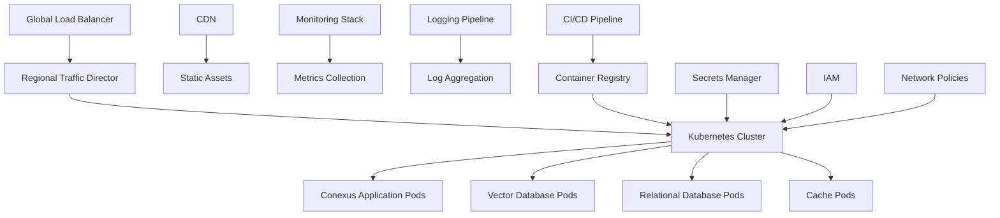
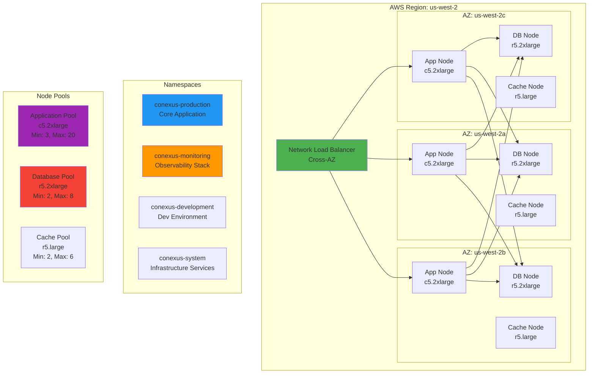
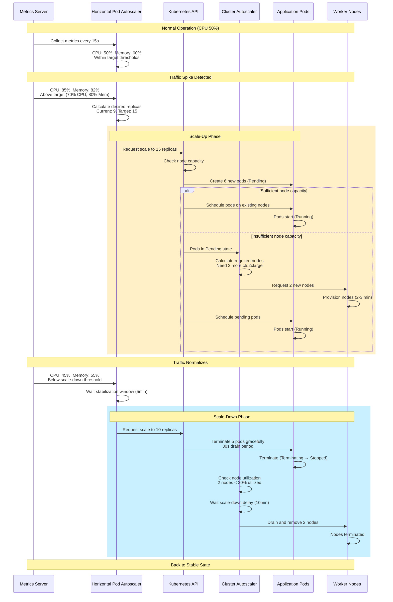

# Infrastructure Architecture

## Overview

This document outlines the infrastructure architecture for the Agentic Context Engine (Conexus), focusing on Kubernetes deployment, multi-region setup, and auto-scaling configurations. The architecture is designed to provide high availability, scalability, and performance for a global user base while maintaining security and cost efficiency.

## Architecture Principles

### Design Goals

1. **High Availability**: 99.9% uptime with multi-region redundancy
2. **Scalability**: Handle 1000+ concurrent users with sub-second response times
3. **Security**: SOC 2 Type II compliance with encryption at rest and in transit
4. **Cost Optimization**: Efficient resource utilization with auto-scaling
5. **Observability**: Comprehensive monitoring and alerting
6. **Disaster Recovery**: Automated failover and data recovery

### Infrastructure Layers



## Kubernetes Architecture

### Cluster Design

#### Kubernetes Cluster Topology



**Topology Characteristics:**
- **Multi-AZ Deployment**: 3 availability zones for fault tolerance
- **Node Pool Segregation**: Dedicated pools for different workload types
- **Cross-AZ Load Balancing**: Traffic distributed across all availability zones
- **Namespace Isolation**: Logical separation of environments and services
- **High Availability**: Minimum 3 nodes per pool spread across AZs

#### Multi-Region Setup

```yaml
# Regional cluster configuration
apiVersion: v1
kind: ConfigMap
metadata:
   name: cluster-config
   namespace: conexus-system
 data:
  region: "us-west-2"
  availability-zones: "us-west-2a,us-west-2b,us-west-2c"
  node-count: "9"  # 3 nodes per AZ for HA
  instance-type: "c5.2xlarge"
  storage-class: "gp3"
```

#### Node Pool Configuration

```yaml
# Application node pool
apiVersion: eksctl.io/v1alpha5
kind: ClusterConfig
metadata:
   name: conexus-production
   region: us-west-2
spec:
  nodeGroups:
    - name: conexus-app-nodes
      instanceType: c5.2xlarge
      desiredCapacity: 6
      minSize: 3
      maxSize: 20
      availabilityZones: ["us-west-2a", "us-west-2b", "us-west-2c"]
      ssh:
        allow: false
      labels:
        node-type: application
        workload: conexus
      taints:
        - key: dedicated
          value: conexus
          effect: NoSchedule

    - name: conexus-db-nodes
      instanceType: r5.2xlarge
      desiredCapacity: 3
      minSize: 2
      maxSize: 8
      availabilityZones: ["us-west-2a", "us-west-2b", "us-west-2c"]
      labels:
        node-type: database
        workload: conexus
      taints:
        - key: dedicated
          value: database
          effect: NoSchedule
```

### Namespace Organization

#### Namespace Structure

```yaml
# Core application namespace
apiVersion: v1
kind: Namespace
metadata:
   name: conexus-production
   labels:
     environment: production
     team: conexus
     monitoring: enabled
   annotations:
     description: "Conexus production environment"

---
# Monitoring namespace
apiVersion: v1
kind: Namespace
metadata:
   name: conexus-monitoring
  labels:
    environment: production
    team: platform
    monitoring: critical

---
# Development namespace
apiVersion: v1
kind: Namespace
metadata:
   name: conexus-development
   labels:
     environment: development
     team: conexus
     monitoring: enabled
```

### Pod Security Standards

#### Security Context

```yaml
# Pod security context
apiVersion: v1
kind: Pod
metadata:
   name: conexus-server
   namespace: conexus-production
spec:
  securityContext:
    runAsNonRoot: true
    runAsUser: 1000
    runAsGroup: 1000
    fsGroup: 2000
    seccompProfile:
      type: RuntimeDefault

  containers:
  - name: conexus-server
    securityContext:
      allowPrivilegeEscalation: false
      readOnlyRootFilesystem: true
      runAsNonRoot: true
      runAsUser: 1000
      capabilities:
        drop:
          - ALL
      volumeMounts:
      - name: tmp-volume
        mountPath: /tmp
        readOnly: false

  volumes:
  - name: tmp-volume
    emptyDir:
      sizeLimit: 100Mi
```

## Application Deployment

### Deployment Strategy

#### Rolling Updates

```yaml
# Conexus server deployment
apiVersion: apps/v1
kind: Deployment
metadata:
   name: conexus-server
   namespace: conexus-production
spec:
  replicas: 9
  strategy:
    type: RollingUpdate
    rollingUpdate:
      maxUnavailable: 1
      maxSurge: 2

  selector:
    matchLabels:
      app: conexus-server

  template:
    metadata:
      labels:
        app: conexus-server
        version: v1.0.0
    spec:
      affinity:
        podAntiAffinity:
          preferredDuringSchedulingIgnoredDuringExecution:
          - weight: 100
            podAffinityTerm:
              labelSelector:
                matchExpressions:
                 - key: app
                   operator: In
                   values:
                   - conexus-server
              topologyKey: kubernetes.io/hostname

      containers:
      - name: conexus-server
        image: conexus-registry/conexus-server:v1.0.0
        ports:
        - containerPort: 8080
          name: http
        - containerPort: 9090
          name: metrics

        env:
        - name: CONEXUS_ENVIRONMENT
          value: "production"
        - name: CONEXUS_LOG_LEVEL
          value: "info"

        resources:
          requests:
            memory: "2Gi"
            cpu: "500m"
          limits:
            memory: "4Gi"
            cpu: "1000m"

        livenessProbe:
          httpGet:
            path: /health
            port: 8080
          initialDelaySeconds: 30
          periodSeconds: 10
          timeoutSeconds: 5
          failureThreshold: 3

        readinessProbe:
          httpGet:
            path: /ready
            port: 8080
          initialDelaySeconds: 5
          periodSeconds: 5
          timeoutSeconds: 3
          failureThreshold: 3

        volumeMounts:
        - name: config
          mountPath: /app/config
          readOnly: true
        - name: logs
          mountPath: /app/logs

      volumes:
      - name: config
        configMap:
          name: conexus-config
      - name: logs
        emptyDir: {}
```

### Service Configuration

#### Service Definitions

```yaml
# Conexus server service
apiVersion: v1
kind: Service
metadata:
   name: conexus-server
   namespace: conexus-production
  annotations:
    service.beta.kubernetes.io/aws-load-balancer-type: nlb
    service.beta.kubernetes.io/aws-load-balancer-cross-zone-load-balancing-enabled: "true"
spec:
  type: LoadBalancer
  ports:
    - port: 80
      targetPort: 8080
      protocol: TCP
      name: http
    - port: 9090
      targetPort: 9090
      protocol: TCP
      name: metrics
  selector:
    app: conexus-server

---
# Vector database service
apiVersion: v1
kind: Service
metadata:
  name: conexus-qdrant
  namespace: conexus-production
spec:
  type: ClusterIP
  ports:
    - port: 6333
      targetPort: 6333
      protocol: TCP
      name: grpc
    - port: 6334
      targetPort: 6334
      protocol: TCP
      name: http
  selector:
    app: conexus-qdrant
```

## Database Architecture

### Vector Database Deployment

#### Qdrant Cluster

```yaml
# Qdrant StatefulSet
apiVersion: apps/v1
kind: StatefulSet
metadata:
  name: conexus-qdrant
  namespace: conexus-production
spec:
  serviceName: conexus-qdrant
  replicas: 3
  selector:
    matchLabels:
      app: conexus-qdrant

  template:
    metadata:
      labels:
        app: conexus-qdrant
    spec:
      containers:
      - name: qdrant
        image: qdrant/qdrant:v1.7.4
        ports:
        - containerPort: 6333
          name: grpc
        - containerPort: 6334
          name: http

        env:
        - name: QDRANT_CONFIG_PATH
          value: /qdrant/config/config.yaml

        volumeMounts:
        - name: config
          mountPath: /qdrant/config
        - name: storage
          mountPath: /qdrant/storage

        resources:
          requests:
            memory: "4Gi"
            cpu: "1000m"
          limits:
            memory: "8Gi"
            cpu: "2000m"

  volumeClaimTemplates:
  - metadata:
      name: storage
    spec:
      accessModes: [ "ReadWriteOnce" ]
      storageClassName: gp3
      resources:
        requests:
          storage: 500Gi
```

#### Database Configuration

```yaml
# Qdrant configuration
apiVersion: v1
kind: ConfigMap
metadata:
  name: qdrant-config
  namespace: conexus-production
data:
  config.yaml: |
    log_level: INFO
    storage:
      storage_path: /qdrant/storage
      snapshots_path: /qdrant/snapshots
      temp_path: /qdrant/temp
    service:
      http_port: 6334
      grpc_port: 6333
      enable_cors: true
      max_request_size_mb: 32
    cluster:
      enabled: true
      p2p:
        port: 6335
      consensus:
        tick_period_ms: 100
```

### Relational Database Deployment

#### PostgreSQL Cluster

```yaml
# PostgreSQL StatefulSet
apiVersion: apps/v1
kind: StatefulSet
metadata:
  name: conexus-postgres
  namespace: conexus-production
spec:
  serviceName: conexus-postgres
  replicas: 3
  selector:
    matchLabels:
      app: conexus-postgres

  template:
    metadata:
      labels:
        app: conexus-postgres
    spec:
      containers:
      - name: postgres
        image: postgres:15-alpine
        ports:
        - containerPort: 5432
          name: postgres

        env:
        - name: POSTGRES_DB
          value: ace_production
        - name: POSTGRES_USER
          valueFrom:
            secretKeyRef:
              name: conexus-secrets
              key: postgres-user
        - name: POSTGRES_PASSWORD
          valueFrom:
            secretKeyRef:
              name: conexus-secrets
              key: postgres-password
        - name: PGDATA
          value: /var/lib/postgresql/data/pgdata

        volumeMounts:
        - name: data
          mountPath: /var/lib/postgresql/data

        resources:
          requests:
            memory: "2Gi"
            cpu: "500m"
          limits:
            memory: "4Gi"
            cpu: "1000m"

  volumeClaimTemplates:
  - metadata:
      name: data
    spec:
      accessModes: [ "ReadWriteOnce" ]
      storageClassName: gp3
      resources:
        requests:
          storage: 200Gi
```

## Auto-Scaling Configuration

### Horizontal Pod Autoscaler

#### Auto-Scaling Workflow



**Auto-Scaling Parameters:**
- **Metrics Collection**: Every 15 seconds via Metrics Server
- **HPA Evaluation**: Every 15-30 seconds based on CPU/memory/custom metrics
- **Scale-Up Policy**: Max 50% increase or 5 pods per minute (whichever is greater)
- **Scale-Down Policy**: Max 10% decrease per minute with 5-minute stabilization
- **Cluster Autoscaler**: 2-3 minute node provisioning time
- **Scale-Down Delay**: 10 minutes of low utilization before node removal
- **Graceful Termination**: 30-second drain period for pods

#### Traffic Routing and Load Balancing Flow

```mermaid
graph TB
    subgraph "Edge Layer"
        CDN[CloudFront CDN<br/>Global Edge Locations]
        WAF[AWS WAF<br/>DDoS Protection]
    end
    
    subgraph "Global Routing"
        R53[Route 53<br/>DNS + Health Checks]
        
        R53 --> |Latency routing| POLICY_LATENCY[Route to nearest region]
        R53 --> |Geo routing| POLICY_GEO[Route by user location]
        R53 --> |Failover routing| POLICY_FAIL[Route to healthy region]
    end
    
    subgraph "Regional Load Balancing - US-West-2"
        NLB[Network Load Balancer<br/>Layer 4 TCP/UDP]
        ALB[Application Load Balancer<br/>Layer 7 HTTP/HTTPS]
        
        NLB --> ALB
        
        ALB --> |Path-based routing| ROUTE1[/api/* → Conexus API]
        ALB --> |Path-based routing| ROUTE2[/health → Health Checks]
        ALB --> |Path-based routing| ROUTE3[/metrics → Prometheus]
    end
    
    subgraph "Kubernetes Ingress"
        INGRESS[NGINX Ingress Controller<br/>TLS Termination]
        
        INGRESS --> |Rate limiting| RL[Rate Limit: 1000 req/min]
        INGRESS --> |Request routing| SVCMESH[Service Mesh Layer]
    end
    
    subgraph "Service Layer"
        SVCMESH --> SVC1[conexus-server Service<br/>ClusterIP]
        SVCMESH --> SVC2[conexus-qdrant Service<br/>ClusterIP]
        SVCMESH --> SVC3[conexus-postgres Service<br/>ClusterIP]
        
        SVC1 --> |Round-robin| POD1[conexus-server Pod 1]
        SVC1 --> |Round-robin| POD2[conexus-server Pod 2]
        SVC1 --> |Round-robin| POD3[conexus-server Pod 3]
        SVC1 --> POD4[... Pod N]
    end
    
    subgraph "Health & Monitoring"
        HC[Health Checks<br/>Every 10s]
        METRICS[Prometheus Metrics<br/>Every 15s]
        
        HC --> POD1
        HC --> POD2
        HC --> POD3
        
        METRICS --> POD1
        METRICS --> POD2
        METRICS --> POD3
    end
    
    USER[User Request] --> CDN
    CDN --> WAF
    WAF --> R53
    
    POLICY_LATENCY --> NLB
    POLICY_GEO --> NLB
    POLICY_FAIL --> NLB
    
    POD1 -.->|Metrics| METRICS
    POD2 -.->|Metrics| METRICS
    POD3 -.->|Metrics| METRICS
    
    style CDN fill:#00BCD4
    style R53 fill:#9C27B0
    style NLB fill:#4CAF50
    style ALB fill:#4CAF50
    style INGRESS fill:#FF9800
    style SVC1 fill:#2196F3
```

**Traffic Routing Flow:**
1. **Edge Layer**: CloudFront CDN caches static assets, AWS WAF filters malicious traffic
2. **Global DNS**: Route 53 directs users based on latency, geography, and health
3. **Regional Load Balancing**: NLB handles Layer 4 traffic, ALB provides Layer 7 routing
4. **Ingress Layer**: NGINX Ingress terminates TLS, enforces rate limits, routes requests
5. **Service Mesh**: Optional Istio/Linkerd for advanced traffic management
6. **Service Layer**: Kubernetes Services distribute traffic to healthy pods via round-robin
7. **Health Monitoring**: Continuous health checks and metrics collection ensure reliability

**Load Balancing Strategies:**
- **Round-Robin**: Default for service-level pod distribution
- **Least Connections**: For database connection pooling
- **IP Hash**: For session affinity when needed
- **Weighted**: For canary deployments and gradual rollouts

#### Application Scaling

```yaml
# HPA for Conexus server
apiVersion: autoscaling/v2
kind: HorizontalPodAutoscaler
metadata:
  name: conexus-server-hpa
  namespace: conexus-production
spec:
  scaleTargetRef:
    apiVersion: apps/v1
    kind: Deployment
    name: conexus-server
  minReplicas: 3
  maxReplicas: 50
  metrics:
  - type: Resource
    resource:
      name: cpu
      target:
        type: Utilization
        averageUtilization: 70
  - type: Resource
    resource:
      name: memory
      target:
        type: Utilization
        averageUtilization: 80
  - type: Pods
    pods:
      metric:
        name: packets-per-second
      target:
        type: AverageValue
        averageValue: "1000"
  behavior:
    scaleDown:
      stabilizationWindowSeconds: 300
      policies:
      - type: Percent
        value: 10
        periodSeconds: 60
    scaleUp:
      stabilizationWindowSeconds: 120
      policies:
      - type: Percent
        value: 50
        periodSeconds: 60
      - type: Pods
        value: 5
        periodSeconds: 60
      selectPolicy: Max
```

#### Database Scaling

```yaml
# HPA for vector database
apiVersion: autoscaling/v2
kind: HorizontalPodAutoscaler
metadata:
  name: conexus-qdrant-hpa
  namespace: conexus-production
spec:
  scaleTargetRef:
    apiVersion: apps/v1
    kind: StatefulSet
    name: conexus-qdrant
  minReplicas: 3
  maxReplicas: 15
  metrics:
  - type: Resource
    resource:
      name: cpu
      target:
        type: Utilization
        averageUtilization: 60
  - type: Resource
    resource:
      name: memory
      target:
        type: Utilization
        averageUtilization: 75
  - type: Object
    object:
      metric:
        name: qdrant_search_latency
      describedObject:
        apiVersion: apps/v1
        kind: StatefulSet
        name: conexus-qdrant
      target:
        type: Value
        value: "100ms"
```

### Cluster Autoscaler

#### Node Auto-Scaling

```yaml
# Cluster autoscaler configuration
apiVersion: v1
kind: ConfigMap
metadata:
  name: cluster-autoscaler-config
  namespace: kube-system
data:
  cluster-autoscaler-config: |
    expander: random
    scale-down-enabled: true
    scale-down-delay-after-add: 10m
    scale-down-delay-after-delete: 5m
    scale-down-delay-after-failure: 3m
    scale-down-unneeded-time: 10m
    scale-down-unready-time: 20m
    max-node-provision-time: 15m
    max-graceful-termination-sec: 600
    max-total-unready-percentage: 45
    ok-total-unready-count: 3
    scale-down-utilization-threshold: 0.3
    scale-down-gpu-utilization-threshold: 0.5
    max-empty-bulk-delete: 10
    new-pod-scale-up-delay: 0s
    max-scale-down-parallelism: 10
```

## Multi-Region Architecture

### Global Traffic Management

#### Multi-Region Deployment Topology

```mermaid
graph TB
    USER[Global Users] --> GLB[Global Load Balancer<br/>Route 53 / Traffic Manager]
    
    GLB --> |Latency-based routing| US_WEST[US-West-2 Region<br/>Primary]
    GLB --> |Failover routing| US_EAST[US-East-1 Region<br/>Secondary]
    GLB --> |Geo routing| EU_WEST[EU-West-1 Region<br/>Secondary]
    
    subgraph "US-West-2 (Primary)"
        US_W_LB[Regional LB]
        US_W_K8S[K8s Cluster<br/>9 nodes across 3 AZs]
        US_W_DB[PostgreSQL<br/>Primary + 2 replicas]
        US_W_VECTOR[Qdrant<br/>3 shards]
        US_W_CACHE[Redis<br/>3 nodes cluster]
        
        US_W_LB --> US_W_K8S
        US_W_K8S --> US_W_DB
        US_W_K8S --> US_W_VECTOR
        US_W_K8S --> US_W_CACHE
    end
    
    subgraph "US-East-1 (Secondary)"
        US_E_LB[Regional LB]
        US_E_K8S[K8s Cluster<br/>6 nodes across 3 AZs]
        US_E_DB[PostgreSQL<br/>Read replicas]
        US_E_VECTOR[Qdrant<br/>2 shards]
        US_E_CACHE[Redis<br/>2 nodes cluster]
        
        US_E_LB --> US_E_K8S
        US_E_K8S --> US_E_DB
        US_E_K8S --> US_E_VECTOR
        US_E_K8S --> US_E_CACHE
    end
    
    subgraph "EU-West-1 (Secondary)"
        EU_LB[Regional LB]
        EU_K8S[K8s Cluster<br/>6 nodes across 3 AZs]
        EU_DB[PostgreSQL<br/>Read replicas]
        EU_VECTOR[Qdrant<br/>2 shards]
        EU_CACHE[Redis<br/>2 nodes cluster]
        
        EU_LB --> EU_K8S
        EU_K8S --> EU_DB
        EU_K8S --> EU_VECTOR
        EU_K8S --> EU_CACHE
    end
    
    subgraph "Data Replication"
        SYNC[Async Replication<br/>Every 6 hours]
        US_W_DB -.->|Streaming replication| US_E_DB
        US_W_DB -.->|Streaming replication| EU_DB
        US_W_VECTOR -.->|Snapshot sync| US_E_VECTOR
        US_W_VECTOR -.->|Snapshot sync| EU_VECTOR
    end
    
    subgraph "Global Services"
        CDN[CloudFront CDN<br/>Global edge locations]
        BACKUP[Backup Storage<br/>Multi-region S3]
        MONITOR[Monitoring<br/>Centralized dashboard]
    end
    
    US_W_K8S -.->|Backup| BACKUP
    US_E_K8S -.->|Backup| BACKUP
    EU_K8S -.->|Backup| BACKUP
    
    US_W_K8S -.->|Metrics| MONITOR
    US_E_K8S -.->|Metrics| MONITOR
    EU_K8S -.->|Metrics| MONITOR
    
    CDN -.->|Cache static assets| US_W_K8S
    
    style US_WEST fill:#4CAF50
    style US_EAST fill:#2196F3
    style EU_WEST fill:#FF9800
    style GLB fill:#9C27B0
    style CDN fill:#00BCD4
```



**Multi-Region Strategy:**
- **Primary Region (US-West-2)**: Handles majority of write operations
- **Secondary Regions**: Serve read traffic and provide disaster recovery
- **Latency-Based Routing**: Users routed to nearest region automatically
- **Data Replication**: Asynchronous streaming for databases, snapshot sync for vector data
- **Global Services**: CDN for static assets, centralized monitoring and backups
- **RTO**: 4 hours (Recovery Time Objective)
- **RPO**: 1 hour (Recovery Point Objective)

#### DNS and Load Balancing

```yaml
# Global DNS configuration
apiVersion: v1
kind: ConfigMap
metadata:
  name: global-dns-config
  namespace: conexus-system
data:
  external-dns-config: |
    domainFilters:
      - conexus.yourcompany.com
    provider: aws
    registry: txt
    txt-owner-id: conexus-production
    txt-prefix: conexus-
```

#### Regional Failover

```yaml
# Regional traffic director
apiVersion: networking.gke.io/v1beta1
kind: TrafficDirector
metadata:
  name: conexus-global-router
  namespace: conexus-system
spec:
  healthChecks:
  - name: conexus-health-check
    type: HTTP
    httpHealthCheck:
      port: 80
      requestPath: /health

  backends:
  - name: conexus-us-west-2
    failover: true
    groups:
    - group: conexus-us-west-2
  - name: conexus-us-east-1
    failover: true
    groups:
    - group: conexus-us-east-1

  defaultService: conexus-us-west-2
```

### Data Replication

#### Cross-Region Data Sync

```yaml
# Cross-region replication job
apiVersion: batch/v1
kind: CronJob
metadata:
  name: conexus-data-sync
  namespace: conexus-production
spec:
  schedule: "0 */6 * * *"  # Every 6 hours
  jobTemplate:
    spec:
      template:
        spec:
          containers:
          - name: data-sync
            image: conexus-registry/data-sync:v1.0.0
            env:
            - name: SOURCE_REGION
              value: us-west-2
            - name: TARGET_REGION
              value: us-east-1
            - name: SYNC_TYPE
              value: incremental
          restartPolicy: OnFailure
```

#### Disaster Recovery

```yaml
# DR configuration
apiVersion: v1
kind: ConfigMap
metadata:
  name: dr-config
  namespace: conexus-production
data:
  dr-plan: |
    recovery-time-objective: 4h
    recovery-point-objective: 1h
    failover-regions:
      - us-east-1
      - eu-west-1
    data-backup-regions:
      - us-west-2
      - eu-central-1
    notification-channels:
      - slack:#conexus-alerts
      - email:ops@yourcompany.com
```

## Monitoring and Observability

### Metrics Collection

#### Prometheus Configuration

```yaml
# Prometheus deployment
apiVersion: apps/v1
kind: Deployment
metadata:
  name: prometheus
  namespace: conexus-monitoring
spec:
  replicas: 2
  selector:
    matchLabels:
      app: prometheus

  template:
    metadata:
      labels:
        app: prometheus
    spec:
      containers:
      - name: prometheus
        image: prom/prometheus:v2.45.0
        ports:
        - containerPort: 9090
          name: web

        volumeMounts:
        - name: config
          mountPath: /etc/prometheus
        - name: data
          mountPath: /prometheus

        resources:
          requests:
            memory: "2Gi"
            cpu: "500m"
          limits:
            memory: "4Gi"
            cpu: "1000m"

      volumes:
      - name: config
        configMap:
          name: prometheus-config
      - name: data
        persistentVolumeClaim:
          claimName: prometheus-data

---
# Prometheus configuration
apiVersion: v1
kind: ConfigMap
metadata:
  name: prometheus-config
  namespace: conexus-monitoring
data:
  prometheus.yml: |
    global:
      scrape_interval: 15s
      evaluation_interval: 15s

    rule_files:
      - "alerts.yml"

    scrape_configs:
      - job_name: 'conexus-server'
        static_configs:
          - targets: ['conexus-server.conexus-production:9090']
        metrics_path: /metrics
        scrape_interval: 15s

      - job_name: 'conexus-qdrant'
        static_configs:
          - targets: ['conexus-qdrant.conexus-production:6334']
        metrics_path: /metrics
        scrape_interval: 30s

      - job_name: 'kubernetes-nodes'
        scheme: https
        tls_config:
          ca_file: /var/run/secrets/kubernetes.io/serviceaccount/ca.crt
          insecure_skip_verify: true
        bearer_token_file: /var/run/secrets/kubernetes.io/serviceaccount/token
        kubernetes_sd_configs:
        - role: node
        relabel_configs:
        - action: labelmap
          regex: __meta_kubernetes_node_label_(.+)
        - target_label: __address__
          replacement: kubernetes.default.svc:443
        - source_labels: [__meta_kubernetes_node_name]
          regex: (.+)
          target_label: __metrics_path__
          replacement: /api/v1/nodes/${1}/proxy/metrics
```

### Alerting Configuration

#### AlertManager Setup

```yaml
# AlertManager configuration
apiVersion: v1
kind: ConfigMap
metadata:
  name: alertmanager-config
  namespace: conexus-monitoring
data:
  config.yml: |
    global:
      smtp_smarthost: 'smtp.yourcompany.com:587'
      smtp_from: 'alerts@yourcompany.com'

    route:
      group_by: ['alertname']
      group_wait: 10s
      group_interval: 10s
      repeat_interval: 1h
      receiver: 'conexus-team'

      routes:
      - match:
          severity: critical
        receiver: 'conexus-oncall'
        continue: true

    receivers:
    - name: 'conexus-team'
      slack_configs:
      - api_url: '${SLACK_WEBHOOK_URL}'
        channel: '#conexus-alerts'
        title: '{{ range .Alerts }}{{ .Annotations.summary }}{{ end }}'
        text: '{{ range .Alerts }}{{ .Annotations.description }}{{ end }}'

    - name: 'conexus-oncall'
      pagerduty_configs:
      - routing_key: '${PAGERDUTY_ROUTING_KEY}'
```

### Logging Architecture

#### Fluent Bit Configuration

```yaml
# Fluent Bit DaemonSet
apiVersion: apps/v1
kind: DaemonSet
metadata:
  name: fluent-bit
  namespace: conexus-monitoring
spec:
  selector:
    matchLabels:
      app: fluent-bit

  template:
    metadata:
      labels:
        app: fluent-bit
    spec:
      containers:
      - name: fluent-bit
        image: fluent/fluent-bit:2.1.8
        ports:
        - containerPort: 2020
          name: metrics

        volumeMounts:
        - name: varlogcontainers
          mountPath: /var/log/containers
          readOnly: true
        - name: varlogpods
          mountPath: /var/log/pods
          readOnly: true
        - name: fluent-bit-config
          mountPath: /fluent-bit/etc/

        resources:
          requests:
            memory: "100Mi"
            cpu: "100m"
          limits:
            memory: "200Mi"
            cpu: "200m"

      volumes:
      - name: varlogcontainers
        hostPath:
          path: /var/log/containers
      - name: varlogpods
        hostPath:
          path: /var/log/pods
      - name: fluent-bit-config
        configMap:
          name: fluent-bit-config
```

## Security Architecture

### Network Policies

#### Namespace Isolation

```yaml
# Default deny all traffic
apiVersion: networking.k8s.io/v1
kind: NetworkPolicy
metadata:
  name: default-deny-all
  namespace: conexus-production
spec:
  podSelector: {}
  policyTypes:
  - Ingress
  - Egress

---
# Allow Conexus server to communicate with databases
apiVersion: networking.k8s.io/v1
kind: NetworkPolicy
metadata:
  name: conexus-server-access
  namespace: conexus-production
spec:
  podSelector:
    matchLabels:
      app: conexus-server
  policyTypes:
  - Ingress
  - Egress

  ingress:
  - from:
    - namespaceSelector:
        matchLabels:
          environment: production
    ports:
    - protocol: TCP
      port: 8080

  egress:
  - to:
    - podSelector:
        matchLabels:
          app: conexus-postgres
    ports:
    - protocol: TCP
      port: 5432
  - to:
    - podSelector:
        matchLabels:
          app: conexus-qdrant
    ports:
    - protocol: TCP
      port: 6333
  - to:
    - podSelector:
        matchLabels:
          app: conexus-redis
    ports:
    - protocol: TCP
      port: 6379
```

### Secrets Management

#### External Secrets Operator

```yaml
# Secret store configuration
apiVersion: external-secrets.io/v1beta1
kind: SecretStore
metadata:
  name: aws-secrets-store
  namespace: conexus-production
spec:
  provider:
    aws:
      service: SecretsManager
      region: us-west-2
      auth:
        jwt:
          serviceAccountRef:
            name: eso-sa
            namespace: conexus-production

---
# Conexus secrets
apiVersion: external-secrets.io/v1beta1
kind: ExternalSecret
metadata:
  name: conexus-secrets
  namespace: conexus-production
spec:
  refreshInterval: 1h
  secretStoreRef:
    name: aws-secrets-store
    kind: SecretStore

  target:
    name: conexus-secrets
    creationPolicy: Owner

  data:
  - secretKey: postgres-password
    remoteRef:
      key: conexus-production/postgres-password
  - secretKey: qdrant-api-key
    remoteRef:
      key: conexus-production/qdrant-api-key
  - secretKey: jwt-secret
    remoteRef:
      key: conexus-production/jwt-secret
```

## Cost Optimization

### Resource Optimization

#### Rightsizing Recommendations

```yaml
# Vertical Pod Autoscaler
apiVersion: autoscaling.k8s.io/v1
kind: VerticalPodAutoscaler
metadata:
  name: conexus-server-vpa
  namespace: conexus-production
spec:
  targetRef:
    apiVersion: apps/v1
    kind: Deployment
    name: conexus-server
  updatePolicy:
    updateMode: Auto
  resourcePolicy:
    containerPolicies:
    - containerName: conexus-server
      minAllowed:
        cpu: 100m
        memory: 500Mi
      maxAllowed:
        cpu: 2000m
        memory: 8Gi
```

#### Spot Instance Usage

```yaml
# Spot instance node pool for non-critical workloads
apiVersion: eksctl.io/v1alpha5
kind: NodeGroup
metadata:
  name: conexus-spot-nodes
  namespace: conexus-production
spec:
  instanceTypes: ["c5.large", "c5.xlarge", "c5.2xlarge"]
  spotPrice: ""
  instancesDistribution:
    maxPrice: 0.05
    instanceTypes: ["c5.large", "c5.xlarge"]
    onDemandBaseCapacity: 0
    onDemandAboveBaseCapacity: 0
    spotInstancePools: 3
    spotAllocationStrategy: diversified
```

## Performance Optimization

### CDN Configuration

#### Static Asset Delivery

```yaml
# CloudFront distribution for static assets
apiVersion: v1
kind: ConfigMap
metadata:
  name: cdn-config
  namespace: conexus-production
data:
  cloudfront-distribution: |
    DefaultCacheBehavior:
      TargetOriginId: conexus-s3-origin
      ViewerProtocolPolicy: redirect-to-https
      Compress: true
      ForwardedValues:
        QueryString: false
        Cookies:
          Forward: none

    Origins:
      conexus-s3-origin:
        DomainName: conexus-assets.s3.amazonaws.com
        S3OriginConfig:
          OriginAccessIdentity: ""
```

### Database Optimization

#### Read Replica Configuration

```yaml
# PostgreSQL read replicas
apiVersion: apps/v1
kind: Deployment
metadata:
  name: conexus-postgres-read
  namespace: conexus-production
spec:
  replicas: 2
  selector:
    matchLabels:
      app: conexus-postgres-read

  template:
    metadata:
      labels:
        app: conexus-postgres-read
    spec:
      containers:
      - name: postgres-read
        image: postgres:15-alpine
        ports:
        - containerPort: 5432
          name: postgres

        env:
        - name: POSTGRES_DB
          value: ace_production
        - name: POSTGRES_USER
          valueFrom:
            secretKeyRef:
              name: conexus-secrets
              key: postgres-user
        - name: POSTGRES_PASSWORD
          valueFrom:
            secretKeyRef:
              name: conexus-secrets
              key: postgres-password
        - name: PGDATA
          value: /var/lib/postgresql/data/pgdata

        command:
        - postgres
        - -c
        - hot_standby=on

        volumeMounts:
        - name: data
          mountPath: /var/lib/postgresql/data

        resources:
          requests:
            memory: "1Gi"
            cpu: "250m"
          limits:
            memory: "2Gi"
            cpu: "500m"

      volumes:
      - name: data
        persistentVolumeClaim:
          claimName: postgres-read-data
```

## Maintenance and Operations

### Automated Backups

#### Backup CronJobs

```yaml
# Database backup job
apiVersion: batch/v1
kind: CronJob
metadata:
  name: conexus-database-backup
  namespace: conexus-production
spec:
  schedule: "0 2 * * *"  # Daily at 2 AM
  jobTemplate:
    spec:
      template:
        spec:
          containers:
          - name: postgres-backup
            image: postgres:15-alpine
            command:
            - /bin/bash
            - -c
            - |
              pg_dump -h conexus-postgres -U $POSTGRES_USER $POSTGRES_DB > /backup/backup.sql
              aws s3 cp /backup/backup.sql s3://conexus-backups/$(date +%Y-%m-%d)/
          env:
          - name: POSTGRES_USER
            valueFrom:
              secretKeyRef:
              name: conexus-secrets
              key: postgres-user
          - name: POSTGRES_DB
            value: ace_production
          - name: POSTGRES_HOST
            value: conexus-postgres
          volumeMounts:
          - name: backup
            mountPath: /backup
          resources:
            requests:
              memory: "500Mi"
              cpu: "250m"
            limits:
              memory: "1Gi"
              cpu: "500m"

      volumes:
      - name: backup
        emptyDir: {}

      restartPolicy: OnFailure
```

### Health Checks and Monitoring

#### Custom Health Checks

```yaml
# Custom health check for Conexus
apiVersion: v1
kind: ConfigMap
metadata:
  name: conexus-health-checks
  namespace: conexus-production
data:
  health-check.sh: |
    #!/bin/bash

    # Check Conexus server health
    if ! curl -f http://localhost:8080/health; then
        echo "Conexus server health check failed"
        exit 1
    fi

    # Check database connectivity
    if ! pg_isready -h conexus-postgres -U $POSTGRES_USER; then
        echo "Database connectivity check failed"
        exit 1
    fi

    # Check vector database
    if ! curl -f http://conexus-qdrant:6334/health; then
        echo "Vector database health check failed"
        exit 1
    fi

    echo "All health checks passed"
```

## Disaster Recovery

### Failover Procedures

#### Automated Failover

```yaml
# Failover configuration
apiVersion: v1
kind: ConfigMap
metadata:
  name: failover-config
  namespace: conexus-production
data:
  failover-script: |
    #!/bin/bash

    PRIMARY_REGION="us-west-2"
    FAILOVER_REGION="us-east-1"

    # Check primary region health
    if health_check $PRIMARY_REGION; then
        echo "Primary region healthy"
        exit 0
    fi

    # Initiate failover
    echo "Initiating failover to $FAILOVER_REGION"

    # Update DNS
    update_dns $FAILOVER_REGION

    # Scale up failover region
    scale_cluster $FAILOVER_REGION

    # Verify failover
    if health_check $FAILOVER_REGION; then
        notify_team "Failover completed successfully"
    else
        notify_team "Failover failed - manual intervention required"
        exit 1
    fi
```

### Data Recovery

#### Point-in-Time Recovery

```yaml
# Recovery job configuration
apiVersion: batch/v1
kind: Job
metadata:
  name: conexus-data-recovery
  namespace: conexus-production
spec:
  template:
    spec:
      containers:
      - name: recovery
        image: conexus-registry/recovery-tools:v1.0.0
        command:
        - /bin/bash
        - -c
        - |
          # Restore from latest backup
          aws s3 cp s3://conexus-backups/latest/backup.sql /tmp/backup.sql

          # Restore database
          psql -h conexus-postgres -U $POSTGRES_USER -d ace_production < /tmp/backup.sql

          # Restore vector data
          restore_qdrant_data /tmp/qdrant-backup

          # Verify restoration
          run_health_checks
        env:
        - name: POSTGRES_USER
          valueFrom:
            secretKeyRef:
              name: conexus-secrets
              key: postgres-user
        - name: POSTGRES_DB
          value: ace_production
      restartPolicy: Never
```

## Compliance and Governance

### SOC 2 Compliance

#### Audit Logging

```yaml
# Audit log configuration
apiVersion: v1
kind: ConfigMap
metadata:
  name: audit-config
  namespace: conexus-production
data:
  audit-policy.yaml: |
    apiVersion: audit.k8s.io/v1
    kind: Policy
    rules:
    - level: Metadata
      namespaces: ["conexus-production"]
    - level: RequestResponse
      verbs: ["create", "update", "patch", "delete"]
      resources:
      - group: ""
        resources: ["secrets", "configmaps"]
    - level: None
      resources:
      - group: ""
        resources: ["events"]
```

### Cost Monitoring

#### Cost Allocation Tags

```yaml
# Resource tagging for cost allocation
apiVersion: v1
kind: ConfigMap
metadata:
  name: cost-tags
  namespace: conexus-production
data:
  resource-tags: |
    Environment: production
    Team: conexus
    Project: conexus-context-engine
    CostCenter: engineering-platform
    Owner: conexus-team@yourcompany.com
```

## Future Enhancements

### Planned Improvements

1. **Serverless Deployment**: AWS Lambda or Google Cloud Run for spiky workloads
2. **Edge Computing**: Cloudflare Workers for global low-latency access
3. **Advanced Auto-scaling**: Machine learning-based scaling predictions
4. **Zero-Trust Architecture**: Enhanced security with service mesh
5. **Green Computing**: Carbon-aware scheduling and optimization

### Migration Strategies

- **Gradual Rollout**: Canary deployments for new infrastructure
- **Blue-Green Deployments**: Zero-downtime updates
- **Feature Flags**: Controlled rollout of new capabilities
- **Rollback Procedures**: Automated rollback on failures

## Conclusion

This infrastructure architecture provides a robust, scalable, and secure foundation for Conexus deployment across multiple regions. The combination of Kubernetes orchestration, automated scaling, comprehensive monitoring, and disaster recovery capabilities ensures high availability and performance for global users.

Regular reviews and updates to this architecture will accommodate growing demands, incorporate new technologies, and maintain compliance with evolving security and operational standards.