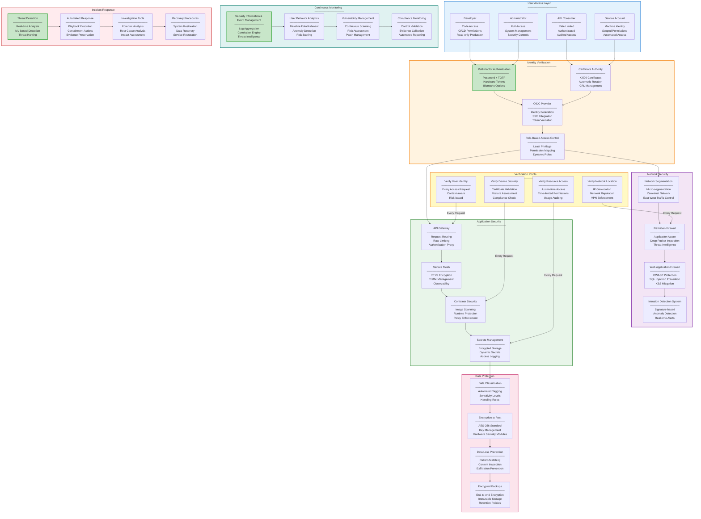

# Security Operations

## Overview

This document outlines the security operations framework for the Agentic Context Engine (Conexus), focusing on SOC 2 compliance, data protection, access controls, and audit procedures. The framework ensures the confidentiality, integrity, and availability of sensitive data while maintaining compliance with industry standards and regulatory requirements.

## Security Principles

### Core Security Objectives

1. **Confidentiality**: Protect sensitive data from unauthorized access
2. **Integrity**: Ensure data accuracy and prevent unauthorized modifications
3. **Availability**: Maintain system availability for authorized users
4. **Compliance**: Meet SOC 2, GDPR, HIPAA, and other regulatory requirements
5. **Risk Management**: Identify, assess, and mitigate security risks

### Security Framework

- **Zero Trust Architecture**: Verify every request and access
- **Defense in Depth**: Multiple layers of security controls
- **Least Privilege**: Grant minimum necessary permissions
- **Continuous Monitoring**: Real-time security event detection and response

## SOC 2 Compliance

### Trust Services Criteria

#### Security (Common Criteria)

```yaml
# Security controls mapping
apiVersion: v1
kind: ConfigMap
metadata:
  name: soc2-security-controls
  namespace: conexus-production
data:
  controls.yaml: |
    CC6.1: Control over systems and data
      - Access controls implemented
      - Authentication mechanisms in place
      - Authorization properly configured

    CC6.2: Protection against unauthorized access
      - Network security controls
      - Encryption at rest and in transit
      - Intrusion detection systems

    CC6.3: Protection against malicious software
      - Antivirus/anti-malware protection
      - Regular security updates
      - Vulnerability scanning

    CC6.4: Protection of system resources
      - Resource monitoring
      - Capacity planning
      - Performance optimization

    CC6.5: Protection of sensitive data
      - Data classification
      - Encryption standards
      - Key management procedures
```

#### Availability (A1.1 - A1.3)

```yaml
# Availability controls
availability_controls:
  A1.1: System availability monitoring
    - Uptime monitoring: 99.9% SLA
    - Performance metrics collection
    - Alert thresholds defined

  A1.2: Backup and recovery procedures
    - Daily automated backups
    - Recovery time objective: 4 hours
    - Recovery point objective: 1 hour

  A1.3: Disaster recovery planning
    - Multi-region redundancy
    - Failover procedures documented
    - Regular DR testing
```

#### Confidentiality (C1.1 - C1.3)

```yaml
# Confidentiality controls
confidentiality_controls:
  C1.1: Data classification
    - Public, Internal, Confidential, Restricted
    - Classification procedures documented
    - Regular data classification reviews

  C1.2: Access controls
    - Role-based access control (RBAC)
    - Multi-factor authentication (MFA)
    - Access review processes

  C1.3: Encryption requirements
    - AES-256 encryption at rest
    - TLS 1.3 for data in transit
     - Key rotation policies
```

### SOC 2 Compliance Architecture

```mermaid
graph TB
    subgraph TrustServices["Trust Services Criteria<br/>───────────────"]
        SECURITY[Security<br/>CC6.1-CC6.8<br/>───────────────<br/>Access Controls<br/>Network Security<br/>Malware Protection<br/>Data Protection]
        AVAILABILITY[Availability<br/>A1.1-A1.3<br/>───────────────<br/>Uptime Monitoring<br/>Backup/Recovery<br/>Disaster Recovery]
        CONFIDENTIALITY[Confidentiality<br/>C1.1-C1.3<br/>───────────────<br/>Data Classification<br/>Access Controls<br/>Encryption Standards]
    end

    subgraph Controls["Security Controls Implementation<br/>───────────────"]
        subgraph CC6["CC6: Security Controls"]
            CC61[CC6.1: System Control<br/>───────────────<br/>Access Management<br/>Authentication<br/>Authorization]
            CC62[CC6.2: Unauthorized Access<br/>───────────────<br/>Network Security<br/>Encryption<br/>Intrusion Detection]
            CC63[CC6.3: Malware Protection<br/>───────────────<br/>Antivirus/Anti-malware<br/>Security Updates<br/>Vulnerability Scanning]
            CC64[CC6.4: System Resources<br/>───────────────<br/>Resource Monitoring<br/>Capacity Planning<br/>Performance Optimization]
            CC65[CC6.5: Sensitive Data<br/>───────────────<br/>Data Classification<br/>Encryption Standards<br/>Key Management]
        end

        subgraph A1["A1: Availability Controls"]
            A11[A1.1: Monitoring<br/>───────────────<br/>99.9% SLA<br/>Performance Metrics<br/>Alert Thresholds]
            A12[A1.2: Backup/Recovery<br/>───────────────<br/>Daily Backups<br/>RTO: 4 hours<br/>RPO: 1 hour]
            A13[A1.3: Disaster Recovery<br/>───────────────<br/>Multi-region<br/>Failover Procedures<br/>DR Testing]
        end

        subgraph C1["C1: Confidentiality Controls"]
            C11[C1.1: Data Classification<br/>───────────────<br/>Public/Internal/Confidential/Restricted<br/>Classification Procedures<br/>Regular Reviews]
            C12[C1.2: Access Controls<br/>───────────────<br/>RBAC<br/>Multi-factor Authentication<br/>Access Reviews]
            C13[C1.3: Encryption<br/>───────────────<br/>AES-256 at Rest<br/>TLS 1.3 in Transit<br/>Key Rotation]
        end
    end

    subgraph Monitoring["Continuous Compliance Monitoring<br/>───────────────"]
        AUTOMATED[Automated Checks<br/>───────────────<br/>Every 5 minutes<br/>Control Validation<br/>Evidence Collection]
        REPORTING[Compliance Reporting<br/>───────────────<br/>Daily Reports<br/>Executive Summary<br/>Remediation Actions]
        AUDITING[Audit Trail<br/>───────────────<br/>All Changes Logged<br/>User Activities<br/>System Events]
        ALERTING[Alert Management<br/>───────────────<br/>Non-compliance Alerts<br/>Escalation Procedures<br/>Ticket Creation]
    end

    subgraph Assessment["Compliance Assessment<br/>───────────────"]
        INTERNAL[Internal Audits<br/>───────────────<br/>Quarterly Reviews<br/>Control Testing<br/>Gap Analysis]
        EXTERNAL[External Audits<br/>───────────────<br/>Annual SOC 2 Type II<br/>Third-party Assessment<br/>Penetration Testing]
        REMEDIATION[Remediation<br/>───────────────<br/>Fix Findings<br/>Update Controls<br/>Re-test Validation]
        CERTIFICATION[SOC 2 Certification<br/>───────────────<br/>Type II Report<br/>Independent Auditor<br/>Annual Renewal]
    end

    subgraph Evidence["Evidence Collection<br/>───────────────"]
        LOGS[Security Logs<br/>───────────────<br/>Authentication Events<br/>Access Attempts<br/>System Changes]
        CONFIG[Configuration<br/>───────────────<br/>Security Policies<br/>Control Settings<br/>System Configurations]
        METRICS[Performance Metrics<br/>───────────────<br/>Uptime Data<br/>Response Times<br/>Error Rates]
        DOCS[Documentation<br/>───────────────<br/>Procedures<br/>Policies<br/>Training Records]
    end

    SECURITY --> CC61
    SECURITY --> CC62
    SECURITY --> CC63
    SECURITY --> CC64
    SECURITY --> CC65

    AVAILABILITY --> A11
    AVAILABILITY --> A12
    AVAILABILITY --> A13

    CONFIDENTIALITY --> C11
    CONFIDENTIALITY --> C12
    CONFIDENTIALITY --> C13

    CC61 --> AUTOMATED
    CC62 --> AUTOMATED
    CC63 --> AUTOMATED
    CC64 --> AUTOMATED
    CC65 --> AUTOMATED
    A11 --> AUTOMATED
    A12 --> AUTOMATED
    A13 --> AUTOMATED
    C11 --> AUTOMATED
    C12 --> AUTOMATED
    C13 --> AUTOMATED

    AUTOMATED --> REPORTING
    REPORTING --> AUDITING
    AUDITING --> ALERTING

    ALERTING --> INTERNAL
    INTERNAL --> REMEDIATION
    REMEDIATION --> EXTERNAL
    EXTERNAL --> CERTIFICATION

    LOGS --> EVIDENCE
    CONFIG --> EVIDENCE
    METRICS --> EVIDENCE
    DOCS --> EVIDENCE

    EVIDENCE --> REPORTING
    EVIDENCE --> AUDITING
    EVIDENCE --> INTERNAL
    EVIDENCE --> EXTERNAL

    style TrustServices fill:#e3f2fd,stroke:#1976d2,stroke-width:2px
    style Controls fill:#fff3e0,stroke:#f57c00,stroke-width:2px
    style Monitoring fill:#f3e5f5,stroke:#7b1fa2,stroke-width:2px
    style Assessment fill:#e8f5e9,stroke:#388e3c,stroke-width:2px
    style Evidence fill:#fce4ec,stroke:#c2185b,stroke-width:2px
    
    style CERTIFICATION fill:#c8e6c9,stroke:#4caf50,stroke-width:3px
    style AUTOMATED fill:#c8e6c9,stroke:#4caf50,stroke-width:3px

    classDef perfBox fill:#fff,stroke:#999,stroke-width:1px,stroke-dasharray: 5 5
```



**Compliance Monitoring Schedule:**
- **Automated Checks**: Every 5 minutes (real-time validation)
- **Daily Reports**: Executive summary and control status
- **Weekly Reviews**: Detailed control analysis and gap identification
- **Quarterly Audits**: Internal assessment and remediation planning
- **Annual Certification**: SOC 2 Type II audit by independent firm

**Key Compliance Metrics:**
- **Control Coverage**: 100% of SOC 2 criteria implemented
- **Evidence Completeness**: 95%+ automated evidence collection
- **Remediation Time**: <7 days for critical findings
- **Audit Success Rate**: 100% certification achievement
- **Continuous Monitoring**: 99.9% uptime for monitoring systems

**Design Principles:**
1. **Defense in Depth**: Multiple overlapping controls for each criterion
2. **Automated Evidence**: Minimize manual processes for efficiency and accuracy
3. **Continuous Assessment**: Real-time monitoring vs. point-in-time audits
4. **Risk-Based Approach**: Focus remediation efforts on highest-impact areas
5. **Integrated Reporting**: Single source of truth for all compliance data

### Compliance Monitoring

#### Automated Compliance Checks

```go
type ComplianceMonitor struct {
    Controls     []ComplianceControl
    CheckInterval time.Duration
    ReportGenerator *ReportGenerator
}

// Run continuous compliance monitoring
func (cm *ComplianceMonitor) Monitor() {
    ticker := time.NewTicker(cm.CheckInterval)
    defer ticker.Stop()

    for range ticker {
        results := make([]*ComplianceResult, 0)

        for _, control := range cm.Controls {
            result := control.Check()
            results = append(results, result)

            if !result.Compliant {
                cm.handleNonCompliance(result)
            }
        }

        // Generate compliance report
        report := cm.ReportGenerator.Generate(results)
        cm.storeReport(report)
    }
}
```

### Real-Time Security Monitoring Dashboard

```mermaid
graph TB
    subgraph Overview["Executive Dashboard<br/>───────────────"]
        KPI1[Security Score<br/>───────────────<br/>Current: 94.2/100<br/>Trend: +2.1%<br/>Target: >95]
        KPI2[Active Incidents<br/>───────────────<br/>Critical: 0<br/>High: 2<br/>Medium: 5<br/>Low: 12]
        KPI3[MTTD/MTTR<br/>───────────────<br/>Detection: 8 min<br/>Response: 45 min<br/>Target: <15m / <1h]
        KPI4[Vulnerability Age<br/>───────────────<br/>Critical: 0 days<br/>High: 3 days<br/>Medium: 12 days<br/>Target: <7 days]
    end

    subgraph Threats["Threat Detection<br/>───────────────"]
        subgraph RealTime["Real-Time Threats"]
            ANOMALY[Anomalous Activity<br/>───────────────<br/>Unusual Login Patterns<br/>Suspicious API Calls<br/>Geographic Anomalies]
            MALWARE[Malware Detection<br/>───────────────<br/>Virus Signatures<br/>Behavioral Analysis<br/>File Integrity Checks]
            INTRUSION[Intrusion Attempts<br/>───────────────<br/>Failed Authentications<br/>Port Scanning<br/>Exploit Attempts]
            DLP[Data Exfiltration<br/>───────────────<br/>Unusual Data Flows<br/>Sensitive Data Movement<br/>External Destinations]
        end

        subgraph Intelligence["Threat Intelligence"]
            IOC[Indicators of Compromise<br/>───────────────<br/>Known Malicious IPs<br/>Malware Hashes<br/>Suspicious Domains]
            VULN[Vulnerability Feeds<br/>───────────────<br/>CVE Database<br/>Exploit-DB<br/>Vendor Advisories]
            REPUTATION[Reputation Data<br/>───────────────<br/>IP Blacklists<br/>Domain Reputation<br/>File Hashes]
        end
    end

    subgraph Compliance["Compliance Monitoring<br/>───────────────"]
        SOC2[SOC 2 Controls<br/>───────────────<br/>Security: 98.5%<br/>Availability: 99.2%<br/>Confidentiality: 97.8%<br/>Last Audit: 30 days]
        GDPR[GDPR Compliance<br/>───────────────<br/>Data Processing: 100%<br/>Subject Rights: 100%<br/>Breach Notification: 100%<br/>DPIA: Completed]
        HIPAA[HIPAA Compliance<br/>───────────────<br/>PHI Protection: 99.5%<br/>Access Controls: 100%<br/>Audit Logging: 100%<br/>BA Agreements: 100%]
        PCI[PCI DSS<br/>───────────────<br/>Cardholder Data: N/A<br/>Network Security: 100%<br/>Access Control: 100%<br/>Monitoring: 100%]
    end

    subgraph Systems["System Health<br/>───────────────"]
        subgraph Infrastructure["Infrastructure Status"]
            SERVERS[Server Health<br/>───────────────<br/>CPU: 45% avg<br/>Memory: 67% avg<br/>Disk: 34% avg<br/>Uptime: 99.9%]
            NETWORK[Network Health<br/>───────────────<br/>Latency: 12ms avg<br/>Packet Loss: 0.01%<br/>Bandwidth: 65% util<br/>DDoS Protection: Active]
            DATABASE[Database Health<br/>───────────────<br/>Connections: 234/1000<br/>Query Time: 45ms avg<br/>Replication Lag: 0ms<br/>Backup Status: Success]
        end

        subgraph Security["Security Tools"]
            FIREWALL[Firewall Status<br/>───────────────<br/>Rules: 1,247 active<br/>Blocked: 15,234/day<br/>False Positive: 0.2%<br/>Updates: Current]
            IDS[IDS/IPS Status<br/>───────────────<br/>Signatures: 45,231<br/>Alerts: 127/day<br/>False Positive: 1.5%<br/>Tuned Rules: 89%]
            SCANNER[Vulnerability Scanner<br/>───────────────<br/>Last Scan: 2 hours ago<br/>Findings: 3 medium<br/>False Positive: 0.8%<br/>Coverage: 100%]
        end
    end

    subgraph Response["Incident Response<br/>───────────────"]
        ACTIVE[Active Incidents<br/>───────────────<br/>#IR-2024-0123: High<br/>Status: Investigating<br/>Assigned: SOC Team B<br/>ETA Resolution: 2 hours]
        QUEUE[Response Queue<br/>───────────────<br/>Pending: 8 items<br/>Avg Response: 23 min<br/>SLA Compliance: 98.5%<br/>Escalated: 2 items]
        PLAYBOOKS[Available Playbooks<br/>───────────────<br/>Data Breach: Ready<br/>DDoS Attack: Ready<br/>Malware: Ready<br/>Insider Threat: Ready]
        AUTOMATION[Automated Actions<br/>───────────────<br/>Account Suspensions: 12<br/>IP Blocks: 45<br/>Service Isolations: 3<br/>Evidence Collections: 8]
    end

    subgraph Analytics["Security Analytics<br/>───────────────"]
        TRENDS[Trend Analysis<br/>───────────────<br/>Incidents: -15% MoM<br/>Vulnerabilities: -8% MoM<br/>False Positives: +2% MoM<br/>Response Time: -12% MoM]
        PREDICTIONS[Risk Predictions<br/>───────────────<br/>High Risk Assets: 3<br/>Likely Attack Vectors: 2<br/>Vulnerability Windows: 5<br/>Recommended Actions: 7]
        CORRELATION[Event Correlation<br/>───────────────<br/>Related Events: 234<br/>Attack Chains: 3<br/>False Positive Groups: 12<br/>Threat Actor Tracking: 2]
        REPORTING[Automated Reports<br/>───────────────<br/>Daily Summary: Sent<br/>Weekly Analysis: Sent<br/>Monthly Executive: Due<br/>Regulatory: Compliant]
    end

    subgraph Alerts["Alert Management<br/>───────────────"]
        CRITICAL[Critical Alerts<br/>───────────────<br/>Active: 0<br/>Last 24h: 2<br/>Avg Response: 8 min<br/>Escalation: Auto]
        HIGH[High Priority<br/>───────────────<br/>Active: 3<br/>Last 24h: 15<br/>Avg Response: 23 min<br/>Escalation: 1 hour]
        MEDIUM[Medium Priority<br/>───────────────<br/>Active: 12<br/>Last 24h: 67<br/>Avg Response: 2.5 hours<br/>Escalation: 4 hours]
        INFO[Informational<br/>───────────────<br/>Active: 45<br/>Last 24h: 234<br/>Auto-resolved: 89%<br/>Human Review: 11%]
    end

    subgraph Integration["External Integrations<br/>───────────────"]
        THREAT_INTEL[Threat Intelligence<br/>───────────────<br/>VirusTotal: Active<br/>AlienVault OTX: Active<br/>MITRE ATT&CK: Active<br/>Last Update: 5 min ago]
        VULN_DB[Vulnerability DBs<br/>───────────────<br/>NVD: Active<br/>Exploit-DB: Active<br/>Vendor Feeds: Active<br/>Custom Signatures: 127]
        COMPLIANCE[Compliance Tools<br/>───────────────<br/>Vanta: Connected<br/>Drata: Connected<br/>AuditBoard: Connected<br/>Last Sync: 1 hour ago]
        NOTIFICATION[Notification Services<br/>───────────────<br/>PagerDuty: Active<br/>Slack: Active<br/>Email: Active<br/>SMS: Active]
    end

    KPI1 --> Overview
    KPI2 --> Overview
    KPI3 --> Overview
    KPI4 --> Overview

    ANOMALY --> RealTime
    MALWARE --> RealTime
    INTRUSION --> RealTime
    DLP --> RealTime

    IOC --> Intelligence
    VULN --> Intelligence
    REPUTATION --> Intelligence

    SOC2 --> Compliance
    GDPR --> Compliance
    HIPAA --> Compliance
    PCI --> Compliance

    SERVERS --> Infrastructure
    NETWORK --> Infrastructure
    DATABASE --> Infrastructure

    FIREWALL --> Security
    IDS --> Security
    SCANNER --> Security

    ACTIVE --> Response
    QUEUE --> Response
    PLAYBOOKS --> Response
    AUTOMATION --> Response

    TRENDS --> Analytics
    PREDICTIONS --> Analytics
    CORRELATION --> Analytics
    REPORTING --> Analytics

    CRITICAL --> Alerts
    HIGH --> Alerts
    MEDIUM --> Alerts
    INFO --> Alerts

    THREAT_INTEL --> Integration
    VULN_DB --> Integration
    COMPLIANCE --> Integration
    NOTIFICATION --> Integration

    style Overview fill:#e3f2fd,stroke:#1976d2,stroke-width:2px
    style Threats fill:#ffebee,stroke:#c62828,stroke-width:2px
    style Compliance fill:#f3e5f5,stroke:#7b1fa2,stroke-width:2px
    style Systems fill:#fff3e0,stroke:#f57c00,stroke-width:2px
    style Response fill:#e8f5e9,stroke:#388e3c,stroke-width:2px
    style Analytics fill:#fce4ec,stroke:#c2185b,stroke-width:2px
    style Alerts fill:#fff9c4,stroke:#f57f17,stroke-width:2px
    style Integration fill:#e0f2f1,stroke:#00796b,stroke-width:2px
    
    style KPI1 fill:#c8e6c9,stroke:#4caf50,stroke-width:3px
    style CRITICAL fill:#ffcdd2,stroke:#d32f2f,stroke-width:3px
    style THREAT_INTEL fill:#c8e6c9,stroke:#4caf50,stroke-width:3px

    classDef perfBox fill:#fff,stroke:#999,stroke-width:1px,stroke-dasharray: 5 5
```



**Dashboard Refresh Intervals:**
- **Real-time Metrics**: 30-second updates (threats, alerts, system health)
- **KPI Calculations**: 5-minute updates (scores, trends, compliance status)
- **Analytics**: 15-minute updates (correlations, predictions, reports)
- **External Data**: 1-hour updates (threat intel, vulnerability feeds)

**Alert Escalation Matrix:**

| Severity | Response Time | Escalation | Notification |
|----------|---------------|-------------|--------------|
| **Critical** | <5 minutes | Auto-page + Slack | All stakeholders |
| **High** | <15 minutes | Slack + Email | Security team + leadership |
| **Medium** | <1 hour | Dashboard + Email | Security team |
| **Low** | <4 hours | Dashboard only | On-call engineer |

**Key Performance Indicators:**
- **Security Score**: Composite metric (0-100) based on controls, incidents, vulnerabilities
- **Mean Time to Detection**: Average time from breach start to alert
- **Mean Time to Response**: Average time from alert to initial response
- **Vulnerability Age**: Average days vulnerabilities remain unpatched
- **Compliance Score**: Percentage of controls meeting requirements

**Design Principles:**
1. **Single Pane of Glass**: All security information in one consolidated view
2. **Role-Based Access**: Different dashboard views for different user roles
3. **Mobile Responsive**: Full functionality on mobile devices for on-call engineers
4. **Automated Insights**: ML-powered anomaly detection and trend analysis
5. **Integration Hub**: Centralized connection to all security tools and data sources

## Access Controls

### Identity and Access Management

#### Role-Based Access Control (RBAC)

```yaml
# RBAC configuration
apiVersion: rbac.authorization.k8s.io/v1
kind: ClusterRole
metadata:
  name: conexus-admin
  namespace: conexus-production
rules:
- apiGroups: [""]
  resources: ["*"]
  verbs: ["*"]
- apiGroups: ["apps"]
  resources: ["*"]
  verbs: ["*"]
- apiGroups: ["networking.k8s.io"]
  resources: ["*"]
  verbs: ["*"]

---
apiVersion: rbac.authorization.k8s.io/v1
kind: ClusterRole
metadata:
  name: conexus-developer
  namespace: conexus-production
rules:
- apiGroups: [""]
  resources: ["pods", "services", "configmaps", "secrets"]
  verbs: ["get", "list", "watch"]
- apiGroups: ["apps"]
  resources: ["deployments", "replicasets"]
  verbs: ["get", "list", "watch"]

---
apiVersion: rbac.authorization.k8s.io/v1
kind: RoleBinding
metadata:
  name: conexus-developer-binding
  namespace: conexus-production
subjects:
- kind: User
  name: developer@yourcompany.com
  apiGroup: rbac.authorization.k8s.io
roleRef:
  kind: ClusterRole
  name: conexus-developer
  apiGroup: rbac.authorization.k8s.io
```

#### Multi-Factor Authentication

```yaml
# MFA configuration
apiVersion: v1
kind: ConfigMap
metadata:
  name: mfa-config
  namespace: conexus-production
data:
  mfa-policy.yaml: |
    required_factors:
      - password
      - totp
      - webauthn

    grace_period: 24h
    trusted_devices: 30d
    backup_codes: 10

    enforcement:
      admin_users: immediate
      regular_users: 7d
      service_accounts: exempt
```

### Access Review Processes

#### Automated Access Reviews

```go
type AccessReviewer struct {
    ReviewSchedule *ReviewSchedule
    EntitlementStore *EntitlementStore
    NotificationService *NotificationService
}

// Conduct automated access reviews
func (ar *AccessReviewer) ConductReview() error {
    // Get all active entitlements
    entitlements := ar.EntitlementStore.GetActive()

    // Group by resource owner
    byOwner := ar.groupByOwner(entitlements)

    // Send review requests
    for owner, ents := range byOwner {
        review := &AccessReview{
            Owner:         owner,
            Entitlements:  ents,
            DueDate:       time.Now().Add(7 * 24 * time.Hour),
            Reviewer:      ar.getReviewer(owner),
        }

        if err := ar.NotificationService.SendReview(review); err != nil {
            log.Errorf("Failed to send review to %s: %v", owner, err)
        }
    }

    return nil
}
```

### Zero Trust Security Architecture



**Zero Trust Implementation Strategy:**

| Component | Implementation | Verification | Enforcement |
|-----------|----------------|-------------|-------------|
| **Identity** | OIDC + MFA + Certificates | Every authentication | Continuous validation |
| **Network** | Micro-segmentation + NGFW | Every connection | Policy-based routing |
| **Application** | API Gateway + Service Mesh | Every API call | Request-level authorization |
| **Data** | Classification + Encryption | Every data access | Attribute-based controls |
| **Monitoring** | SIEM + UBA + Vulnerability | Continuous | Automated response |

**Verification Points:**
1. **User Identity**: MFA + risk scoring + device posture
2. **Device Security**: Certificate validation + compliance checks
3. **Network Location**: IP reputation + geolocation + VPN enforcement
4. **Resource Access**: Just-in-time permissions + usage auditing

**Performance Impact:**
- **Authentication Latency**: <100ms (cached tokens)
- **Authorization Latency**: <50ms (policy evaluation)
- **Network Overhead**: <5% (mTLS + segmentation)
- **Monitoring Overhead**: <2% CPU (SIEM correlation)
- **Total Request Latency**: +150-300ms vs. traditional perimeter security

**Key Design Decisions:**
1. **Assume Breach**: Every request treated as potentially malicious
2. **Micro-segmentation**: Network divided into micro-perimeters
3. **Just-in-time Access**: Permissions granted for specific time windows
4. **Continuous Verification**: Identity and context re-verified throughout session
5. **Automated Response**: Pre-defined playbooks for common threat scenarios

## Data Protection and Privacy

### GDPR Compliance

#### Data Processing Records

```yaml
# GDPR Article 30 records
apiVersion: v1
kind: ConfigMap
metadata:
  name: gdpr-records
  namespace: conexus-production
data:
  data-processing-records.yaml: |
    processing_activities:
      - name: "Context Retrieval"
        purpose: "Provide relevant code context to AI assistants"
        legal_basis: "Legitimate interest"
        categories:
          - "Code snippets"
          - "Documentation"
          - "User queries"
        retention: "90 days"
        recipients: "Internal systems only"

      - name: "Performance Analytics"
        purpose: "Improve system performance and user experience"
        legal_basis: "Legitimate interest"
        categories:
          - "Usage statistics"
          - "Performance metrics"
        retention: "2 years"
        recipients: "Internal analytics systems"
```

#### Data Subject Rights

```go
type GDPRProcessor struct {
    RequestHandler *RequestHandler
    DataLocator    *DataLocator
    Anonymizer     *Anonymizer
}

// Handle GDPR requests
func (gp *GDPRProcessor) ProcessRequest(request *GDPRRequest) (*GDPRResponse, error) {
    switch request.Type {
    case "access":
        return gp.handleAccessRequest(request)
    case "rectification":
        return gp.handleRectificationRequest(request)
    case "erasure":
        return gp.handleErasureRequest(request)
    case "portability":
        return gp.handlePortabilityRequest(request)
    case "restriction":
        return gp.handleRestrictionRequest(request)
    case "objection":
        return gp.handleObjectionRequest(request)
    default:
        return nil, fmt.Errorf("unknown request type: %s", request.Type)
    }
}
```

### Data Loss Prevention

#### DLP Policies

```yaml
# Data loss prevention configuration
apiVersion: v1
kind: ConfigMap
metadata:
  name: dlp-config
  namespace: conexus-production
data:
  dlp-policies.yaml: |
    policies:
      - name: "Credit Card Numbers"
        pattern: "\\b(?:\\d{4}[\\s-]?){3}\\d{4}\\b"
        severity: critical
        action: block

      - name: "API Keys"
        pattern: "(?i)(api[_-]?key|apikey)\\s*[:=]\\s*[\"']?([a-zA-Z0-9]{32,})[\"']?"
        severity: high
        action: encrypt

      - name: "Personal Information"
        pattern: "\\b[A-Za-z0-9._%+-]+@[A-Za-z0-9.-]+\\.[A-Z|a-z]{2,}\\b"
        severity: medium
        action: mask
```

## Security Operations Center

### SOC Operations

#### 24/7 Monitoring

```yaml
# SOC monitoring schedule
apiVersion: v1
kind: ConfigMap
metadata:
  name: soc-schedule
  namespace: conexus-production
data:
  monitoring-schedule.yaml: |
    shifts:
      - name: "Primary Shift"
        hours: "08:00-16:00 UTC"
        team: "SOC Team A"
        responsibilities:
          - "Real-time monitoring"
          - "Initial triage"
          - "Basic remediation"

      - name: "Secondary Shift"
        hours: "16:00-00:00 UTC"
        team: "SOC Team B"
        responsibilities:
          - "Escalated incidents"
          - "Complex investigations"
          - "System maintenance"

      - name: "Night Shift"
        hours: "00:00-08:00 UTC"
        team: "SOC Team C"
        responsibilities:
          - "Automated monitoring"
          - "Routine maintenance"
          - "Emergency response"

    escalation_path:
      - level: 1
        team: "SOC Team A"
        response_time: 15m
      - level: 2
        team: "Engineering On-call"
        response_time: 1h
      - level: 3
        team: "Security Leadership"
        response_time: 4h
```

#### Incident Response Playbooks

```yaml
# Incident response playbook
apiVersion: v1
kind: ConfigMap
metadata:
  name: incident-response-playbook
  namespace: conexus-production
data:
  playbook.yaml: |
    playbooks:
      - name: "Data Breach"
        severity: critical
        steps:
          - name: "Detection"
            actions:
              - "Verify alert authenticity"
              - "Assess scope of breach"
              - "Notify incident response team"

          - name: "Containment"
            actions:
              - "Isolate affected systems"
              - "Disable compromised accounts"
              - "Block malicious IPs"

          - name: "Eradication"
            actions:
              - "Remove malware/backdoors"
              - "Patch vulnerabilities"
              - "Reset credentials"

          - name: "Recovery"
            actions:
              - "Restore from clean backups"
              - "Monitor for re-infection"
              - "Validate system integrity"

          - name: "Lessons Learned"
            actions:
              - "Conduct post-mortem"
              - "Update security controls"
              - "Train team members"

      - name: "DDoS Attack"
        severity: high
        steps:
          - name: "Detection"
            actions:
              - "Monitor traffic patterns"
              - "Identify attack vectors"
              - "Alert network team"

          - name: "Mitigation"
            actions:
              - "Enable DDoS protection"
              - "Route traffic through scrubbers"
              - "Scale up capacity"

          - name: "Recovery"
            actions:
              - "Restore normal operations"
              - "Monitor for follow-on attacks"
              - "Update DDoS defenses"
```

## Compliance Auditing

### Internal Auditing

#### Automated Audit Procedures

```go
type InternalAuditor struct {
    AuditPlan    *AuditPlan
    EvidenceCollector *EvidenceCollector
    ReportGenerator   *AuditReportGenerator
}

// Conduct internal security audit
func (ia *InternalAuditor) ConductAudit() (*AuditReport, error) {
    // Execute audit plan
    for _, control := range ia.AuditPlan.Controls {
        evidence := ia.EvidenceCollector.Collect(control)

        control.Result = ia.evaluateControl(control, evidence)
        control.Evidence = evidence
    }

    // Generate audit report
    return ia.ReportGenerator.Generate(ia.AuditPlan)
}
```

### External Auditing

#### Third-Party Assessments

```yaml
# External audit configuration
apiVersion: v1
kind: ConfigMap
metadata:
  name: external-audit-config
  namespace: conexus-production
data:
  audit-config.yaml: |
    auditors:
      - name: "Deloitte"
        type: "SOC 2 Type II"
        frequency: "annual"
        scope:
          - "Security"
          - "Availability"
          - "Confidentiality"

      - name: " penetration_testing"
        type: "Penetration Testing"
        frequency: "quarterly"
        scope:
          - "External network"
          - "Web applications"
          - "API endpoints"

    evidence_retention:
      audit_reports: 7y
      evidence: 3y
      working_papers: 2y
```

## Security Training and Awareness

### Security Training Program

#### Mandatory Training

```yaml
# Security training requirements
apiVersion: v1
kind: ConfigMap
metadata:
  name: security-training-config
  namespace: conexus-production
data:
  training-requirements.yaml: |
    roles:
      - role: "Developer"
        courses:
          - "Secure Coding Practices"
          - "OWASP Top 10"
          - "Data Protection Basics"
        frequency: "annual"
        assessment: "quiz"

      - role: "Operations Engineer"
        courses:
          - "Infrastructure Security"
          - "Incident Response"
          - "Compliance Basics"
        frequency: "annual"
        assessment: "practical"

      - role: "Security Engineer"
        courses:
          - "Advanced Threat Detection"
          - "Forensic Analysis"
          - "Security Architecture"
        frequency: "annual"
        assessment: "certification"
```

#### Phishing Simulation

```go
type PhishingSimulator struct {
    CampaignManager *CampaignManager
    TemplateEngine  *TemplateEngine
    Analytics       *SimulationAnalytics
}

// Run phishing awareness campaigns
func (ps *PhishingSimulator) RunCampaign(targets []string) error {
    // Generate realistic phishing emails
    emails := ps.TemplateEngine.Generate(targets)

    // Send simulation emails
    for _, email := range emails {
        if err := ps.CampaignManager.Send(email); err != nil {
            log.Errorf("Failed to send phishing email: %v", err)
        }
    }

    // Track responses and analyze results
    return ps.Analytics.AnalyzeResponses(emails)
}
```

## Continuous Improvement

### Security Metrics and KPIs

#### Key Performance Indicators

```yaml
# Security KPIs
apiVersion: v1
kind: ConfigMap
metadata:
  name: security-kpis
  namespace: conexus-production
data:
  kpi-definitions.yaml: |
    kpis:
      - name: "Mean Time to Detection (MTTD)"
        description: "Average time to detect security incidents"
        target: "< 15 minutes"
        measurement: "automated monitoring"

      - name: "Mean Time to Response (MTTR)"
        description: "Average time to respond to security incidents"
        target: "< 1 hour"
        measurement: "incident response logs"

      - name: "Vulnerability Remediation Time"
        description: "Average time to fix critical vulnerabilities"
        target: "< 7 days"
        measurement: "vulnerability management system"

      - name: "Security Training Completion"
        description: "Percentage of staff completing security training"
        target: "100%"
        measurement: "LMS reports"

      - name: "Compliance Score"
        description: "Overall compliance with security standards"
        target: "> 95%"
        measurement: "automated compliance checks"
```

### Security Posture Assessment

#### Regular Assessments

```go
type SecurityAssessor struct {
    AssessmentFramework *AssessmentFramework
    Tools              []AssessmentTool
    ReportGenerator    *AssessmentReportGenerator
}

// Conduct comprehensive security assessment
func (sa *SecurityAssessor) Assess() (*SecurityAssessment, error) {
    assessment := &SecurityAssessment{
        Timestamp: time.Now(),
        Findings:  make([]*SecurityFinding, 0),
    }

    // Run assessment tools
    for _, tool := range sa.Tools {
        findings, err := tool.Run()
        if err != nil {
            log.Errorf("Assessment tool %s failed: %v", tool.Name(), err)
            continue
        }

        assessment.Findings = append(assessment.Findings, findings...)
    }

    // Generate assessment report
    return sa.ReportGenerator.Generate(assessment)
}
```

## Emergency Procedures

### Security Incident Response

#### Emergency Contacts

```yaml
# Emergency contact list
apiVersion: v1
kind: ConfigMap
metadata:
  name: emergency-contacts
  namespace: conexus-production
data:
  contacts.yaml: |
    primary:
      - name: "Security Operations Center"
        phone: "+1-555-SEC-OPS"
        email: "soc@yourcompany.com"
        escalation_time: "15 minutes"

    secondary:
      - name: "Engineering Director"
        phone: "+1-555-ENG-DIR"
        email: "eng-director@yourcompany.com"
        escalation_time: "1 hour"

    tertiary:
      - name: "CTO"
        phone: "+1-555-CTO"
        email: "cto@yourcompany.com"
        escalation_time: "4 hours"

    external:
      - name: "Legal Department"
        phone: "+1-555-LEGAL"
        email: "legal@yourcompany.com"

      - name: "Public Relations"
        phone: "+1-555-PR"
        email: "pr@yourcompany.com"
```

### Business Continuity

#### Continuity Planning

```yaml
# Business continuity plan
apiVersion: v1
kind: ConfigMap
metadata:
  name: business-continuity-plan
  namespace: conexus-production
data:
  bcp.yaml: |
    objectives:
      - recovery_time_objective: "4 hours"
      - recovery_point_objective: "1 hour"
      - minimum_service_level: "80% capacity"

    strategies:
      - name: "Multi-Region Failover"
        trigger: "Regional outage"
        procedure: "automated_failover_to_secondary_region"

      - name: "System Restoration"
        trigger: "Complete system failure"
        procedure: "restore_from_backup"

      - name: "Degraded Mode"
        trigger: "Partial system failure"
        procedure: "operate_with_reduced_functionality"

    communication_plan:
      - internal: "Slack #conexus-emergency"
      - external: "Status page update"
      - customers: "Email notification for major incidents"
```

## Conclusion

This security operations framework provides comprehensive protection for Conexus while ensuring compliance with SOC 2 and other regulatory requirements. Through continuous monitoring, automated response, and regular assessment, the framework maintains a strong security posture that evolves with emerging threats and regulatory changes.

The combination of technical controls, operational procedures, and governance processes ensures that Conexus operates securely, reliably, and in compliance with industry standards.